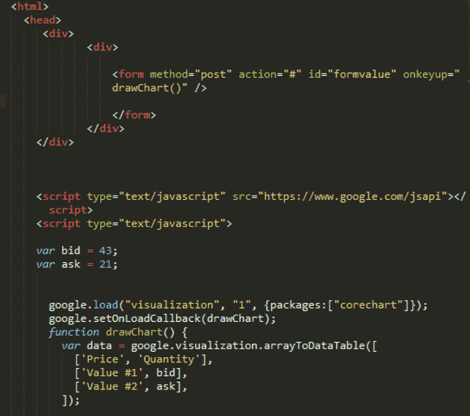
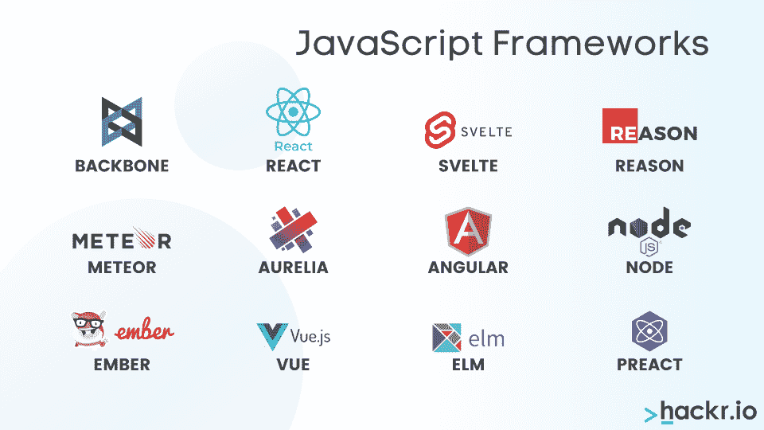

# JavaScript 是什么？JavaScript 简介

> 原文：<https://hackr.io/blog/what-is-javascript>

JavaScript 可能是世界上最流行、最广泛使用的编程语言。成立于 1995 年，它很快成为编程界的必备语言。据 Github 的 [2020 Octoverse 报告](https://github.blog/2020-12-02-the-state-of-the-octoverse-2020/) 显示，全球 18 亿网站中，95%使用 JavaScript。

但是什么是[JavaScript](https://hackr.io/blog/how-to-learn-javascript)？JavaScript 是什么意思？

这篇文章将介绍 Javascript 的定义和功能，这样你就可以了解 JavaScript 能做什么！

## **JavaScript 是什么？**

JavaScript 的含义需要一种强大的面向对象的 [脚本语言](https://hackr.io/blog/best-programming-languages-to-learn) 用来创建交互式网页。它最初被设计为在浏览器中运行。尽管如此，今天你仍然可以使用名为[node . js](https://nodejs.org/en/)的 JavaScript 服务器端版本构建 web 和移动应用、实时应用、视频流应用以及游戏。

什么是 JavaScript 编码？下面是一个简单的 JavaScript 代码示例:

```
script type="text/javascript"> 

document.write("JavaScript is a simple language and everyone can learn it"); 

</script>
```

在学习 JavaScript 开发网页之前，你需要具备一些基本技能，比如

*   对互联网的大致了解
*   熟悉 HTML
*   编程知识

在阅读 JavaScript 的时候，你可能会遇到这样的陈述:“JavaScript 核心语言特性是在一个叫做 ECMA-262 的标准中定义的。”让我们更深入地研究这个问题。

### **什么是 ECMAScript？**

ECMAScript 是一种嵌入在浏览器中的通用编程语言，但现在广泛用于服务器端应用。浏览器中的 JavaScript 和服务器端的 Node.js 是 ECMAScript 的超集。JavaScript 遵循并支持 ECMAScript 规范的所有功能。

## 【Javascript 是做什么的？

Javascript 的可能性大大超过了 HTML 和 CSS 的能力。这里有一些你可以用 Javascript 做的事情:

### **1。使网页互动**

如果用户所能做的只是阅读网页的内容，他们可能会对网页感到厌倦。Javascript 可以通过以下方式吸引观众:

*   放大或缩小
*   播放视频和音频
*   显示动画
*   允许他们在图像间滑动
*   当观众点击或悬停时显示信息或下拉菜单

### **2。构建应用程序**

你可以使用 Javascript 框架或代码库来创建移动和桌面应用。有了这些代码库，开发人员可以节省大量的时间来完成普通的编程任务，从而将他们的注意力集中在开发的创造性方面。

### **3。开发游戏**

****

开发者可以用 Javascript 创建引人入胜的浏览器游戏。此外，Javascript 新手可以使用简单的游戏开发来熟悉这种编程语言。

## **JavaScript 的特性**

**浏览器:** 所有流行的网页浏览器都支持 JavaScript，比如网景导航器(从 2.0 开始)、微软 ie 浏览器(从 3.0 版本开始)、火狐、Safari、Opera、谷歌 Chrome。浏览器有一个称为 Java 虚拟机的运行时环境。这些引擎将解释的代码转换成机器语言。不同的浏览器有不同的引擎名称/运行时环境，如 Chrome 中的 V8，Firefox 中的 SpiderMonkey，Microsoft Edge 中的 Chakra。

**语法:** JavaScript 遵循 C 编程语言的语法，比如代码块用花括号，赋值用=等等。然而，它只是表面上与 C 类似。JavaScript 是一种脚本语言，不同于 C、C++或 Java。

**操作系统:** JavaScript 支持 Windows、macOS、Linux 等多种操作系统。

**数据类型:** 你不需要声明变量的数据类型或者定义方法为 public、private 等。

**客户端和服务器端对象:** 客户端和服务器端预定义的 JavaScript 对象是不同的。

JavaScript 根据功能分为两个组件:

### **客户端 JavaScript**

JavaScript 的这个组件在浏览器上运行，允许应用程序在 HTML 表单上拥有元素。该应用程序响应用户事件，如鼠标点击、表单输入、显示日期和时间的页面导航、动态下拉框和显示警告框/弹出窗口。

下面是一个示例 JavaScript 代码，当你点击鼠标按钮时，它会显示一个警告框。

```
<html> 

<head> 

<script type="text/javascript"> 

function sayHello() { 

 alert("Hello There, JavaScript is easy"); 

} 

</script> 

</head> 

<body> 

<p>Welcome to JavaScript</p> 

<form> 

<input type="button" value="click" onclick="sayHello()"/> 

</form> 

</body> 

</html> 
```

### 查看本 JavaScript 课程

【JavaScript 全教程 2023:从零到专家！

### **服务器端 JavaScript**

JavaScript 的这个组件运行在服务器上，允许应用程序与数据库通信。它还通过调用和响应调用来处理应用程序的工作流，或者在服务器上执行文件操作。使用服务器端 JavaScript 代码的 HTML 页面被编译成字节码可执行文件。具有运行时环境的 web 服务器运行应用程序可执行文件。

Node.js 或 Node 是一个开源的运行时环境，可以在浏览器之外执行 JavaScript 代码。这是一个围绕 Chrome 强大的 V8 引擎构建的环境，具有额外的功能和特性。

节点通常用于开发 [API](https://hackr.io/blog/what-is-api-testing) (应用编程接口)。这些服务由客户端应用程序访问，客户端应用程序可以是用户可见的 web 应用程序或移动应用程序。后端服务从数据库获取数据、发送电子邮件、管理文件、推送通知、管理工作流等。在构建包含大量数据的实时应用程序时，Node 非常强大。

**以下是 Node 的一些优点:**

*   **敏捷:** 敏捷开发，即你可以开发一个快速的应用原型。
*   快速: 你可以用更快的响应时间开发高度可伸缩的应用程序。
*   **可信:** 沃尔玛、贝宝、优步使用 Node，在快速应用程序开发、使用更少资源和实现快速响应时间方面表现出显著优势。
*   **干净:** 因为是基于 JavaScript 的代码，所以你的应用会有一个更干净的代码库，前后都有 JavaScript 代码。
*   安全多样 :作为开源软件，它有一个庞大的图书馆生态系统供你使用。

下面是一个样本节点代码。

*函数 myFirstNode()*

*console.log('我的第一个节点程序')；*

*}*

*my first node()；*

注意:特定于用户界面的“文档”或“窗口”等对象在 Node 中不存在，因为它是一个后端环境。相反，它有自己的后端对象集。

**JavaScript 框架**

## ****

市场上有几种 JavaScript 框架，包括流行的 Angular、Vue、Svelte 和 React。框架为开发应用程序提供了可重用代码库和结构化框架。框架已经定义了构建应用程序的方法、组件如何交互、应用程序启动过程等。

框架加速了应用程序的开发，因为你可以使用可重用的代码而不是重写它。

框架像 Angular 用[Typescript](https://hackr.io/tutorials/learn-typescript)，JavaScript 的超集。除了其他特性，所有 Javascript 特性都存在于 typescript 中。不过，Typescript 比 JavaScript 更面向对象，因为您有类、对象、接口、访问修饰符和静态数据类型等概念(您不需要在代码中指定变量数据类型)。

**了解更多:** [**十大最佳 JavaScript 框架使用**](https://hackr.io/blog/best-javascript-frameworks)

**结论**

## JavaScript 是什么？它是一种脚本语言，可以帮助您创建引人入胜的创造性内容。如果你想从事 web 开发，你需要知道这种确保工作的编程语言。

JavaScript 程序员和专业人士的机会很多，发展空间也很大。

你想扩展你的 JavaScript 知识吗？为什么不试着参加一个课程来继续你的学习之旅呢？

**推荐课程**

### [](https://click.linksynergy.com/deeplink?id=jU79Zysihs4&mid=39197&murl=https%3A%2F%2Fwww.udemy.com%2Fcourses%2Fsearch%2F%3Finstructional_level%3Dall%26q%3Djavascript%26ratings%3D4.5%26sort%3Drelevance%26src%3Dukw)

**相关文章:**

**Related Articles:**