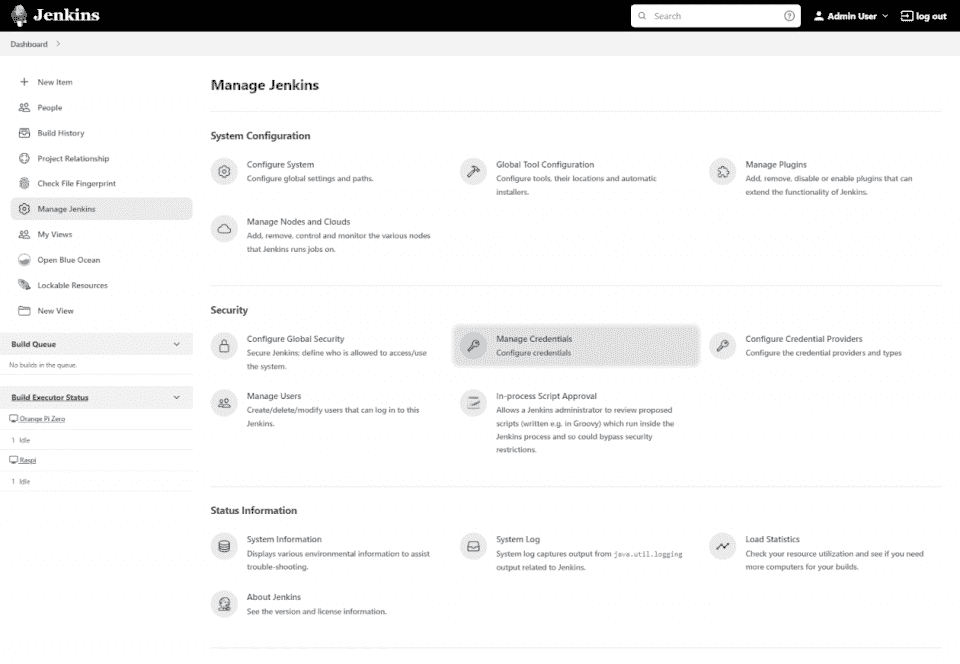
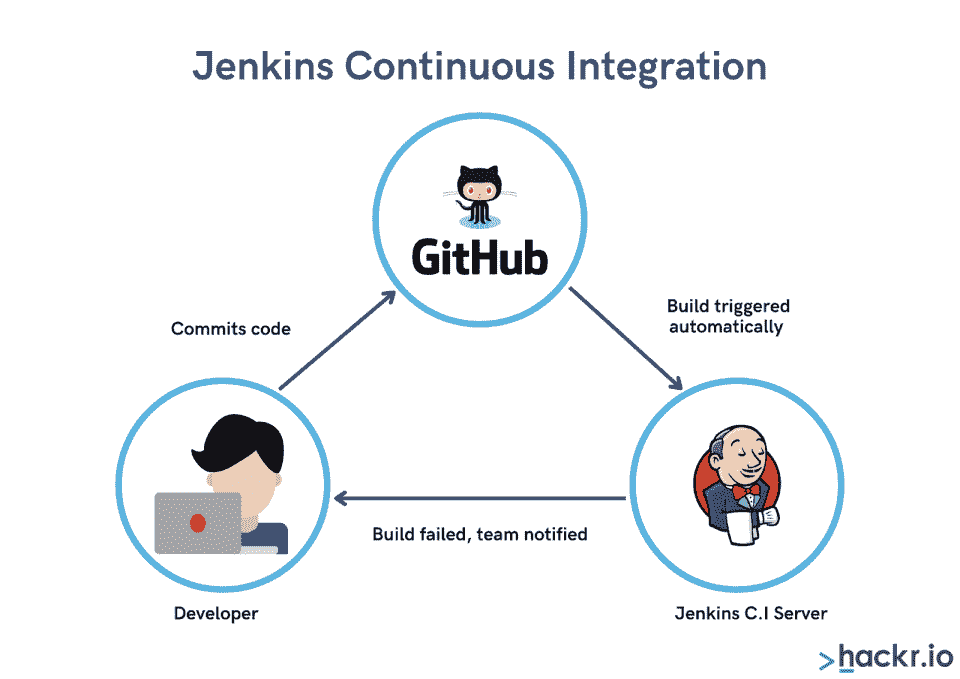
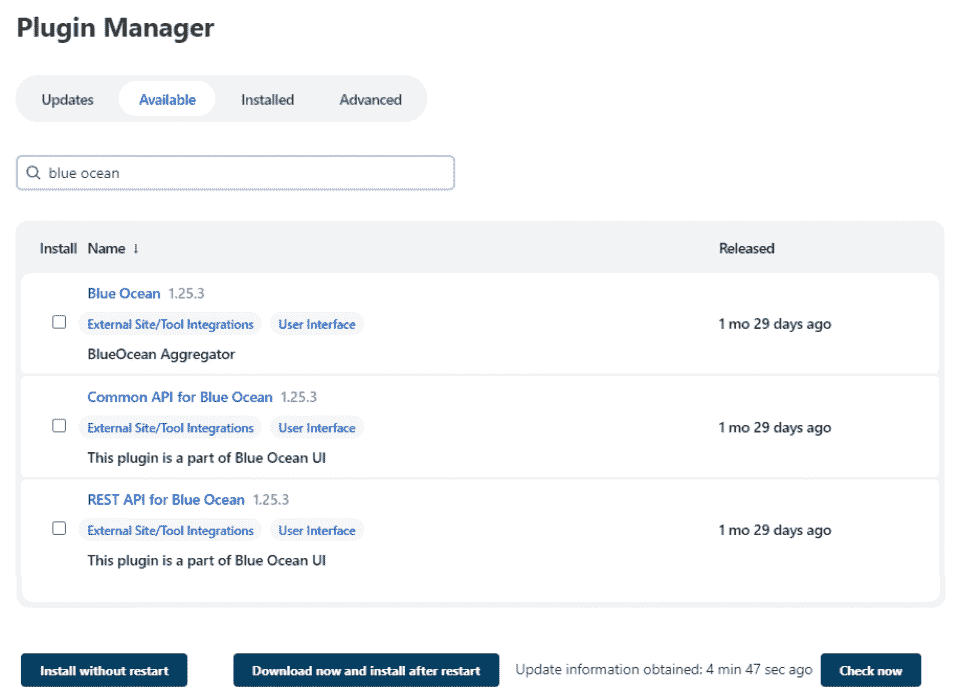
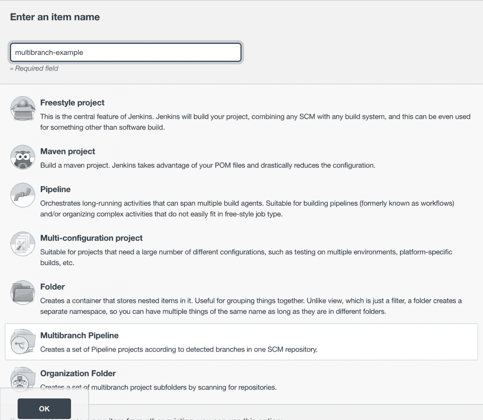
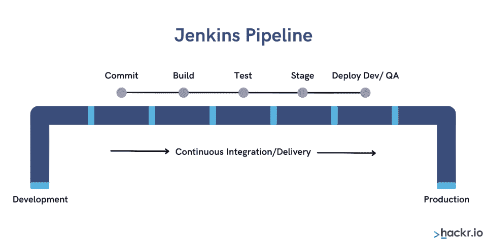
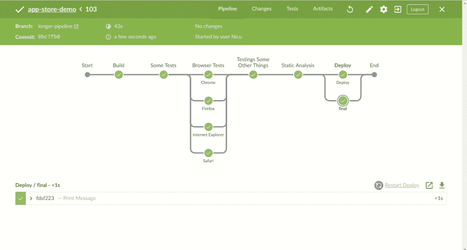
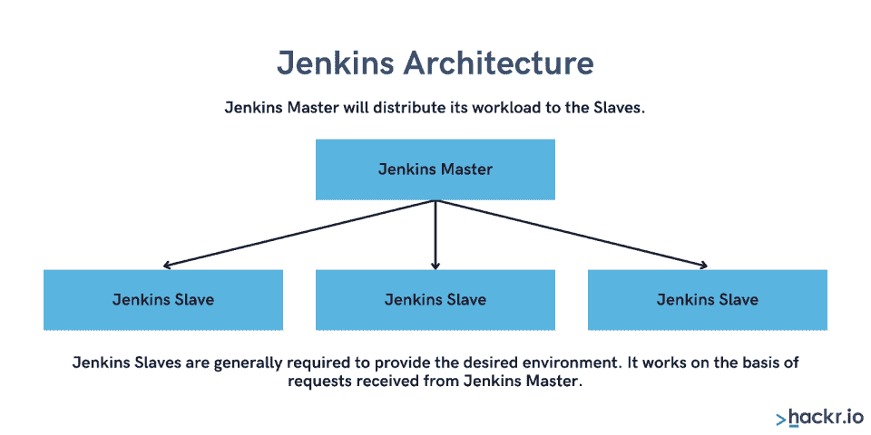

# 詹金斯是什么？它的工作原理、主要特性、优缺点

> 原文：<https://hackr.io/blog/what-is-jenkins>

当我们谈论持续集成或持续交付(CI/CD)工具时，有一个工具名列榜首:Jenkins。它是最著名的开源 CI/CD 工具，用于与其他几个云原生工具一起支持 [DevOps](https://hackr.io/blog/what-is-devops) 。

那么，什么是[詹金斯](https://www.jenkins.io/)？这是一个开源的自动化服务器。用 Jenkins automation 升级软件开发过程是可能的。在整个生命周期中，它帮助您管理软件交付过程。不同的生命周期阶段包括构建、测试、记录、打包、试运行、部署等等。

本文将帮助您详细理解 Jenkins 工具。现在，让我们来定义詹金斯。

## **詹金斯是什么？詹金斯解释道**

川口幸介在 2004 年创造了詹金斯。该套件的唯一目标是持续集成。Jenkins 是全球最受欢迎的连续交付解决方案。

Jenkins 用 [Java](https://hackr.io/blog/what-is-java) 编写，允许持续开发、测试和部署新创建的代码。

社区最初将 Jenkins 编写为一个构建和发布工具。它是一个基于服务器的应用程序，需要一个像 Apache Tomcat 这样的 web 服务器。Jenkins 允许用户不断地构建和测试项目，使开发人员更容易将更改集成到项目中，并使用户更容易获得新的构建。

图片:管理 Jenkins.png，Alt-Text:Jenkins 管理屏幕截图。

现在，我们来分析一下持续集成的概念！

## **什么是持续集成？**

持续集成是将几个开发人员在一个项目中所做的所有代码变更进行集成的过程。代码在提交后被反复测试，以保证代码没有错误。

*Alt-text:持续集成图*

开发团队有几个成员，所以多次提交可能会有 bug。有了 CI，在将变更推向生产之前，更容易及早发现这些错误。将每一段代码整合成一个可执行的形式，称为构建。如果这个构建是绿色的，那么执行的代码就可以部署了。否则，团队必须解决 bug 并从头开始重复整个过程。

此外，这个工具的主干是 Jenkins 社区。这个令人难以置信的社区支持这个项目，并在它的成功中发挥了重要作用。自开发以来，Jenkins 已呈指数级增长。目前，詹金斯的下载量和活跃用户都有数百万。

但真正的问题是，詹金斯是如何实现持续集成的？它使用插件来集成几个詹金斯 DevOps 阶段。如果你想集成，你所需要的就是安装插件，你就可以开始了！

## **詹金斯是干什么用的？**

作为一个持续集成工具，Jenkins 帮助开发团队在项目的早期阶段识别错误，并自动化新代码的集成过程。CI/CD 是 DevOps 流程的重要组成部分，在从初创公司到像网飞这样的大型科技公司的所有事情中都发挥着重要作用。

Jenkins 在开发过程中的实际参与情况如下:

*   开发人员开始向存储库提交代码，Jenkins 定期检查存储库
*   如果代码有变化，Jenkins 会编译代码
*   如果有一个失败的构建，开发人员会得到通知
*   如果构建成功，代码将被部署到生产环境中

它的几个大插件也很有用，因为它们提供了很多可定制性。总的来说，它非常灵活，可以在不同的环境下工作。Jenkins 还允许您基于特定事件安排测试，并且您可以设置这些测试的频率。您不必手动运行测试。

## **为什么要用詹金斯？**

所以，詹金斯是一个 CI/CD 工具。但是外面有很多这样的人。为什么您会选择 Jenkins 而不是其他 CI/CD 解决方案？

事实证明，詹金斯有很多好处。它有一个繁荣活跃的社区，易于部署，支持大多数环境。这是一个免费的开源解决方案，您可以根据自己的需要定制您的 Jenkins 发行版。

Jenkins 仍然是敏捷开发、CI/CD 和 DevOps 中最受欢迎的构建/测试解决方案之一，因为它无处不在。它蓬勃发展的社区提供了惊人的支持，它的代码库非常稳定。

在使用 Jenkins 之前，组织可能需要手动启动其测试解决方案——延长了 QA 流程，并使其成本大幅增加。在 Jenkins 之后，组织可以自动创建一个构建，并将其推向测试——这使得将提交推下 CI/CD 管道变得更加容易。

但这只是詹金斯的一个用途。Jenkins 作为一个全能的编排工具，在用于自动化时有很多优势。

## **詹金斯的特征**

Jenkins 有一些功能，可以作为 CI/CD 工具进行销售。这些是其中的一些:

*   插件
*   易于设置
*   支持大多数环境
*   开源
*   易于分发

### **插件**

数千个插件的可用性允许很大程度的可定制性。开发人员有机会将这些插件与开发和测试工具集成在一起，并定制架构以服务于许多可能性。

### **易于设置**

Jenkins 有可执行的软件包，可以很快安装在 Windows、Mac 和 Unix 操作系统上。它只是一个独立的 Java 程序，您可以在十分钟内设置好。

### **支持大多数环境**

Jenkins 支持大多数环境，包括基于云的架构。当团队开始使用不同的环境时，这很方便。它还支持所有主要的云平台，包括 Amazon、Azure、Google 和 IBM Cloud。

### **开源**

Jenkins 是开源的，可以免费使用。它有一个热情的开发者社区，经常举行面对面和在线会议。

### **轻松分发**

很容易将 Jenkins 分布到工作机器上，这使得构建、测试和部署更快。

### **安全**

Jenkins 提供开箱即用的安全工具来帮助组织保持其数据和系统的安全。这包括基于角色的访问控制、会话管理和加密等功能。此外，Jenkins 还集成了几个与安全相关的插件，以进一步增强其安全功能。

在[了解了基础](https://click.linksynergy.com/link?id=jU79Zysihs4&offerid=1045023.2673824&type=2&murl=https%3A%2F%2Fwww.udemy.com%2Fcourse%2Fjenkinswithavinash%2F&u1=blog%2Fwhat-is-jenkins_amcid-QMVrUNeJigMiQM7PogQoY)之后，我们来详细分析一下詹金斯的工作方式。

## **詹金斯如何工作**

想到这些，詹金斯会怎么做呢？Jenkins 如何改进您的流程？

最初，开发人员将代码提交给源代码。现在，Jenkins 服务器定期检查存储库。一旦提交发生，Jenkins 服务器就会发现并提取这些更改。此外，它还准备了一个新版本。

如果构建在两次测试之间没有通过，开发人员会被立即通知采取适当的措施。现在，Jenkins 准备将构建部署到一个允许在发布到生产管道之前进行任何用户验收测试(UAT)的环境中。

图片:詹金斯代码库 Management.png，Alt-Text:詹金斯代码库管理的截图。

上面执行的 UAT 测试是通过一个叫做 Selenium 的工具自动进行的。如果测试通过，代码被附加到主分支以创建一个黄金构建。然后直接部署到生产管道中。

测试之后，Jenkins 通知开发人员测试结果和构建。

现在，整个循环反复继续。

在 Jenkins 中，您可以很容易地找出哪个提交导致了构建失败。然而，如果所有的单元测试都通过了，构建管道将前进到下一个阶段。

Jenkins 在几台机器上运行并行构建，以减少完成其他活动所消耗的总时间。

此外，一些跨国公司，如谷歌和亚马逊，已经实现了连续交付的里程碑。它帮助他们一天数次部署到生产环境中。

Jenkins 的持续集成管道非常强大，包含多种不同用途的工具，如托管、监控、测试代码和编译。

以下是此类工具的列表:

*   持续集成服务器:Jenkins、TeamCity 等
*   源码控制工具:CVS，GIT，SVN 等
*   自动化测试框架:Appium，Selenium，UFT 等
*   构建工具:ANT，Ivy，Make，Gradle

## **什么是詹金斯管道？**

Jenkins 管道是几个连续任务和事件的互连。它是一个插件池，有助于持续交付管道的轻松集成和实现。

Jenkins 管道的主要特征是每个任务或作业都依赖于另一个任务或作业。然而，在连续交付管道的情况下，有不同的状态:构建、测试、部署、发布等。这些状态是相互关联的。

CD 管道是这些状态在其中工作的一系列事件。在发布之前，对软件所做的每一个改变都必须经过多个复杂的过程。

## **如何实现管道**

JenkinsFile 用于定义 Jenkins 管道。它是一个文本文件，用于在代码中实现管道。这个过程用 DSL 来解释。

两种语法定义了 JenkinsFile。

*   **脚本化管道语法:**带有将管道转换成原子命令的资源的语法，在 Jenkins master 上运行。
*   **声明性管道语法:**一种简单的语法，通过简单的方式来控制几个管道执行方面。

Jenkins 的一些优势包括:

*   审查管道的代码更容易。
*   你可以进行审计。
*   它帮助执行为几个分支创建的管道的完整请求。

Jenkins 利用持续集成能力自动化软件开发过程。

Jenkins 管道中可以有不同的用户来编辑和执行多个流程。此外，您可以暂停 Jenkins 管道进程，直到获得用户输出。

## **詹金斯架构**

Jenkins 坚持使用主从架构技术来管理分布式构建。

单个 Jenkins 服务器有一些障碍:

*   您可能想在几个环境中测试您的构建，但是您不能在一个 Jenkins 服务器上测试。
*   单台服务器无法承受较重项目的负荷。

因此，詹金斯提出了一种分布式主从架构:

*   詹金斯大师
*   詹金斯奴隶

### **詹金斯大师**

Jenkins Master 是主要的 Jenkins 服务器。它处理并直接执行大量任务，例如:

*   计划生成作业。
*   记录和展示构建结果。
*   将构建交付给从属服务器执行。
*   在线和离线监控从机。

### **詹金斯奴隶**

Jenkins slaves 在远程服务器上运行。Jenkins 主命令从执行几个任务。

以下是詹金斯奴隶的一些主要特征:

*   詹金斯从机必须服从詹金斯主机的命令，执行主机给出的构建任务。
*   从机可以在几个操作系统上运行。
*   可以将项目配置为在特定的从属机器上运行。

## **詹金斯 Docker 是什么？**

Docker 是一个容器化平台，允许您在容器中创建、部署和运行应用程序。

容器是一个自包含的单元，它将应用程序及其所有依赖项打包，以便应用程序可以快速可靠地从一个环境运行到另一个环境。

Docker 容器是轻量级和可移植的，这使得它们非常适合部署沙盒环境进行测试。Jenkins Docker 是一个插件，允许 Jenkins 与 Docker 进行交互。有了这个插件，你可以使用 Docker 运行 Jenkins 代理和构建——这对机器人测试自动化非常有用。

向前看，让我们揭开詹金斯的优点。

## **詹金斯的优势**

*   **用户友好且易于安装。**您不需要额外的安装或工具。
*   **独立于平台。**您可以在多种平台和操作系统上找到 Jenkins，如 Windows、Linux、OS X 等。
*   **配置简单。**您可以配置、修改或扩展它。此外，代码部署和报告生成都很快。对于持续交付和持续集成，您可以根据自己的需求配置 Jenkins。
*   **丰富的插件生态系统。** Jenkins 的大规模插件集合使其更加灵活，并允许跨多个平台进行构建、部署和自动化。
*   **免费。**还需要我们多说吗？
*   难以置信的支持。 Jenkins 是目前最流行的开源服务器；因此，敏捷团队可以在全球范围内解决您的问题。
*   **自动化集成。**这有助于在每个项目的过程中节省金钱和时间。
*   **容易发现的错误。**这让您不再需要大规模的覆盖错误的集成。

此外，通过与 Docker 合作，Jenkins 加快了开发团队在不同项目上的进度。它还在整个过程中为软件基础设施提供了敏捷开发。

## **詹金斯的缺点**

*   **难以管理。**它运行在服务器上，需要服务器管理员监控所有相关活动的技能。
*   在某些方面，与当前的 UI 趋势相比，它缺乏用户友好性。
*   安装和配置 Jenkins 的过程相当繁琐。
*   每当设置发生变化时，持续集成管道就会中断。集成停止了，需要开发人员的干预。

## **结论:詹金斯是怎么回事？**

那么，简而言之詹金斯是什么？

有了 Jenkins，软件公司可以升级[软件开发过程](https://hackr.io/blog/sdlc-methodologies)，快速地自动化、构建和测试过程。Jenkins 还允许您跟踪整个项目开发过程中的重复任务。

底线？如果你想提升你组织的软件开发进度，Jenkins 是你最好的选择！

想进一步了解詹金斯吗？

如果你真的想用你的詹金斯知识给人留下深刻印象？

[**探索詹金斯认证**](https://hackr.io/blog/jenkins-certification)

## **常见问题解答**

Jenkins 是一个 CI 工具和 CI/CD 工具，但它是*特别是*一个“持续集成”工具，而不是“持续部署/持续交付”工具。

您可以使用 Jenkins 来构建和自动化其他开发、测试和部署任务。

#### **2。詹金斯需要编码吗？**

不，詹金斯不需要编码。它是一个配置工具，允许你用一系列插件定义你的构建过程。您可以使用这些插件来自动化任务，比如编译代码、运行测试和部署应用程序。您还可以使用 Jenkins 来编排包含多个步骤和不同工具的复杂工作流。

詹金斯在技术上不是一个测试工具；然而，它被用来*自动化*测试。Jenkins t 可以自动化测试任务，例如运行测试和生成测试报告，但是这些测试是手动合并的。

#### **4。为什么在 Selenium 中使用 Jenkins？**

Jenkins 运行自动化的 Selenium 测试，作为持续集成(CI)或持续交付(CD)管道的一部分。这允许开发人员快速获得关于他们代码更改的反馈，并有助于确保尽早发现质量问题。