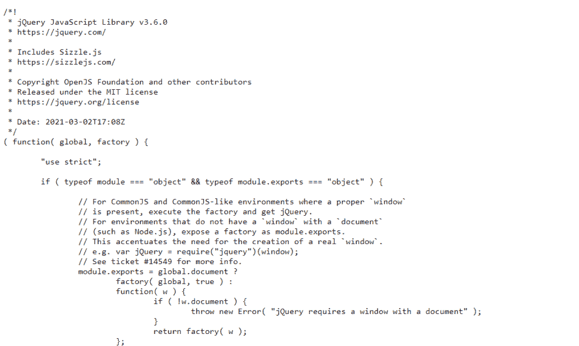
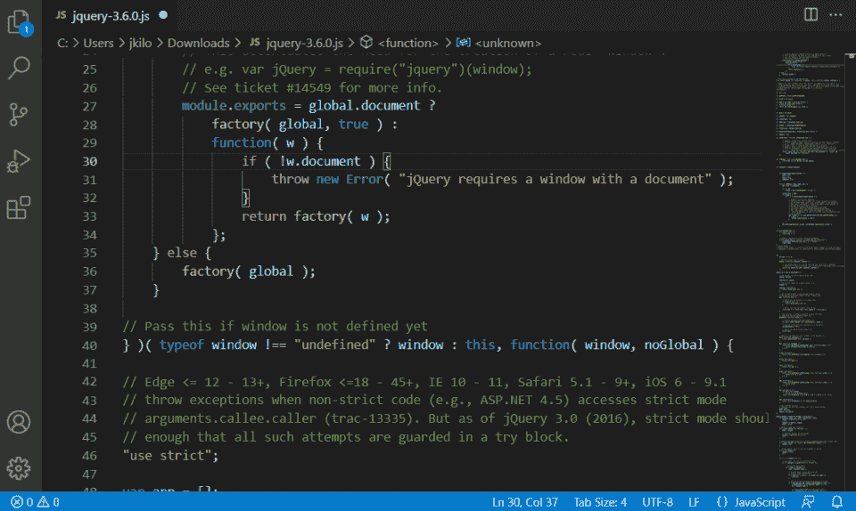
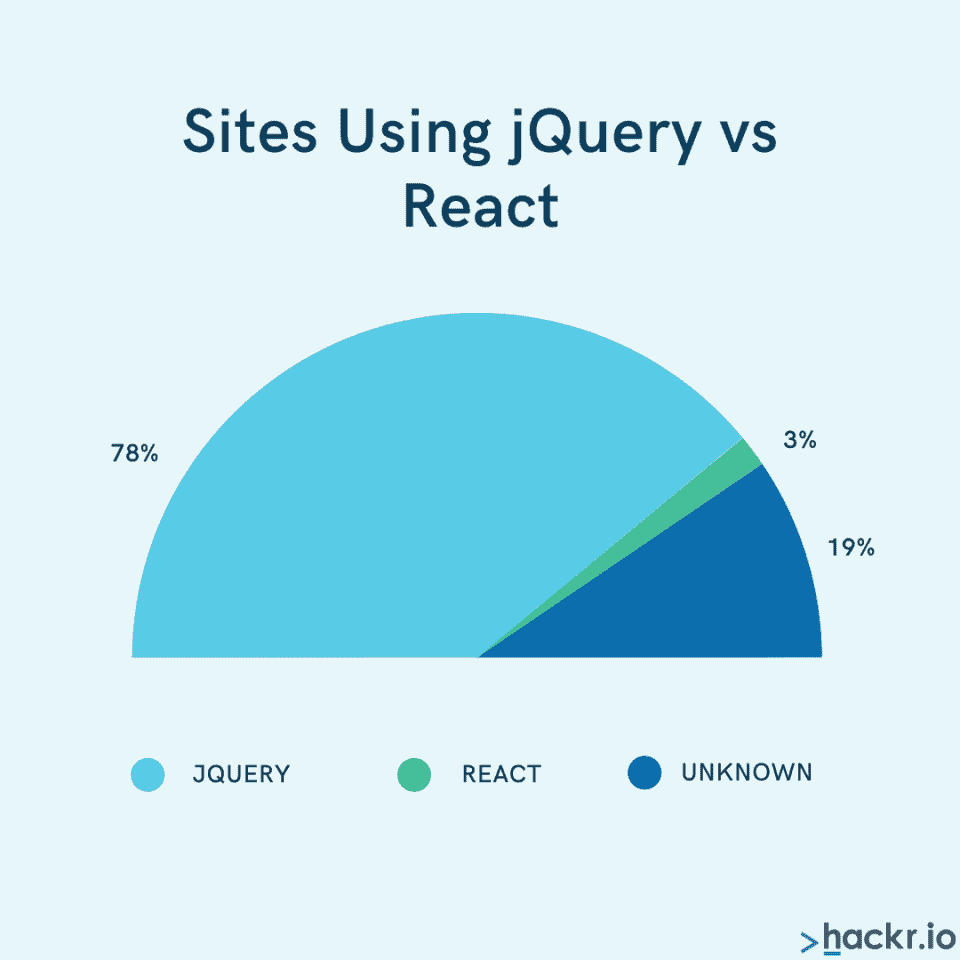
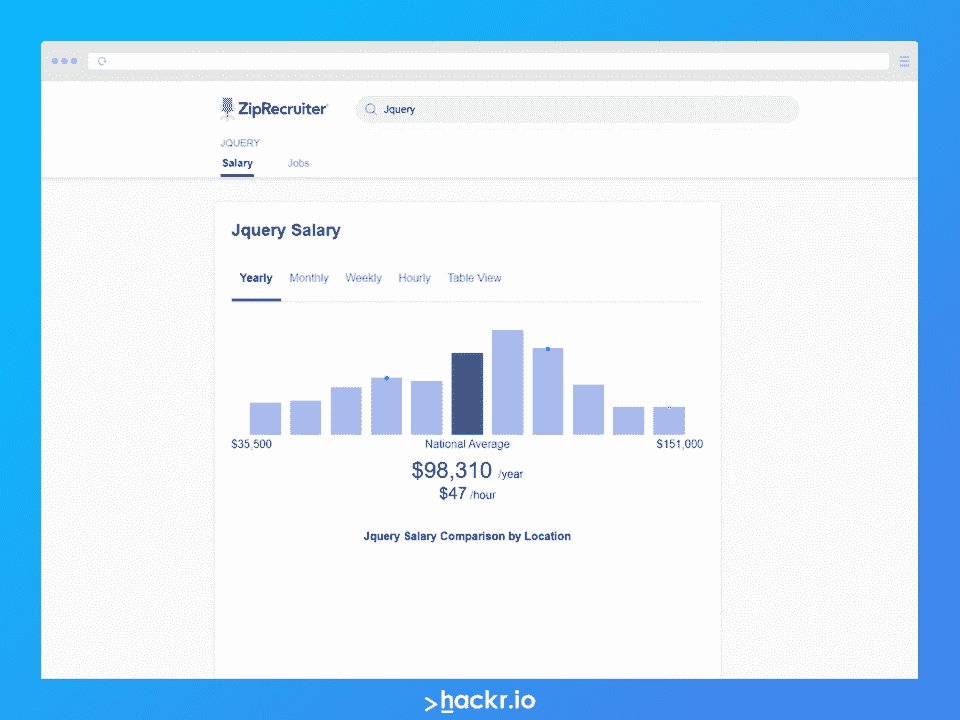

# 什么是 jQuery？

> 原文：<https://hackr.io/blog/what-is-jquery>

什么是 jQuery？jQuery 是一个 JavaScript 库，旨在简化 web 开发和设计过程。一款前端 web 开发工具，jQuery:

*   使开发更简单。 程序员不需要担心底层网站的错综复杂——他们可以马上开始开发。
*   **促进跨浏览器兼容性。** jQuery 可以响应多种平台和分辨率。
*   **增加参与度。** jQuery 包括动画和特效等功能，以创建更具吸引力的网站。
*   **提高可扩展性。** jQuery 加载页面更快，因此减少了渲染网站时使用的资源。 

jQuery 使用 JavaScript、CSS 和 HTML5 来提供流畅的跨平台用户体验。同时，jQuery 最初是在 2006 年发布的——这个产品已经过时了。

在下面的文章中，我们将讨论 jQuery 的用途，当前的 jQuery 版本，以及 jQuery 和 JavaScript 之间的主要区别。

## **什么是 jQuery？**

JavaScript 不是编译语言。相反，它通常使用客户端(如 web 浏览器)实时翻译。jQuery 是一个库——一个包含在 web 应用程序中的脚本，用于简化 web 开发过程。

jQuery 库看起来像任何其他 JavaScript 代码:

因为 jQuery 是一种基于浏览器的语言，所以它应该可以在任何符合当前 JavaScript 标准的浏览器上一致地工作。jQuery 不需要额外的资源，只要有 JavaScript 支持，它可以被插入任何网站。

然而，仅仅在网站中插入 jQuery 是没有任何作用的。开发人员需要知道如何调用 jQuery 元素以及如何访问 jQuery 库。

让我们更深入地了解一下 jQuery 是用来做什么的。

## **jQuery 是用来做什么的，谁使用 jQuery？**

jQuery 主要是前端开发者使用的。优步、Udemy 和 Twitter 都在他们的技术栈中使用 jQuery。事实上，即使是那些不再“使用”jQuery 作为其前端基础的网站，也可能仍然包含这个库，因为这个库被集成到了许多其他插件中。

**jQuery 最适合:**

*   寻求扩展知识的 JavaScript 程序员。
*   希望了解更多前端编程知识的全栈开发人员。
*   需要可靠的库和框架的有抱负的前端程序员。

任何用 JavaScript 开发 web 应用程序的人都可能受益于 jQuery 知识。虽然它现在是一个较旧的系统，但它已经集成到许多主要站点中。因此，开发人员可能不会在 jQuery 中创建网站，但他们可能会被要求维护一个网站。

## 如何使用或安装 jQuery？

您可以通过 GIT BASH 或 PowerShell 使用一个实用程序(如 Visual Studio)安装 jQuery，命令如下:

npm 安装 jquery

或者，您可以下载 [jQuery 脚本](https://code.jquery.com/jquery-3.6.0.js) 并将其包含在您的网站中，代码如下:

*<脚本 src = "[jquery location]"></脚本>*

这段代码将被放在你的 HTML 文档的“header”部分。您可以使用编辑器编辑 jQuery 库和周围的 JavaScript 代码，比如 Visual Studio:

但是因为 jQuery 是一个库，你需要通读 jQuery 的文档来理解如何使用它来设计一个网站。如果想进一步了解 jQuery 的用途，可以看看一些 jQuery 的例子。

## **jQuery 最重要的特性**

为什么 jQuery 如此流行，无处不在？主要是因为它提供了一系列令人难以置信的功能，并使开发人员能够轻松访问这些功能。

**jQuery 最重要的特性包括:**

*   **效果和动画。** 这个库使得在文本下放置阴影或者让文本“飞扑”进来成为可能。jQuery 可用于为单滚动应用程序和复杂的图库视图创建视差显示。
*   **阿贾克斯。** 通过 jQuery 的 Ajax 特性可以轻松访问外部数据。今天，Ajax 已经有点过时了——但是对于那些需要通过 JavaScript 加载访问的人来说，它仍然非常有用。
*   **CSS 操纵。** jQuery 与 CSS 和 HTML5 一起创建了一个更易于上层管理的整体平台。
*   **公用事业。** jQuery 有许多嵌入式实用工具，可以让管理 JavaScript 变得更容易，比如像浏览器版本一样拉变量的能力。这简化了 JavaScript(但是会让先学习 jQuery 然后再过渡到 JavaScript 的用户感到困惑)。

或许更重要的是，jQuery 也有各种插件和强大的社区支持。

如果您的 jQuery 脚本有任何问题，您可以随时向社区咨询。如果你需要代码片段，你可以在 Github 或者其他地方找到。而且有很多插件，你可以直接放进去。

因为 jQuery 是开源的，所以多年来它已经被大量的人改进、简化、维护和管理。任何潜在的问题、错误或漏洞都会迅速得到解决。

## **jQuery vs. JavaScript:两者有什么区别？**

jQuery 是用 JavaScript 写的。这是一个 JavaScript 库。程序员会通过 他们的 JavaScript 代码访问 jQuery *的函数。虽然可以在没有 jQuery 的情况下使用 JavaScript，但是没有 JavaScript 就不能使用 jQuery。*

如果你尝试用 jQuery 或 JavaScript 开发，你可能需要 IDE(如 Visual Studio)和编译器(如 Node)等工具。JS)。虽然 JavaScript 通常不是编译语言，但 Node.js 提供了在服务器端编译它的可能性。

jQuery 和 JavaScript 都是雇主经常寻找的非常受欢迎的技能。

如果你学习 JavaScript，你很可能会遇到 jQuery。但是通常不建议有人先通过 jQuery 开始学习 JavaScript。如果您在第一次学习 JavaScript 时学习 jQuery，您可能会养成坏习惯，或者无法学习库之间的底层技术。

[完整的 jQuery 课程:从初级到高级！](https://click.linksynergy.com/deeplink?id=jU79Zysihs4&mid=39197&murl=https%3A%2F%2Fwww.udemy.com%2Fcourse%2Fjquery-tutorial%2F)

## **jQuery vs . React:jQuery 还有相关性吗？**

全球超过 75%的顶级网站都在使用 jQuery。虽然它的用法有些被否决(今天大多数程序员都避免用 jQuery 开始使用应用程序)，jQuery 专家和分析师仍然非常受欢迎。这是因为许多现有的系统仍然依赖于 jQuery，仍然需要扩展和维护。

事实上，全球超过 78%的网站都在使用 jQuery。相比之下，React 的使用率仅为 3%左右。虽然 jQuery 不是最现代的 JavaScript 库或框架，但它的知识在业界仍然非常重要。

尽管如此，当你看看最近的趋势时，你也可以看到 React 正在迅速流行。因此，对于开发人员来说，不仅要学习 jQuery，还要学习其他框架和技术，这通常是一个好主意。

jQuery 和 React 并不相互排斥。有些应用程序确实会将 jQuery 与 React、Angular JS 或 Vue 一起使用。但是通常不建议这样做，因为系统之间有很多重叠。

## **jQuery 诉 angularjs 诉 vista**

除了 React(目前最流行的 [JavaScript 框架](https://hackr.io/blog/best-javascript-frameworks)，尽管 jQuery 仍然是最大的库)，还有 Angular JS 和 [Vue](https://hackr.io/tutorials/learn-vue) 。

[AngularJS](https://hackr.io/tutorials/learn-angular) 更适合 web 应用开发，而 jQuery 更适合 DOM 操作。但是 DOM 操作现在已经很少被使用了。

类似地，Vue 被视为 web 应用程序开发的一个更易于使用的选项，具有直观的框架和可靠的文档。但是 jQuery 更广为人知，也更容易访问。

它的核心是 jQuery 有点不同。 jQuery 是一组库，旨在使 JavaScript 更容易使用。 React、Angular JS、Vue 全是基于 JavaScript 构建的*框架* 让开发应用更快更简单。

## 使用 jQuery 有什么缺点吗？

为什么有些人认为 jQuery 已经过时了？现在，许多开发人员不建议用 jQuery 开始项目。但这并不意味着 jQuery 不是一项好技术。使用它有几个主要的缺点:

*   jQuery 非常庞大。 它不仅是一个随着时间增长的巨大的库，而且因为它没有被编译，整个脚本都是从网站上下载的。这可能会使网站运行缓慢、笨拙，并且难以扩展。
*   jQuery 会让学习 JavaScript 变得困难。 如果你还不知道 JavaScript，学习 jQuery 可能会阻碍你，因为 jQuery 掩盖了 JavaScript“幕后”发生的许多事情。可以从 JavaScript 学习 jQuery，但是不能从 jQuery 学习 JavaScript。
*   jQuery 的某些部分现在已经过时了。 这包括 jQuery DOM APIs 之类的东西。所使用的 jQuery DOM APIs 会让站点感觉迟钝或响应缓慢，从而降低网站的吸引力。

这些原因(以及其他原因)是人们逐渐远离 jQuery 开发的原因。但是已经有如此多的网站是用 jQuery 设计的，因此 jQuery 在未来的许多年里都将保持相关性。

## 当前的 jQuery 版本是什么？

在撰写之时， [目前 jQuery 版本最多的是 3.6.0](https://blog.jquery.com/2021/03/02/jquery-3-6-0-released/) ，2021 年 3 月 2 日发布。这包括一些 bug 修复、兼容性问题，以及一个“瘦”版本，该版本解决了 jQuery 经常抱怨的一些性能和大小问题。“瘦”构建省去了 Ajax 和 Effects 模块等模块，从而创建了一个更小、更具可伸缩性的系统。

自从第一次发布以来，jQuery 并没有太大的变化——但是目前的 jQuery 版本已经非常成熟和稳定了。尽管 jQuery 可能存在一些问题，但多年来，一个庞大而繁荣的社区已经对它进行了修改、支持和改进。

## **如何学习 jQuery**

由于 jQuery 是如此重要的基础语言，许多前端和全栈开发人员可能想要学习它。据 ZipRecruiter 称，jQuery 开发人员[的平均年薪接近 10 万美元。](https://www.ziprecruiter.com/Salaries/Jquery-Salary)

有人可以通过几种方式 [学习 jQuery](https://hackr.io/blog/how-to-learn-jquery) 包括:

*   在网上查找信息。 jQuery 有很好的文档记录，所以自学者只需在自己的机器上安装它就可以开始学习。
*   **翻阅** [**jQuery 教程**](https://hackr.io/tutorials/learn-jquery) **。jQuery 教程可以成为扩展知识的绝佳切入点。**
*   **获取** [**JavaScript 认证**](https://hackr.io/blog/best-javascript-certification) **。这些不仅仅是教你，也是向雇主展示你知道自己在做什么。**
*   **经历一个** **JavaScript 类或者 bootcamp** **。** 很多会涵盖 jQuery、React 等技术。
*   **Answering some** [**jQuery interview questions**](https://hackr.io/blog/jquery-interview-questions)**.** These questions will test your knowledge about jQuery and JavaScript.

    **结论**

## 希望您现在已经知道了这个问题的答案:什么是 jQuery？jQuery 是一个流行的 JavaScript 库，旨在简化 JavaScript web 应用程序的开发。jQuery 充分利用了 JavaScript、HTML5 和 CSS 的强大功能——所有这些都是为了制作看起来漂亮、干净、吸引人的网站。

你准备好开始学习了吗？您可以通过注册 jQuery 在线课程，开始您的旅程。

[最佳 Javascript 课程](https://hackr.io/blog/best-javascript-courses)

[Best Javascript Courses](https://hackr.io/blog/best-javascript-courses)