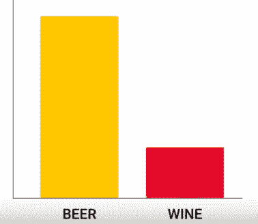
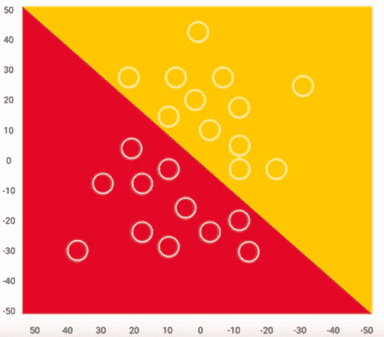
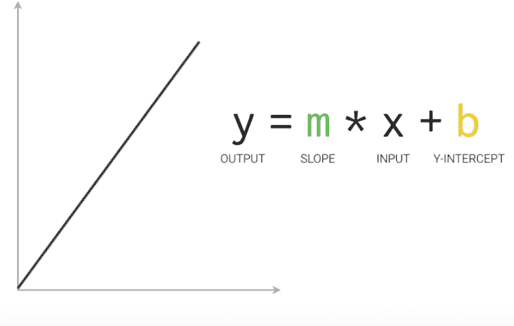
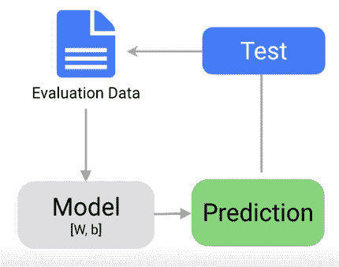
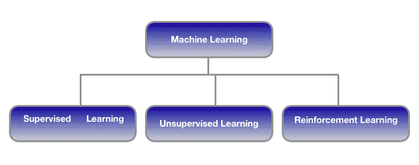

# 什么是机器学习？-定义、类型

> 原文：<https://hackr.io/blog/what-is-machine-learning-definition-types>

世界由数据组成，很多数据。数据大多以文档、音乐、视频、图片等形式存在。除了我们这些人之外，数据还来自许多其他资源，如手机、平板电脑、电脑和其他设备。传统上，人类分析数据并使系统适应数据模式的变化。然而，数据量超出了人类理解数据并手动编写规则的能力。

机器学习带来了从所有数据中获取意义的希望；这是一个自动化系统，可以从数据中学习，也可以从数据变化中学习。机器学习正迅速成为一个预期的功能，每个公司都在以某种方式在他们的产品中使用它。

## 什么是机器学习？[定义]

机器学习可以归结为五个词:

使用数据被称为训练，回答问题被称为做出预测或推断。培训是指使用我们的数据来创建和微调预测模型。预测模型可用于对以前未见过的数据进行预测，并回答这些问题。随着时间的推移，随着更多数据的收集，可以改进模型，也可以部署新的模型。

ML 的价值开始显现；像给照片中的物体和人加标签这样的事情是机器学习在起作用。在 YouTube 这样的视频应用中，推荐下一个要观看的视频也是由机器学习提供动力的。使用最多的谷歌搜索引擎的核心有许多机器学习系统，从理解你的查询文本到根据你的兴趣调整结果。今天，[机器学习应用](https://hackr.io/blog/real-world-machine-learning-applications)已经相当广泛，包括图像识别、欺诈检测和推荐系统。机器学习用于使人类任务比以前更好、更快、更舒适。我们期待我们的技术个性化、有洞察力和自我修正的那一天已经不远了。

## **机器学习是如何工作的？**

引擎盖下的机器学习是一个 7 步模型，包括:

1.  收集数据
2.  数据准备
3.  选择模型
4.  培养
5.  估价
6.  超参数调谐
7.  预言；预测；预告

现在让我们借助一个例子来讨论 ML 的工作流程:

在这个例子中，我们创建了一个系统来回答给定的饮料是葡萄酒还是啤酒的问题。

这个为回答问题而建立的系统被称为模型，它是通过训练过程创建的。机器学习要求我们建立一个准确的模型，这个模型能够正确地回答我们的问题。我们需要收集数据来训练模型，这是该过程的第一步。

### 1.收集数据

数据是从葡萄酒和啤酒杯中收集的。我们可以收集很多方面的数据，从泡沫的数量到玻璃的形状。在这个例子中，我们选择颜色作为光的波长，酒精含量作为百分比，并将它们称为特征。第一步包括我们从杂货店买一些不同的饮料，还需要一些测量设备一个测量颜色的分光计和一个测量酒精含量的比重计。

收集数据的步骤至关重要，因为所收集数据的质量或数量决定了预测模型的质量。收集每种饮料的颜色和酒精含量会产生一个颜色、酒精含量以及是啤酒还是葡萄酒的表格，这是我们的训练数据。

### 2.数据准备

该步骤要求将数据加载到合适的位置，并为我们的[机器学习训练](https://hackr.io/tutorial/machine-learning-stanford-university)做好准备。

我们放入数据，然后随机排序，因为我们不想让系统知道这不是确定饮料是啤酒还是葡萄酒的一部分。该系统必须能够确定饮料，是啤酒还是葡萄酒，而不考虑顺序。在这个阶段还可以进行相关的可视化，以查看不同变量之间是否存在任何相关关系，以及是否存在任何数据不平衡。如果我们为啤酒而不是葡萄酒收集更多的数据点，那么训练好的模型就会严重偏向于猜测它看到的几乎所有东西都是啤酒，因为大多数时候它都是对的。然而，在现实世界中，模型可能会遇到等量的葡萄酒和啤酒，因此有一半的时间它会猜错啤酒。

我们还将数据分成两部分，第一部分用于训练模型，第二部分用于评估训练模型的性能。需要评估模型的性能，因为我们不会使用训练模型的相同数据，因为它能够记住问题。收集的数据有时需要处理，如复制、[标准化](https://hackr.io/blog/dbms-normalization)、误差校正等。数据准备步骤相应地调整数据。

[机器学习 A-Z:Python&R in Data Science【2023】](https://click.linksynergy.com/deeplink?id=jU79Zysihs4&mid=39197&murl=https%3A%2F%2Fwww.udemy.com%2Fcourse%2Fmachinelearning%2F)

### 3.选择数据模型

研究人员和数据科学家多年来已经创建了几个模型。有些非常适合图像数据，有些适合文本或音乐等序列，有些适合数字数据。在我们的例子中，我们使用一个小的线性模型，因为我们有两个特征——颜色和酒精。

### 4.培养

训练也是机器学习过程的主要部分。这一步使用数据逐步提高模型预测给定饮料是葡萄酒还是啤酒的能力。直线的公式是

其中 x 表示输入，m 是直线的斜率，b 是 y 轴截距，y 是该位置 x 处直线的值，斜率 m 和 y 轴截距 b 是唯一可用于调整或训练的值。因为仅有的变量是输入 x 和输出 y，所以没有其他方法可以影响线的位置。在机器学习中，存在几个 m，因为可能有许多特征。从这些值构建一个称为权重矩阵 w 的矩阵。

同样，对于 b，我们把它们排列在一起，称之为偏差。训练包括初始化 w 和 b 的一些随机值，并试图预测这些值的输出。虽然一开始表现不佳，但可以将模型的预测与它应该产生的输出进行比较，并调整 w 和 b 中的值，以便下次有更准确的预测。如此反复这个过程。更新权重和偏差的每次迭代或循环被称为一个训练步骤。

### 5.估价

一旦训练完成，就该对模型进行评估了，看看它是否胜任和训练有素。评估允许我们用从未用于训练的数据来测试我们的模型。该指标使我们能够看到模型对尚未看到的数据的表现。评估旨在表示模型在现实世界中的表现。

### 6.超参数调谐

调整后，我们执行调整，以检查培训中是否有进一步改进的空间；这是通过调整我们的一些参数来实现的。下面列出了可以执行的参数调整示例:

训练集在训练期间运行的次数:我们可以多次显示数据，这样做，我们可能会导致更高的精度。

学习率:学习率根据前一个训练步骤的信息定义了每一步生产线移动的距离。对于复杂的模型，初始条件可以发挥重要作用，并决定训练的结果。差异取决于模型是否以初始化为零的值开始训练，而不是值的某种分布。

在培训的这个阶段，有许多考虑，你必须指定和定义什么是对你有用的模型；否则，我们可能会发现自己要调整很长时间的参数。

这些参数被称为超参数。

### 7.预测或推断

我们最终可以测试该模型，根据颜色或酒精百分比来预测给定的饮料是葡萄酒还是啤酒。机器学习使我们能够使用模型而不是人类的判断和标准规则来区分葡萄酒和啤酒。

## **机器学习的类型**

****

### 1.监督学习

学习的方法包括监督或指导一个特定的活动，并确保它被正确地完成。这是一种我们使用标记数据来训练机器的方法。

它解决了两种问题:

**回归:**是用于预测连续变量的预测性分析。例如预测股票的价格。

**分类:**涉及到预测一个标签或者一个类别。例如将电子邮件分类为垃圾邮件或非垃圾邮件。

### 2.无监督学习

在这种类型的学习中，机器在没有任何指导的情况下根据未标记的数据进行训练。它发现数据中隐藏的模式和趋势。

它解决了两种问题:

**关联:**它涉及发现数据中的模式，寻找共现，等等。

**聚类和异常检测:**聚类涉及目标营销，而异常检测跟踪异常活动。信用卡诈骗。

查看此处:[监督学习和非监督学习的区别](https://hackr.io/blog/supervised-vs-unsupervised-learning)

### 3.强化学习

在这种学习中，代理通过产生动作和发现错误和奖励来与环境进行交互。例如，一开始，一个未经训练的机器人对它所处的环境一无所知。所以在执行特定的动作后，它会发现更多关于周围环境的信息。机器人在这里被称为代理人，而周围的环境就是环境，所以对于它所采取的每一个行动，它都能收到奖励或惩罚。

## **机器学习的应用**

### 1.虚拟助手

谷歌助手，Alexa，Cortana，Siri，以及许多其他类似的谷歌助手以一种显著的方式改善了我们的生活。他们通过记录我们说的话，然后将其发送到服务器，这就是云。然后在机器学习和神经网络的帮助下解码代码，然后提供输出。该系统努力在没有 WiFi 的情况下工作，因为它无法联系服务器。

### 2.交通预测

地图根据两种方法预测交通是畅通、缓慢行驶还是严重拥堵:

特定日期特定时间在该路线上花费的平均时间。

来自谷歌地图应用和传感器的车辆实时位置数据。

我们都注意到，如果我们在网上搜索一些我们打算购买的产品，我们最终会在其他社交网站和应用程序如脸书和 Instagram 上看到关于该产品的推荐和广告。机器学习算法在推荐产品的背后起作用。

### 4.垃圾邮件过滤

通过垃圾邮件过滤器对邮件进行分析并将其分为垃圾邮件或非垃圾邮件。它的工作原理是分析收集的数据，并在邮件中搜索关键词，如“彩票”或“中奖者”。

垃圾邮件过滤器有以下几种类型:

*   内容过滤器
*   标题过滤器
*   通用黑名单过滤器
*   基于规则的过滤器
*   权限过滤器
*   挑战-响应过滤器

### 5.辅助医疗技术

在机器学习的帮助下，医疗技术在诊断疾病方面取得了创新。它允许分析 2D CT 扫描，并提出预测大脑中确切位置病变的 3D 模型。它对脑瘤和中风病变同样有效。它还应用于胎儿成像和心脏分析。

## 机器学习工程师的工资

| **1。入门级** |
| **2。中级** |
| **3。高级水平** |

资料来源:薪级表

## **总结**

机器学习正在成为本世纪的时尚领域。[机器学习 vs 人工智能](https://hackr.io/blog/ai-vs-machine-learning)是这些天的热门话题，因为它们都可以互换使用，人工智能只是研究训练系统来改进渐进给定的任务，而人工智能则是开发能够像人脑一样行为和执行任务的机器。

ML 已经成为组织想要添加任何产品的核心特性。它推动了自动化的理念，让人类更容易完成任务。它越来越受欢迎，应用领域越来越广，比如电子设备、智能家居、农业、健康等等。机器学习以这样或那样的方式在我们的日常生活中使用。你一整天都在使用机器学习吗？而且对你有帮助吗？怎么会？还有，让我们知道你更喜欢开发的机器学习技术？

请在下面的评论中告诉我们！

**人也在读:**