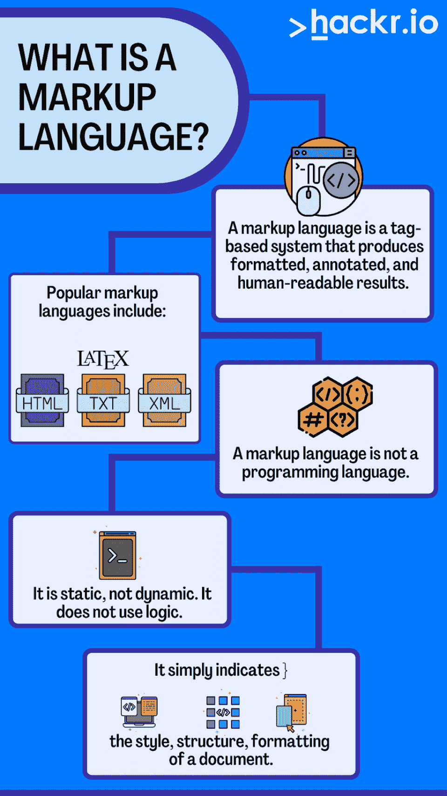

# 什么是标记语言？定义、历史、特征和应用

> 原文：<https://hackr.io/blog/what-is-markup-language>

你可能已经听说过“编程语言”——JavaScript、C++和 Python 等等。但是什么是标记语言呢？谁使用它们，我们为什么需要它们？

您可能会惊讶地发现标记语言是如此无处不在。全球最广为人知的开发者语言是一种标记语言: **HTML** 。

今天，我们将讨论标记语言的含义，如何学习标记语言，以及如何确定哪种语言最适合你。

## **什么是标记语言？【定义】**

让我们开始定义标记语言。

标记语言是一种基于标记的系统，它产生格式化的、带注释的、人类可读的结果。

HTML、XML 和 LaTeX 是最流行的标记语言，但是标记语言已经以多种形式存在了很长时间。

在 HTML 中，你可以写“ **HTML** ”这将显示为 **HTML** 。开始和结束标记指示粗体开始和结束的位置。

标记语言不是编程语言。它是静态的，不是动态的。它不使用逻辑。它只是指示文档的样式、结构和格式。

## **历史**

标记语言从 1967 年就已经存在了。第一种广泛使用的标记语言是 SGML，它是 GML 的变体，一些系统至今仍在使用。IBM 的开发人员使用 SGML 来创建易于阅读和分发的大型复杂文档。

1993 年，出现了最流行的标记语言( [HTML](https://en.wikipedia.org/wiki/HTML) )。开发人员和设计人员很快在整个万维网上采用了它。

XML 是一种更新的标记语言，但仍然非常流行。XML 开发于 1996 年，易于阅读和理解。开发人员经常使用 XML 在不同系统之间传输(导出和导入)数据。

## **特性**

当我们思考“什么是标记语言”时，我们考虑一些共同的特征。如果您想知道一种语言是否是标记语言，请将这种语言与以下特征进行比较:

*   标记语言使用**标签**来注释文本。标签是特殊的单词或字符，指示何时应该应用格式。
*   **标签成对出现**，有一个开始标签和一个结束标签。例如，在 HTML 中，粗体标签被写成< b >和< /b >。
*   位于开始和结束标签之间的文本将受到**格式**的影响。对于粗体标签，文档将以粗体显示文本。
*   标记语言**易于阅读**。在很大程度上，任何人都应该能够阅读和理解标记语言，即使他们不会写。
*   标记语言也有一个**语法**，或者一组规则，定义如何使用标签。这种语法允许一致和结构化的文档。

除此之外，标记语言可以有很大的不同，这取决于开发人员设计它们的目的。

## **应用程序**

设计师使用标记语言创建格式化文档。最常见的应用是创建网页，但标记语言也可以在文字处理、排版和电子出版中找到。

当然，HTML 是用来为网络格式化文档的。设计师可以用 HTML 创建一个完整的网站，而不需要任何逻辑编程。

## **优势**

标记语言容易学习和使用。即使没有编程经验的人也可以使用 HTML 创建一个基本的网页。

标记语言也不像编程语言那样严格；如果 HTML 出错，您不会收到编译器错误。出于这个原因，专家经常建议编程新手从学习标记语言开始。

## **缺点**

标记语言本质上是有局限性的。它们不像编程语言那样通用，不能用于创建动态或交互式应用程序。

大多数严肃的 web 开发都需要编程语言，如 [PHP](https://hackr.io/blog/what-is-php) 、Javascript 或 Python。

[HTML 课程，从头学习如何建立一个网页](https://click.linksynergy.com/deeplink?id=jU79Zysihs4&mid=39197&murl=https%3A%2F%2Fwww.udemy.com%2Fcourse%2Fhtml-course-learn-how-to-build-a-webpage-from-the-beginning%2F)

## **最流行的标记语言**

你准备好看看最流行的标记语言了吗？这不是一个详尽的列表。事实上，有无数种标记语言。因为标记语言非常容易使用，许多公司创建并使用他们自己的语言。但是有一些非常流行的标记语言:

| **参数** | **HTML** | **XML** | **SGML** | **特克斯** |
| **开发年份** | 1993 | 1996 | 1986 | 1978 |
| **用例** | 网站 | 结构数据 | 结构数据 | 排版和学术 |
| **当前版本** | HTML5 | XML 1.1 | ISO 8879 | 3.141592653 |
| **上次更新** | 2022 | 2006 | 1998 | 2021 |

### **什么是 HTML？**

HTML 或超文本标记语言是当今使用最广泛的标记语言。通过 HTML，开发者可以创建网页、网站和类似的数字文档。最精彩的部分？HTML 代码是**易于阅读和理解。**

HTML 是从更简单的标记语言如 SGML 和 GML 发展而来的。最初，HTML 由一小组标记组成，用来注释文本。但是到了 HTML 的最后一个版本，HTML5，这种语言变得更加复杂了。HTML 是当今所有 web 浏览器的标准，开发人员只需使用 HTML 就可以实现复杂的设计和格式化。

**快速问答:** HTML 和 CSS——哪一种是标记语言？许多人将 CSS 误认为是一种标记语言，因为它是静态的而不是动态的，并且因为它控制格式。但是 CSS 不是标记语言，因为它不涉及标记，即使它包括分类、类别和格式。

### **什么是 XML？**

XML 或可扩展标记语言是一种为存储和传输数据而设计的标记语言。它在使用标签注释文本方面与 HTML 相似。然而，XML 标签不像 HTML 标签那样是预定义的。您可以创建标签来描述您正在定义的数据。

XML 通常用于在不同系统之间交换数据。它有时也用作数据库格式。如今，XML 最常见的用途是创建网站地图——网站的分层指南。

### **SGML 是什么？**

SGML，或标准通用标记语言，是 XML 和 HTML 之前的标记语言。IBM 的开发人员创造了 GML 来设计易于阅读和分发的大型复杂文档。最终，GML 演变成了 SGML，并被 XML 和 HTML 取代。

今天，SGML 不像以前那样被广泛使用。然而，它仍然被用于一些行业，如航空航天和工程。

### **什么是 TeX？**

作为最古老的标记语言之一，TeX 是一种用于高质量文档和手稿的排版语言。TeX 在学术界尤其受欢迎，在学术界，复杂的数学公式需要清晰易读。

您可以使用 TeX 创建数字和打印文档。它有时也用于创建标志或其他图形。LaTeX 是基于 TeX 的排版语言和软件平台，流行于学术界。

还有其他的标记语言。事实上，作为一个练习，你可以创造自己的。因为标记语言非常简单，你甚至可以编写一个标记语言编译器。

## 标记语言是用来做什么的？

因此，我们知道标记语言可以创建有吸引力的、可读的、格式良好的文档和数据。

但是什么是标记语言的实际应用呢？

除了创建网站，开发人员还可以使用标记语言导入和导出数据。标记语言可用于创建人类和计算机都能阅读的数据文件格式。工程师和开发人员可以将标记语言用于高度技术性的活动，在这些活动中，数据必须被适当地格式化和控制。

## 谁使用标记语言？

标记语言有广泛的应用。web 开发人员使用它们来创建网站，学者使用它们来格式化文档，工程师使用它们来以可访问的格式存储数据。

事实上，对于任何需要创建格式化文档或结构化数据的人来说，标记语言都是一个很好的选择。

大多数 web 开发人员会在学习其他编程语言之前学习标记语言。HTML 和 XML 经常被用来向开发人员介绍编程。开发人员通常会从 HTML 转向 CSS 和 JavaScript。

标记语言对于教育系统也非常重要。例如，那些开发数字学习程序和信息档案的人将经常使用标记语言。

## **学习标记语言的理由**

全世界有数百万人出于各种各样的目的使用标记语言。以下是学习标记语言的一些原因:

*   **Web 开发:**大部分 Web 开发人员需要知道至少一种标记语言来创建网站。记住，CSS 不是一种标记语言——虽然它确实产生格式，但它不利用标记系统。
*   数据存储和传输: XML 可以像基本数据库一样存储和传输数据。
*   **印刷和数字文档；** TeX 通常用于创建高质量的打印和数字文档。
*   **学术研究:**许多学者使用标记语言来格式化他们的论文和研究。学术研究必须格外严谨，尤其是在数学、算法和资源方面。
*   **创建文件格式:**你可以使用标记语言创建易读的文档文件格式。

简而言之，当你处理数据或格式时，标记语言会有所帮助。

## 从哪里可以学习标记语言？

现在，你可以在哪里学习标记语言？

首先，决定你想学哪种标记语言。虽然 HTML、XML 和 LaTeX 都是标记语言，但它们并不等同。

对于那些想了解更多的人来说，网上有很多教程、项目和训练营。

## **结论**

那么，什么是标记语言呢？当然，这是任何网站的基石！这是标记语言的基本含义:一种使用人类和机器可读的标签来格式化文本的方法。

计算机科学中最常用的标记语言是 HTML。但是也有其他的标记语言，比如 XML 和 TeX。一旦你对标记语言有了更多的了解，你会更频繁地注意到它们。

想了解更多关于 [HTML 和其他标记语言](https://hackr.io/blog/difference-between-html-html5-xhtml)？没有像今天这样的时间。从哪里开始最好？

## **常见问题解答**

#### **1。什么是标记语言示例？**

三种最常见的标记语言是 HTML、XML 和 LaTeX。虽然这些可能是最受欢迎的，但还有数百种(如果不是数千种)活动标记语言。许多软件公司使用专有标记语言，无论是用于内部文档还是数据存储和处理。

#### **2。HTML 是唯一的标记语言吗？**

HTML 是最成功和最流行的标记语言，但不是唯一的。虽然其他标记语言有专门的应用(如学术界)，但 HTML 对于构建网站是必不可少的。

#### **3。HTML 为什么叫标记语言？**

术语“标记语言”指的是编辑可能做的草稿的“标记”。在报纸或杂志上，编辑可能会将某些文本加粗、倾斜、加下划线或加标题。HTML 也是如此。

#### **4。什么不是标记语言？**

CSS 通常被称为标记语言，但它不是。虽然 CSS 是静态的，并且确实帮助开发人员管理他们的格式，但它不是传统的标记语言，因为它不是以封装的标签格式编写的(例如 **this** )。相反，定义和样式是与数据分开定义的。

#### **5。标记语言和编程语言有什么区别？**

标记语言是一种基于标记的静态语言，主要关注格式和设计。编程语言是一种基于逻辑的动态语言，专注于提供交互式体验。

#### **6。写标记语言需要什么程序？**

大多数标记语言可以用纯文本编写。只需启动记事本并开始。但是你也可以用流行的 ide 写标记语言，比如 NetBeans 或者 Visual Studio。