# 什么是 MySQL？【定义】完全的初学者指南

> 原文：<https://hackr.io/blog/what-is-mysql>

MySQL 是由瑞典公司 MySQL AB 创建的，被科技世界的许多商业巨头所使用。但是 MySQL 到底是什么？它是由 [C 和 C++](https://hackr.io/blog/difference-between-c-and-cplusplus) 等编程语言组成的数据库管理系统，帮助你管理关系数据库。您可以根据您对这个免费开源软件的独特需求修改其源代码。

用户可以在几个平台上访问 MySQL，分别是 Unix、 [Windows、Linux](https://hackr.io/blog/linux-vs-windows) 。它在可靠性和可扩展性方面表现出色。此外，MySQL 是 LAMP 堆栈的重要组成部分。LAMP 栈包括 Linux、Apache、MySQL 和 PHP。让我们来探索 MySQL 的定义、用途和重要特性！

## **什么是 MySQL 数据库？**

数据库是数据的结构化集合。你可以在任何地方找到数据库。

关系数据库将数据分成不同的部分，并将它们存储在表中。表格只包含行和列，充当大量数据和信息的存储单元。

在大数据生态系统中，MySQL 是使用最多的技术之一。它被认为是最流行的数据库，在各行各业得到了广泛而有效的应用。有了 MySQL，即使是初学者也可以立即构建强大而快速的数据存储系统。此外，接口和语法易于实现。

可以肯定地说，MySQL 是最流行的软件栈中不可或缺的一部分，它帮助构建和处理数据驱动的 B2B 服务的 web 应用程序。

现在我们已经介绍了 MySQL 的基础知识，让我们继续了解 MySQL 是如何工作的。

## MySQL 是如何工作的？

你一定很想了解 MySQL 是如何工作的。MySQL 有一个客户端-服务器架构。它用于网络环境，服务器程序负责与数据库的所有交互。它与数据库文件驻留在同一个系统上。

一些客户端程序，如 MySQL 工具或任何用其他编程语言编写的应用程序，通过连接到服务器来发出数据库请求。然后，服务器处理客户端请求，并将结果发送回客户端。

客户机可以选择与服务器保持在同一个系统上，或者切换到远程主机并向服务器发送数据库请求。您必须记住，MySQL 服务器必须处于运行状态，以便客户端可以连接。

简而言之，MySQL 环境的主要流程如下:

*   [MySQL 创建一个数据库](https://hackr.io/blog/mysql-create-database)来存储或操作数据，并定义每个表的关系。
*   客户端可以在 MySQL 上键入特定的 [SQL 语句](https://hackr.io/blog/sql-commands)来发出请求。
*   服务器应用程序用所请求的信息进行响应，并在客户端被接收。

## **MySQL 是用来做什么的？**

MySQL 是基于 SQL 的关系数据库管理系统。您可以将它用于多种用途，如电子商务、数据仓库、创建 web 应用程序、b2b 服务、日志应用程序等等。

然而，MySQL 最常见和最受欢迎的用途是构建 web 数据库。它可以用来存储任何东西，从一条信息到网上商店的海量数据的整个产品清单。

此外，您可以将其与 PHP 或 Perl 等脚本语言相关联，以创建与 MySQL 数据库实时交互的网站。这是非常有益的，因为它可以快速地向网站客户或访问者显示分类信息。

继续，让我们更多地了解 MySQL。

## **关系数据库和客户-服务器模式**

人们常常不清楚 MySQL 是否是一个数据库。MySQL 是数据库吗？

MySQL 是基于结构化查询语言(SQL)的关系数据库管理系统(RDBMS)。此外，关系数据库就像一个用于收集数据并按照关系模型组织数据的数字商店。

现在，MySQL 有两个基本组件:关系数据库和客户机-服务器模型。为了更好地理解这两者，让我们深入研究这两个概念。

### **关系数据库**

在一个地方存储数据有多种方法。MySQL 使用关系数据库来达到这个目的。数据不是累积在一个大单元中，而是存储在称为表的多个行和列中。

如果您希望存储两种数据:

*   客户:姓名
*   订单:名称、颜色、价格、制造商等。

…然后，这些数据必须被分成两部分并组装到一个关系数据库中。如果没有，您可能会面临一些障碍，例如:

*   冗余:例如，客户名称可能与不同甚至相同的产品类别相同。在这种情况下，您很难管理数据。
*   管理:将订单数据与客户数据进行匹配会变得非常不方便

关系数据库处理这样的障碍。它为客户创建一个表，为订单创建另一个表。

现在，如果您希望一次看到单个客户的所有订单，该怎么办呢？关系数据库为此提供了一个关键。关键字帮助您将数据与两个表链接起来。因此，您可以根据需要组合不同表中的数据。密钥是唯一的，以数字 ID 号的形式出现。

现在，让我们转向客户端模型。

### **客户端模型**

MySQL 使用客户端模型和关系数据库。

所有数据都保存在服务器上。要取回它，你需要提出一个请求。这个请求是由客户端发出的，目的是获取所需的信息。

为了清楚起见，这里有一个例子。如果您访问任何网站并想要访问可用的网页，该网站会向数据库服务器发送几个 SQL 请求，以便在您的 web 浏览器上显示信息。

## **MySQL 的特性**

MySQL 有太多的相关特性。让我们来看看:

*   开源:MySQL 是开源的。任何人都可以根据需要下载、使用或修改。它很容易理解，而且免费。MySQL 使用 GPL，即通用公共许可证。它提到了关于应用程序该做什么和不该做什么的规则和条例。
*   可伸缩性:MySQL 是高度可伸缩的。它可以处理少量或大量的数据，多台机器，更无缝地，改善客户的体验。
*   可靠且速度极快:数据高效地存储在 MySQL 中。它保证一致性和零冗余，使用户可以快速访问数据
*   高度安全:MySQL 有一个强大的密码系统支持，这使它成为一个安全的界面。
*   易于管理:该软件易于下载和访问。如果您希望计划任务，可以使用事件计划程序。
*   健壮:MySQL 为您提供分布式多版本支持，并具有 ACID(原子性、一致性、隔离性、持久性)属性
*   令人难以置信的性能:使用该软件，您可以获得表索引分区和内存缓存。
*   24/7 支持:您可以在任何平台上使用 MySQL，并随时找到对开源版和企业版的支持。

既然您已经非常熟悉 MySQL 的特性和优点，下面是它支持的数据类型。

## **MySQL 数据类型**

MySQL 中有不同类型的数据类型。我们将其分类如下:

*   数字数据类型
*   日期和时间数据类型
*   字符串数据类型
*   空间数据类型
*   二进制大对象数据类型

### **数字数据类型**

1.  TINYINT: TINYINT 可以是有符号的，也可以是无符号的。在有符号的情况下，范围从-128 到 127 不等。无符号范围是 0 到 255。
2.  SMALLINT:泰语数据类型可以是有符号的，也可以是无符号的。对于有符号的情况，范围从-32768 到 32767 不等。无符号范围是 0 到 65535。
3.  MEDIUMINT:无论有符号还是无符号，这个中等整数范围在有符号时从-8388608 到 8388607 变化。无符号范围是 0 到 16777215。
4.  FLOAT (m，d):浮点数不能是无符号的。m 是显示长度，而 d 是小数位数。
5.  DECIMAL (m，d):这个数据类型是一个未打包的浮点数。每个十进制数代表一个字节。
6.  DOUBLE(m，d):这是一个双精度浮点，不能带符号。m 表示显示长度，d 表示小数位数。
7.  INT: INT 既可以是有符号的，也可以是无符号的。在有符号的情况下，范围是-2147483648 到 2147483647。无符号范围是 0 到 4294967295。
8.  BIGINT: BIGINT 要么是有符号的，要么是无符号的。在有符号的情况下，范围是-9223372036854775808 到 9223372036854775807。无符号范围是 0 到 18446744073709551615。
9.  BOOL:该数据类型显示真或假条件。
10.  布尔型:与布尔型相同。

### **日期和时间数据类型**

1.  日期:格式为年-月-日。范围从 1000-01-01 到 9999-12-31 不等。
2.  时间:它遵循“时:分:秒”的格式。范围在'-838:59:59 '到' 838:59:59 '之间。
3.  日期时间:格式为“yyyy-mm-dd hh:mm:ss”。范围是“1000-01-01 00:00:00”到“9999-12-31 23:59:59”。
4.  时间戳(m):它遵循“YYYY-MM-DD HH:MM:SS”格式。范围是世界协调时 1970-01-01 00:00:01 到 TC 2038-01-19 03:14:07。

### **字符串数据类型**

对于多种字符串数据类型，最大长度为 255 个字符，这意味着一个字符串可以存储的字符总数。以下是这些数据类型:

1.  茶
2.  可变长字符串
3.  小文本
4.  文本
5.  二进制的
6.  VARBINARY

其他字符串数据类型如下所示:

1.  文本:最大长度为 65535 个字符。
2.  MEDIUMTEXT:最大长度为 16777215 个字符。
3.  LONGTEXT:最大 4GB 或 4294967295。
4.  ENUM:它最多可以容纳 65，535 个值。

### **空间数据类型**

1.  几何学
2.  要点
3.  线串
4.  多边形
5.  几何收藏
6.  多点
7.  多点字符串多多边形
8.  **二进制大型对象数据类型(BLOB)**

### BLOB:最大大小为 65535 字节。

1.  TINYBLOB:最大 255 字节。
2.  LONGBLOB:最大大小为 4，294，967，295 字节。
3.  MEDIUMBLOB:最大 16777215 字节。
4.  [从初级到高级的 MySQL、SQL 和存储过程](https://click.linksynergy.com/deeplink?id=jU79Zysihs4&mid=39197&murl=https%3A%2F%2Fwww.udemy.com%2Fcourse%2Fmysql-and-sql-from-beginner-to-advanced%2F)

**如何安装 MySQL 数据库服务器？**

## 要在您的 Windows 系统上安装 MySQL，请一步一步地遵循下面提到的过程。

第一步是下载 MySQL 安装程序。

**下载 MySQL 安装程序**

### MySQL 安装程序帮助您安装 MySQL 以及其他一些重要的组件，即 MySQL 通知程序、示例数据库、文档、可用的连接器、MySQL 服务器以及用于 Microsoft Visual Studio 和 Microsoft Excel 的重要工具。

要下载，请访问下面的链接:
[http://dev.mysql.com/downloads/installer/](https://dev.mysql.com/downloads/installer/)

您将在这里找到两个文件。如果您希望在线安装 MySQL，请使用:

MySQL-安装程序-web-社区- <version>。可执行程序的扩展名</version>

另一方面，如果您希望以离线模式下载，请使用以下链接:

MySQL-安装程序-社区- <version>。可执行程序的扩展名</version>

现在，

**第一步:**

#### 转到 MySQL 安装程序文件，双击它来启动 MySQL 配置。

接下来，选择安装类型。点击完整选项，安装 MySQL 产品及其相关功能。

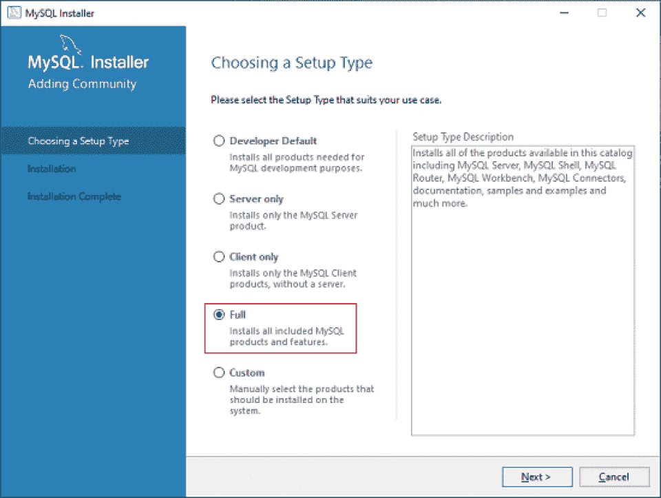

**第二步:**

#### 单击执行安装所有产品。

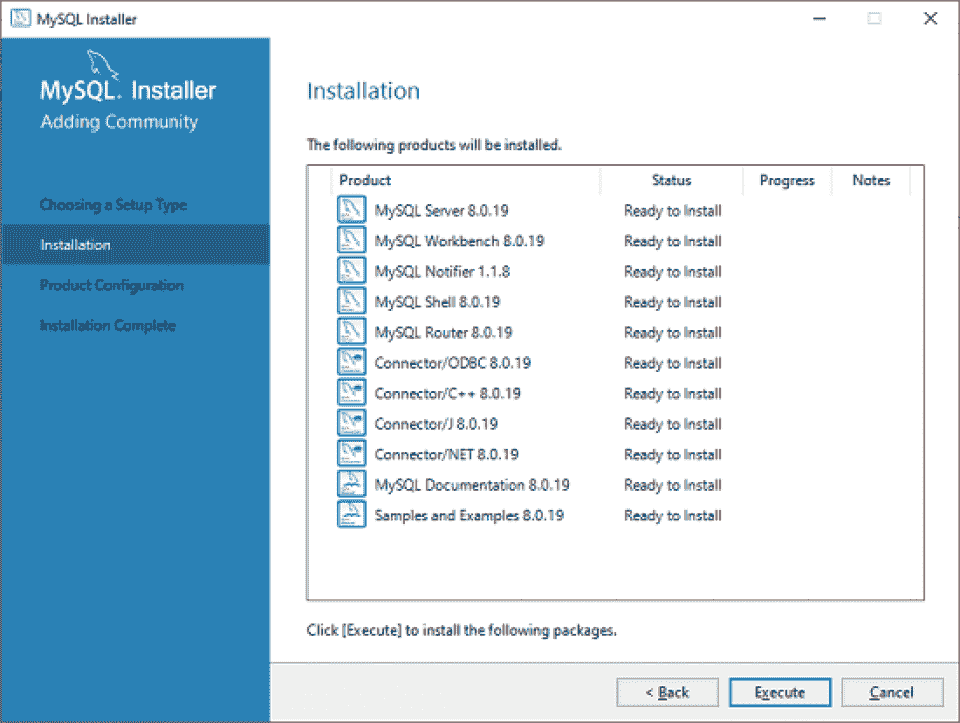

**第三步:**

#### 现在，单击独立 MySQL 服务器/经典 MySQL 复制复选框。点击下一个。根据您的需求选择 InnoDB 集群。

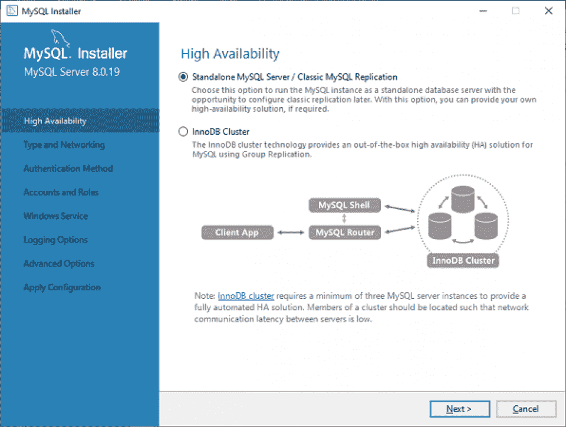

**第四步:**

#### 下一个屏幕要求您选择配置类型，并显示连接选项。单击配置类型选项，并选择开发机器选项。现在，将连接设置为 TCP/IP，端口号设置为 3306，如下图所示。

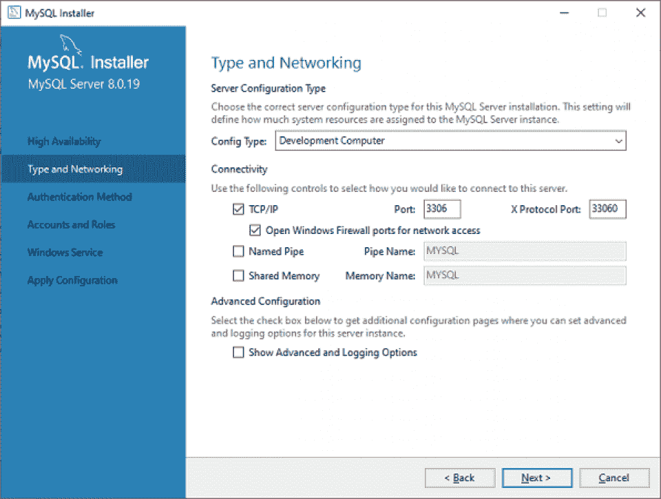

**第五步:**

#### 在身份验证方法向导中选择第一个选项，并设置适当的 MySQL root 帐户密码。设置强密码。

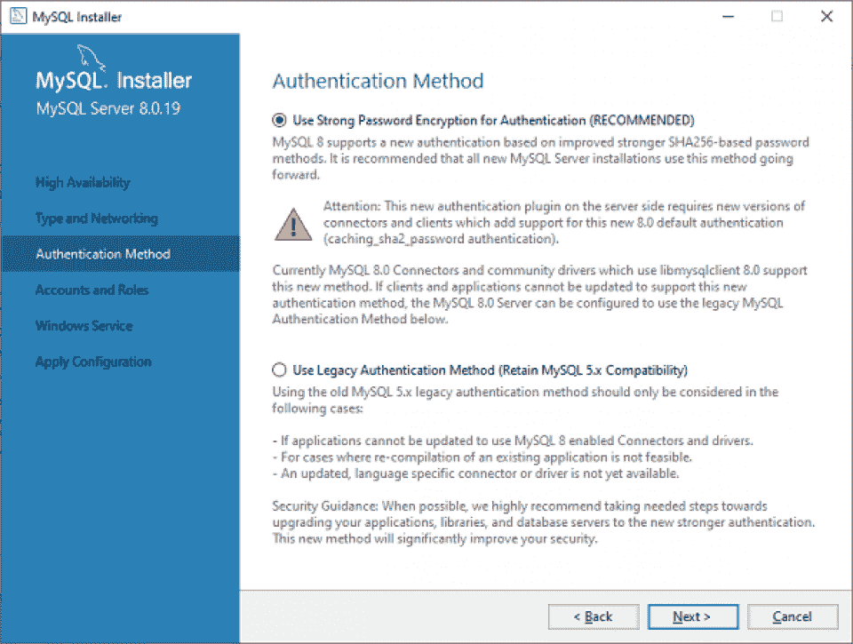 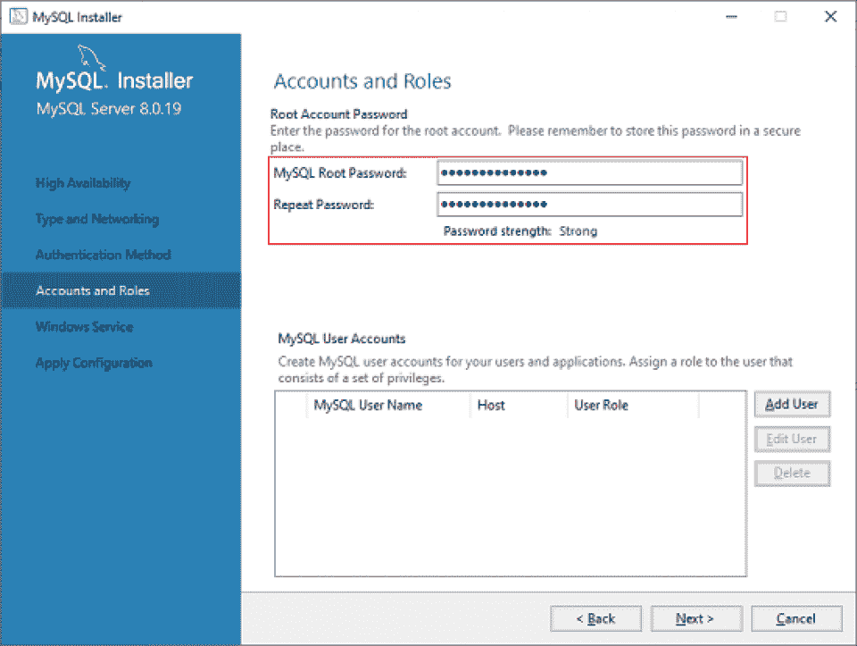

**第六步**

#### 另一个向导将出现在您的屏幕上，要求您应用服务器配置。检查配置并选择执行。配置成功完成后，您的屏幕将显示如下所示的弹出窗口。完成后点击完成按钮。

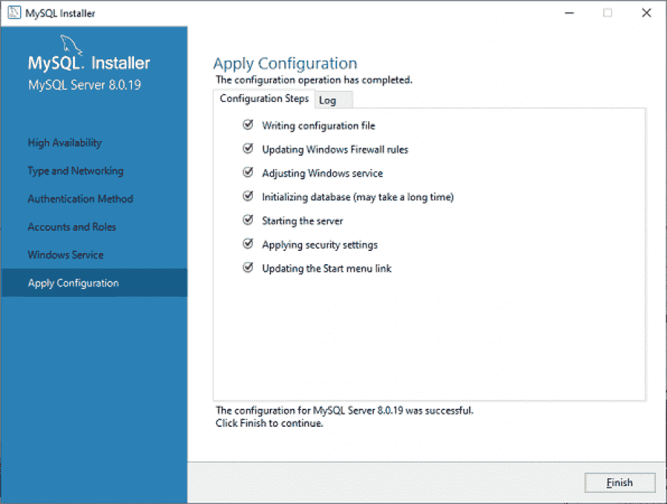

**第七步**

#### 下一步是路由器配置。选择下一步，然后选择完成。

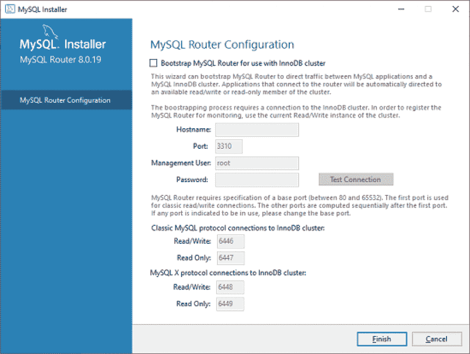

**第 8 步**

#### 这一步要求输入您之前设置的 root 密码。输入密码后，检查连接是否成功。如果是，单击执行按钮。

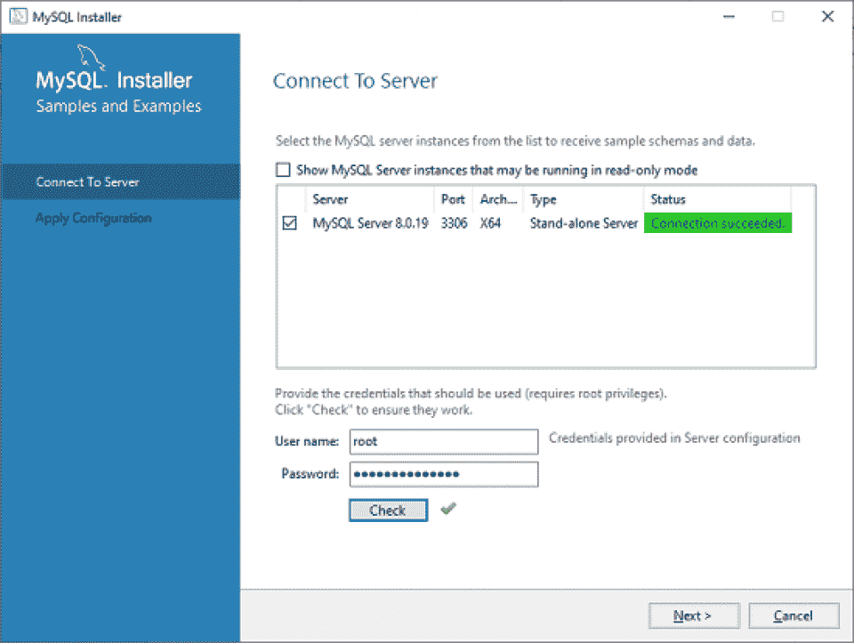

至此，您的配置就完成了！

**第 9 步**

#### 显示屏上出现如下所示的屏幕。点击完成。

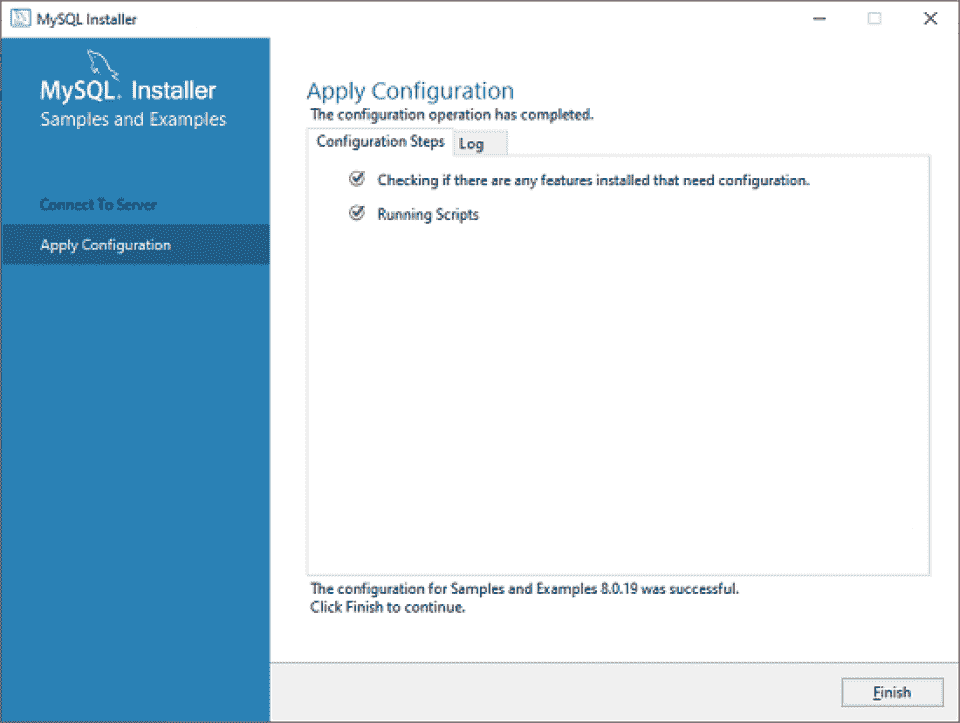 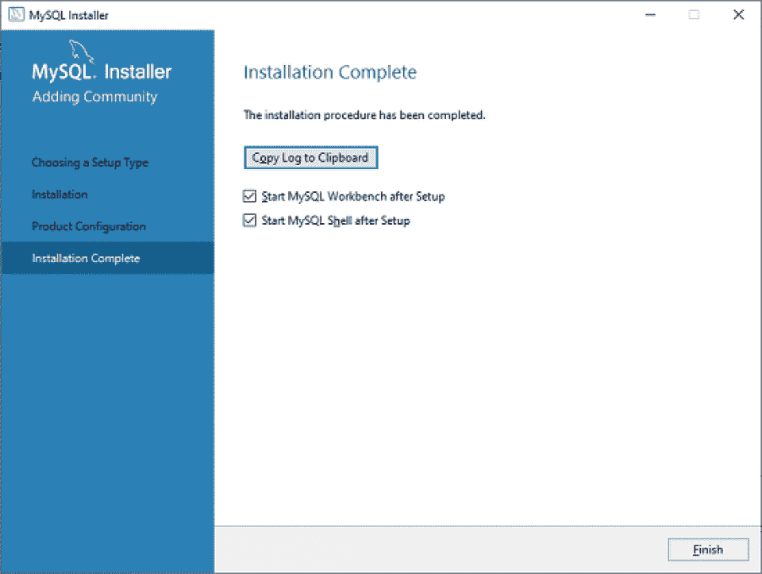

现在安装完成了。您可以单击“完成”按钮退出安装向导框。

恭喜你！您已经成功安装了 MySQL 数据库服务器。

**结论**

## 那么，MySQL 是什么？这是大数据生态系统中最不可思议、最可靠的技术之一。

由于如此频繁地使用 MySQL，IT 部门的工作人员将受益于学习 MySQL 基础知识。

对于许多软件组织来说，MySQL 是构建和维护从 web 应用程序到巨大的、[数据驱动的 B2B 服务](https://www.talend.com/resources/business-intelligence-data-analytics/)的数据的基础。你想扩展你的 MySQL 知识吗？考虑探索一个 [MySQL 教程](https://hackr.io/tutorials/learn-mysql)。

**人也在读:**

**People are also reading:**