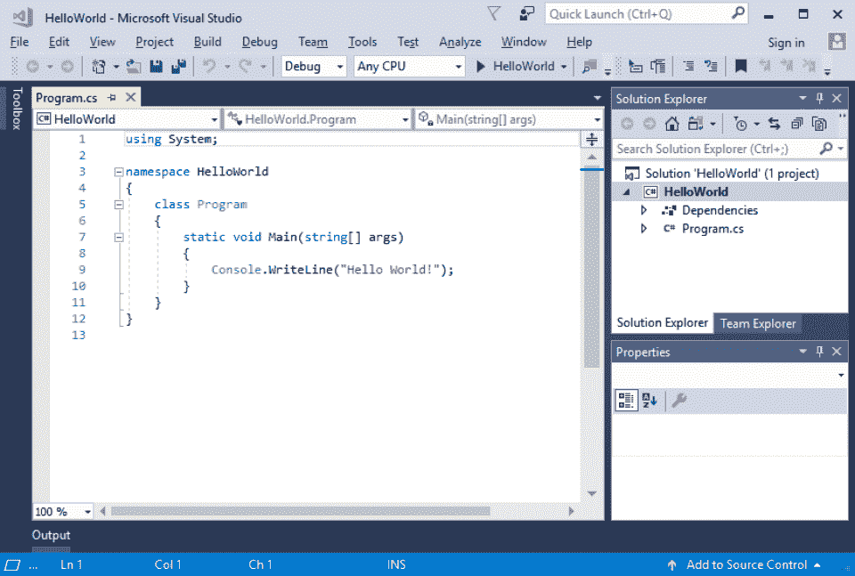
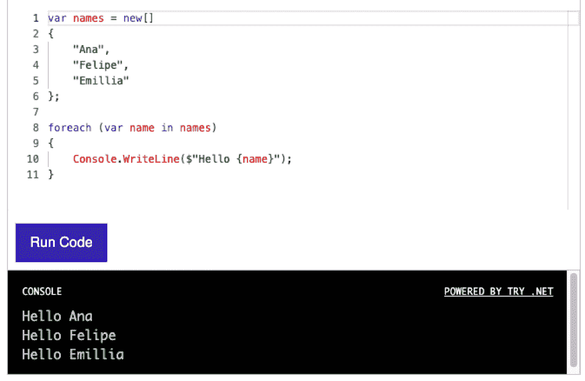

# 什么是。网？为什么应该使用这个框架

> 原文：<https://hackr.io/blog/what-is-net>

是什么。网？你可能听说过。网，。NET Core。NET 框架，甚至 ASP.NET。可以让整个概念。网有点混乱。所有这些技术都相互关联，但它们不是同一个平台。相反，它们都是微软多年来支持的更大生态系统的一部分。

今天，至少可能有[700 万到 800 万。NET 开发者](https://www.daxx.com/blog/development-trends/number-software-developers-world) 全球平均年薪[93076 美元](https://www.ziprecruiter.com/Salaries/Net-Developer-Salary) 。C#、F#和 Visual Basic 程序员都可以从。NET 平台。它不仅是一个通用的系统，而且拥有大量的社区支持。

在本文中，我们将深入了解。网络。NET 框架，以及什么使。网络技术如此重要。

## **是什么。网？** 

2016 年发布， [微软。净](https://dotnet.microsoft.com/) (原名。NET Core)是上一个版本的开源、跨平台迭代。NET 框架。

。NET 可用于构建各种各样的应用程序，包括桌面应用程序、移动应用程序、游戏、web 应用程序和物联网设备。因为它是开源的。NET 还可以利用众多的库、语言和编辑器。

程序员可以写。NET 应用程序使用 C#、Visual Basic 或 F#。然后应用程序可以从。NET 到 Windows、Linux 或 MacOS。此外。NET 有一个由数千名开发人员组成的非常活跃的社区。有了这样一个充满活力的社区，初学者和高级用户都可以使用大量的资源库。

许多合并在一起。NET 与微软的 Visual Studio 和 Visual Basic。很容易看出为什么。

。NET 和 Visual Studio 一起使用来创建应用程序。所以一个程序员对于。NET 可能发生在 Visual Studio 平台中。

但是它们不是一回事。。NET 是为编写应用程序而设计的应用程序开发工具，而。NET 还包含了为支持这些应用程序而设计的生态系统和基础设施。

## **是什么。NET 框架？** 

The。NET Framework 是. NET 的早期版本，于 2002 年发布，仅适用于 Microsoft Windows 应用程序开发。

从本质上说。NET Framework 是微软为在微软 Windows 设备上编写微软 Windows 应用程序而设计的框架。此后，它被微软的 K2 等服务所取代。

本来，。NET 不是一个开源产品。的。NET 框架是一个专有的解决方案。但从那以后，微软开始采用更加开源的方法，并开放了许多平台。的。2019 年发布的. NET Framework 是. NET 最后一个专有版本

## **做什么。NET 框架吗？**

当第一次构思和发布时。NET Framework 提供了一个标准化的软件开发框架来促进 Microsoft Windows 的开发。今天。NET 产品为多种渠道提供了一个开源的开发框架。由开发。NET Foundation 并在 MIT 许可下发布。NET Framework 旨在使开发更容易、更快、更一致。

有一个巨大的生态系统。NET，包括:

*   **WPF (Windows 演示基金会)。** 帮助设计 Windows 操作系统和桌面应用的用户界面工具。
*   **Windows 窗体。**T2。NET 框架 GUI 库，可用于 Windows 桌面应用程序。
*   [**【ASP.NET】**](https://hackr.io/tutorials/learn-asp-net)**招式。** 一个 web 应用程序框架，帮助设计安全且可访问的基于 web 的应用程序。

许多开发者发现。NET 是一项非常强大的技术，尤其是现在它已经成为开源的。但同样，它不应该与 Visual Studio 混淆，尽管 Visual Studio 工具是生态系统中最可见的组件。一个关键的区别是 Visual Studio 实际上支持更多的语言:HTML、CSS、JavaScript、PHP 和 Python。

[https://www.youtube.com/embed/eIHKZfgddLM](https://www.youtube.com/embed/eIHKZfgddLM)

VIDEO

## **是什么。网络用于？**

。NET 包含了许多有助于开发的关键组件:

*   应用框架和库。
*   运行时组件和语言编译器。
*   支持 C#、F#、Visual Basic 等语言。
*   Visual Studio 等工具。

。NET 可用于创建桌面应用程序、web 应用程序、移动应用程序、云原生应用程序、游戏和物联网(IoT)设备。

因为。NET 具有如此惊人的广度，在许多行业中都受到追捧。. NET 程序员会发现他们非常受欢迎。

与此同时，。NET 只是一个框架。用…生产最终产品。NET，开发人员必须知道相应的语言之一——c#、F#或 Visual Basic。

## **有哪些利弊。网？** 

。NET 被很多开发者使用。很容易看出为什么。有很多 **阳性** :

*   Visual Studio IDE。Visual Studio IDE 是一个易于使用的开发环境，可以支持 C#、F#或 Visual Basic。通过 IDE，开发人员将能够快速识别语法或语法问题，并能够快速编译他们的程序。
*   **跨平台开发。** 。NET 可以用于 Windows、Linux 或 MacOS 的开发，这使它成为一个有用的跨平台解决方案。什么时候。NET 用于 web 应用程序，它可以用来创建完全平台无关的应用程序。
*   **开源开发。** 。NET 成为开源解决方案后变得更加强大。作为一个开源解决方案，它得到了一个非常大的社区的支持，并且这些年来经历了许多改进。
*   **面向对象编程。** 面向对象编程让开发者的开发更容易、更快、更一致。
*   **语言支持。** 作为 C#、F#和 Visual Basic 程序员都可以使用。NET，这是一个非常通用的解决方案。
*   **万能。净标准。** 的标准化。NET 已经存在很多年了——它是。NET 框架和。NET 系统。通用标准使得库和组件的设计更加容易。NET，增长的。网络生态系统。
*   **社区支持。** 。NET 拥有非凡的社区支持。这不仅意味着文档随时可用，还意味着有代码片段、课程、教程和其他资源。

但是这并不意味着解决方案是完美的。有 **有** 也有:

*   一些许可要求。 并非整个生态系统都是开源的。有些工具确实需要许可，尤其是那些由微软发布和分发的工具。微软通过微软基金会保留对产品的控制权。
*   **内存泄漏。** 。众所周知，NET 会遇到内存泄漏和缓存问题。当然，这是许多语言都面临的问题——并不仅限于. NET。尽管如此，试图生产精益产品的开发人员可能更倾向于使用另一种语言。
*   **语言**。不过。NET 确实支持 C#、F#和 Visual Basic 编程，但它不支持所有主要的编程语言。例如，用 Java 或 Python 编程的开发人员将不能用。无需完全学习另一种语言。

一些开发商考虑。一种过时的技术。虽然对于早期版本的。NET 框架，。NET 作为一个由活跃的社区推动的开源产品，继续成长和进步。

## 你怎么能学会。NET 编程？

程序员可以为。NET 用 C#，F#，或者 Visual Basic。

**。净替代方案**

## 。NET 是一个广泛的开发框架。因此，有许多竞争对手可能会联合起来取代它的功能。

一个例子是 Linux、Apache 服务器、MySQL 和 PHP 堆栈。这四种技术可以取代. NET web 应用程序。但是这些本身并不是一个框架；要创建一个实际的框架，还需要添加一个 PHP MVC 框架，比如 CakePHP。

其他。净替代品包括:

**K2 软件。** 微软的 K2 软件是一个专有的解决方案，使创建商业应用程序变得更加容易。

*   **Pega 平台。** 一款软件开发套件，通过可视化驱动的应用开发，让快速构建应用变得更加容易。
*   **OnBase by Hyland。** 面向创建可用平台的企业内容管理和项目管理系统。
*   **IntelliJ 理念。** 基于 Java 的集成开发环境，设计用于创建计算机软件，有商业版和非商业版。

作为一个开发框架,。NET 是非常独特的。因为它最初是作为创建 Windows 应用程序的以微软为中心的方法开发的，所以它被设计成一个面向单一目的的全功能套件。

今天，它的可扩展性和灵活性大大提高了。但是。NET 生态系统仍然是功能最全的开发系统之一。

**学习。NET:采取下一步措施**

## 那么，什么是。网？。NET 是一个开源软件开发框架。。NET 用于构建 web 应用程序、移动应用程序和桌面应用程序。该开发框架支持 C#、F#和 Visual Basic，并且可以生成完全跨平台的应用程序。

这里面有很多承诺。NET 技术。穿过。NET 生态系统中，软件开发人员可以在一个单一、紧凑的系统中获得他们需要的一切。Visual Basic、ASP.NET 和。NET 框架；所有人一起工作来帮助创建一个有凝聚力的开发工具包。

如果你对学习感兴趣。NET，你要先了解它的三大核心语言之一——比如[Visual Basic](https://hackr.io/tutorials/learn-visual-basic-net-vb)。从那里，你可以上课。NET、参加训练营或报名参加课程。

[查看。网络课程](https://click.linksynergy.com/deeplink?id=jU79Zysihs4&mid=39197&murl=https%3A%2F%2Fwww.udemy.com%2Fcourses%2Fsearch%2F%3Finstructional_level%3Dall%26q%3D.net%26ratings%3D4.5%26sort%3Drelevance%26src%3Dukw)