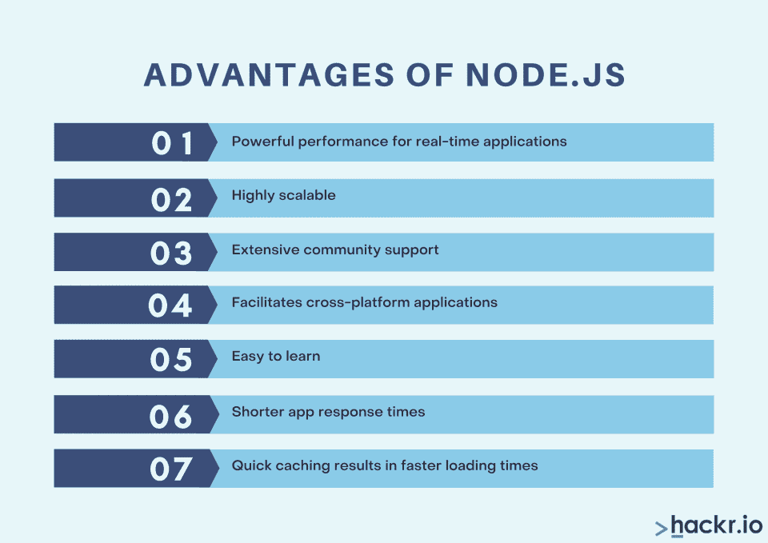

# Node.js 是什么？你 2023 年的终极指南

> 原文：<https://hackr.io/blog/what-is-node-js>

很长一段时间以来， [JavaScript](https://hackr.io/blog/how-to-learn-javascript) 的主要用途是客户端脚本。这发生在由网络浏览器解释的<脚本>标签中。这对开发人员来说是一个严重的限制，因为他们必须为 web 应用程序的客户端和服务器端区域使用多种语言和框架。

node . js 于 2009 年推出，致力于将 JavaScript 引入服务器端应用。Node 有几个众所周知的特性，它主要用于构建快速和可伸缩的网络应用程序。有了这个，开发者就没有束缚，在操作上有了更多的自由。

在这里，我们将回答诸如 Node.js 是什么，它是如何工作的，在哪里使用等等问题。

## **node . js 是什么？**

Node 是一种开源的服务器端脚本语言。它是一个运行时环境，让你在浏览器之外执行[JavaScript](https://hackr.io/tutorials/learn-javascript?q=javasc)。有了它，JavaScript 找到了除了让网站更具互动性之外的其他用途。它建立在谷歌 Chrome 的 V8 JS 引擎上，免费，有强大的社区支持。

理解 Node.js 既不是一个库也不是一个框架是很重要的。相反，它是一个用于运行多个 web 应用程序的跨平台运行时环境(RTE)。RTE 有构建代码的 web APIs 和解析代码的 JS 引擎。因此，Node.js 是轻量级的，易于部署。

## **node . js 是做什么的？**

Node.js 有助于构建实时 web 应用程序，特别是高度可伸缩的服务器端应用程序。RTE 是事件驱动的、异步的和跨平台的，这为开发人员提供了几个好处。

在 Node.js 之前，是客户端发起通信，而现在客户端和服务器都可以发起通信。这使得开发人员能够构建功能显著增强的实时网站。

## **是节点。Js 前端还是后端？**

Node.js 在前端和后端应用中都可以使用。前端应用程序的例子是代码处理器和包，它们是几个组件的集合，使用 Node 放在一起作为一个组件。后端示例包括 API 调用、数据库集成和实时应用程序。

## **node . js 用在哪里？**

从新兴的创业公司到世界上最大的科技公司，Node.js 无处不在。这些公司包括 网飞、Twitter、Trello、易贝、沃尔玛、LinkedIn、PayPal 和阿里巴巴。Node.js 的用途各不相同，但很大一部分都是为了提供事件驱动、异步和快速的通信。

为了给你更多的背景，Node.js 被用来构建网飞的用户界面，改善启动序列的加载次数，以及在 LinkedIn 从[Ruby on Rails](https://hackr.io/tutorials/learn-ruby-on-rails)转移到 Node 后改善其移动应用体验。

## **node . js 的特性**

Node.js 有几个特点，这也是它成为许多公司和团队如此重要的一部分的原因。下面对它们进行总结:

*   **事件驱动:** Node.js 允许通过一个模块进行事件驱动编程。这使得特定的函数在特定的事件发生时执行。事件帮助服务器从以前的 API 调用中获得响应。

*   **异步:** 通过异步，服务器在单线程中处理请求，处理，发送回响应，并继续下一个响应。所有 Node.js API 库都是异步的。

*   ***极速*** : Node.js 建立在谷歌 Chrome 的 V8 JavaScript 引擎之上。这个引擎非常适合 web 应用开发,对基于机器语言的产品和服务器也很有帮助
*   ***跨平台 RTE*** :兼容一系列平台，包括 Windows、macOS、Linux、UNIX，以及多个移动平台
*   ***微服务开发快速部署*** : Node.js 具备快速部署开发 web 开发 app 的能力。它还可以帮助开发微服务，因为 Node.js 可以快速处理数据。
*   ***可扩展性*** : Node.js，适合高可扩展性。它处理并发请求并管理 CPU 内核的负载平衡。有趣的是，它水平分割软件，反过来帮助组织在各种系统上展示应用程序，瞄准大量受众。
*   ***开源社区*** : Node.js 拥有广泛的全球社区。开发人员可以从社区成员那里得到强有力的支持，社区成员也免费向开发人员提供包、工具、模块、框架。
*   ***快速数据流*** : Node.js 提供更快的视频流速度

## **node . js 是如何工作的？**

为了理解 Node.js 是如何工作的，我们应该看一下 Node 架构。Node 依赖于许多库，节点操作的两个主要依赖项是 V8 和 LIBUV。

我们将两者都过一遍。

### **V8**

Node.js 建立在谷歌的 V8 引擎上。众所周知，它是最快的 JavaScript 引擎。它有助于将 JavaScript 代码转换成机器代码。生成的结果返回到 Node.js.

### **LIBUV**

LIBUV 是一个开源库，依赖异步 I/O，实现线程池和事件循环。

异步 I/O 帮助应用程序重叠 I/O 操作。这也叫无阻塞。另一方面，在同步 I/O 中，线程必须等待操作完成，这与异步 I/O 相反，异步 I/O 不等待。

### **事件循环**

Node.js 在单线程中运行进程，线程就是一组指令。在 PHP 中，每个任务都在单独的线程中运行。

例如，在单线程的 Node 中，3 个独立的任务将全部在一个线程中执行。这个事件循环是 node.js 的核心，它在单线程中执行回调函数。

它还通过在线程池中卸载任务来管理和平衡较重的任务，并自己处理较轻的任务。

### **线程池**

有 4 个额外的线程完全独立于主线程。有一定的自由来配置这些，从 4 到 128 个线程，但 4 个线程应该足够了。这四个一起被称为线程池。

现在，有各种繁重的任务，如加密，DNS 查找，密码缓存等。这样的任务可能会在主线程中产生瓶颈。节点将它们卸载到线程池中。

### **重要库**

除了事件循环和线程池，Node 中还有其他一些基本的库。这些是:

*   用于加密的 OpenSSL】
*   用于 DNS 查询的 C-ARES
*   HTTP 解析器
*   Zlib

### **事件驱动架构**

在 Node 中执行的大多数任务都是基于事件的。交互发生在一些观察者聆听物体或发射器物体的时候。大多数事件源于文件、进程或与网络的交互。

发射器中的每个事件由至少有两个参数的方法组成，即:

*   事件名称
*   监听器功能

考虑节点服务器的这个片段:

***const net = require(" net ")；***

***const server = net . create server()。听(8081，“127 . 0 . 0 . 1”)；***

***server.on("监听"，函数(){***

***console.log("服务器监听！");***

***})；***

***server.on("连接"，函数(套接字){***

***console.log("客户端已连接！");***

***socket.end("您好客户端！");***

***})；***

在这段代码中，创建了一个监听端口 8081 的服务器。为了注册两个侦听器函数，在服务器对象上调用 ON 方法。当服务器启动时，将触发 listening 事件。然而，连接事件在客户端连接到 127.0.0.1:8081 后触发。

在这里，事件发射器是服务器或主体。另一方面，list enter 函数是观察者。为了更好地理解这一点，让我们看看 EventEmitter。

node . js 中事件驱动模块的根类叫做 EventEmitter。

它有两个主要功能，即**和 **发射。** 如果您希望收听事件，您可以调用主题上的**addevent listener**。调用浏览器中的事件，如下面提到的代码所示:**

 *****const BTN = document . getelement byid(' subscribe ')；***

***BTN . addevent listener(" click "，函数(){***

***console.log("按钮被点击")；***

***})；***

现在，同样地，我们用对**进行说明。** 下面是一段代码:

***server.on("监听"，()= > {***

***console.log("服务器监听！");***

***})；***

让我们继续讨论如何使用 Node。

**如何使用节点**

## 首先，你必须在你的操作系统上下载并安装 node . js[。为了在 Node 中运行 JavaScript 文件，您必须按照下面编写的命令保存在一个名为 script.js: 的文件中](https://nodejs.org/en/download/)

***console . log(‘节点’的例子)；***

运行终端命令后，节点 script.js 在上面提到的同一个 script.js 文件夹中，它初始化 node。

另外，当涉及到在几个节点开发者之间共享模块时，节点包提供了便利。Npm 是节点的默认程序包管理器。它允许访问数以千计的开源软件包。

**节点作为 REPL**

### REPL 或 Read Evaluate-Print-Loop 功能有助于从命令行执行 JS 命令。对于 node，您可以在终端中运行 node 命令，然后按 enter 键启动 REPL。

现在，您可以运行任何 JavaScript 代码，Node 会为您打印结果。

看一下这个例子可以更清楚地理解它:

***$节点***

***>4+5***

***9***

***>function nodeIsGreat(){***

***...console.log('Node 太棒了！');***

***...}***

***未定义***

***>***

***节点很棒！***

***未定义***

***>。退出*T3**

***$***

在第 4 行可以看到，函数***nodeIsGreat***被定义。该函数接受多行，因此，节点 REPL 在开头打印 **…** 来读取用户的输入语句。

如果您希望退出节点 REPL，您可以使用。随时退出命令。也可以按两次 **ctrl + c.** 退出。

**如何加载现有文件**

### 节点 REPL 可以加载现有的 JS 文件。只需将代码保存在 script.js 中，如下所示:

***var z =【节点编程】***

也可以用 **。加载** 以获取路径参数将其加载到 REPL。为此，使用下面提到的命令:

**T1。加载。/script . js**

***$节点***

***>。加载。/script . js***

***var z = '节点编程！'；***

***>一*一**

一旦脚本文件加载，你可以很容易地访问 REPL 中的变量。因此，z 变量的值由 script.js 设置，从而打印文本“节点编程”，并显示在屏幕上。

**node . js 的优缺点**

## 虽然 Node.js 非常有用，但它也有一些缺点。这是一个知道何时使用 Node 的问题，就像开发中的许多概念一样。下面是 Node.js. 优缺点的快速概述

**node . js 优点**

### 实时应用的强大性能

*   高度可扩展
*   广泛的社区支持
*   促进跨平台应用
*   简单易学
*   更短的应用响应时间
*   快速缓存加快了加载速度

**node . js 的缺点**

### CPU 密集型任务的性能降低

*   异步编程可能是一把双刃剑，因为它会导致大量的回调
*   节点 API 经常变化，这可能会产生错误和兼容性问题
*   **Node.js 非常有用，用途广泛**

## Node.js 是开发多个应用程序的绝佳选择，因为它通过多个并发请求处理异步数据流。社交网络、数据流或项目管理应用——所有这些都可以用 Node.js 开发

作为一种开源的服务器端脚本语言，Node.js 已经成为许多开发者和大型组织的首选。上面列出的特性为他们提供了工具来加快应用程序的速度，并通过不同的系统接触到更多的受众。

虽然 Node.js 有一些缺点，但它绝对值得一试。要了解更多信息，请查看一些 [Node.js 教程！](https://hackr.io/tutorials/learn-node-js)

想更快的学习 Node.js？参加这个课程！
[学习节点。从训练营开始](https://click.linksynergy.com/link?id=jU79Zysihs4&offerid=1045023.3572857&type=2&murl=https%3A%2F%2Fwww.udemy.com%2Fcourse%2Fnodejscourse%2F)

**相关文章:**

**Related Articles:****