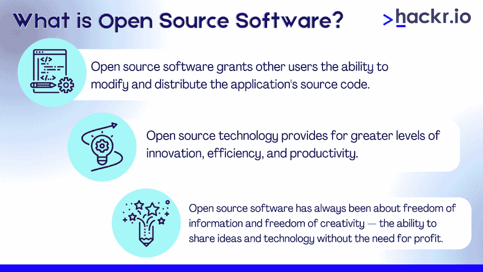
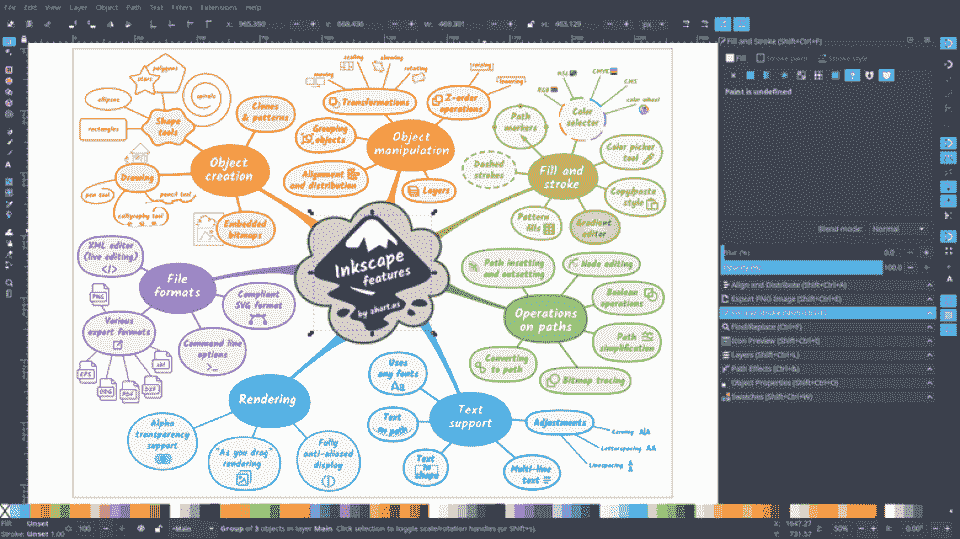

# 什么是开源软件？它是如何工作的？

> 原文：<https://hackr.io/blog/what-is-open-source-software>

曾几何时，几乎每个应用程序都是开源应用程序。即使在今天，70%到 90%的软件应用程序都是开源的。

开源技术是创新的基础支柱。无论你是一名程序员、用户还是业务分析师，理解开源及其更大的影响是很重要的。

任何软件通常被归类为*商业软件和*T2 专利软件或*开源软件(有一些细微差别)。*

*   *商业*解决方案通常需要许可费或订阅费。开发人员维护软件的权利，并控制谁可以修改软件。没有原始开发者的许可，任何人都不能复制或修改软件。
*   开源解决方案通常是完全免费的。开发人员向公众发布应用程序代码，公众可以对其进行修改和改进。然而，有一些限制——例如，开发者可能会要求没有人出售他们开源解决方案的*版本*。

开源软件通常被认为比商业和专利软件更好。但事实并非总是如此。

让我们更深入地了解开源代码及其优缺点。

## **什么是开源软件？**

[开源](https://www.linuxfoundation.org/blog/a-summary-of-census-ii-open-source-software-application-libraries-the-world-depends-on)是什么意思？开源技术是一种在“开源”许可证下发布的技术，该许可证授予其他用户修改和发布应用程序源代码的能力。注意，这并不是无限的修改和分发源代码的能力；一些开源许可仍然要求开发者遵守特定的要求，比如永远不要对软件收费。

在技术层面上，开源技术提供了更高水平的创新、效率和生产力——没有人必须重新发明轮子。

从哲学上讲，开源软件一直是关于信息自由和创造力自由的——分享想法和技术而不需要盈利的能力。

| 

### **开源软件总是免费的吗？**

开源需要免费吗？许多人将开源的含义与“自由软件”混为一谈。开源软件不一定意味着软件是免费的；从技术上讲，它仍然可以由最初的开发商出售。这种情况根本不会发生，因为源代码很容易获得——出售它通常没有好处。有些情况下，开放源码软件可以出售，例如与支持程序打包在一起，或者存储在 USB 驱动器上。 |

### **面向程序员的开源软件**

开源代码显然有利于程序员。当应用程序的源代码公开时，查找和修复错误就变得更容易了。程序员可以根据自己的需求或雇主的需求定制应用程序，而无需重新发明轮子。

很多程序员开始通过开源软件学习。相当多的开发工具包、框架和库是完全开源的——为新的和有经验的程序员提供了丰富的资料。

### **面向公司的开源软件**

使用或开发开源软件的公司有很多优势。从财务角度来看，使用开源解决方案通常更便宜。专有软件经常需要许可费，而大多数开源软件是免费的。开发开源软件提供了收费支持该软件的机会。

因为源代码是可用的，所以公司可以定制一个开源应用程序来更好地满足他们的需求。许多大型企业运行开源技术，但有一个警告；与专有或商业解决方案相比，开源技术往往没有什么内置支持。

### **面向用户的开源软件**

许多人认为开源软件比专有解决方案质量更高，因为有更多的人在使用它。但事实并非总是如此。开源软件也可以“由委员会设计”——变得不稳定和缺乏支持。然而，对于用户来说，开源软件的好处相当直接:开源软件往往是免费的。

## **开源软件的利与弊**

总的来说，开源软件对许多组织和个人来说是一个很好的解决方案。在大多数情况下，利大于弊，尤其是在成本、质量和支持方面。

优势:

*   成本更低。开源解决方案是免费的，所以如果你想避免许可费用，你可以在开源解决方案上运行整个业务
*   更高水平的创新。作为一个委员会/团体来运作，为创新和创造提供了更多的可能性。
*   提高效率和生产率。开发向全球程序员社区开放，而不是依赖于一个小的开发团队。
*   信息自由。有一种关于信息自由的开源解决方案的风气。

缺点:

*   由委员会设计。专有解决方案可能有更多的“方向”，因为有专人负责。
*   缺乏支持。大多数免费和开源解决方案没有任何内置支持，而是依赖于社区。
*   技术专长。虽然这并不总是正确的，但是相当多的开源解决方案是由工程师为工程师设计的。他们中的许多人需要一些知识或技术专长来操作。

## 开源软件是如何工作的？

开源软件通常是以合作的方式开发的，来自世界各地的程序员一起工作来改进代码。当一个新的特性或修复被创建时，它通常被添加到代码的“主”或“主要”分支——软件的最新版本。用户可以从那里下载软件并安装到他们的电脑上。因为这个过程是民主化的，用户也可以成为开发者。

开源软件通常在许可下发布，允许任何人使用、修改和发布他们认为合适的代码。开源软件最常用的许可证是 [GNU 通用公共许可证(GPL)](https://www.gnu.org/licenses/gpl-3.0.en.html) ，但是还有许多其他的许可证。

[开源贡献:开发者指南](https://click.linksynergy.com/deeplink?id=jU79Zysihs4&mid=39197&murl=https%3A%2F%2Fwww.udemy.com%2Fcourse%2Foss-developers%2F)

## **开源软件与闭源软件**

开源软件和闭源软件的主要区别在于谁有权访问代码。使用开源软件，任何人都可以免费查看、使用或修改代码。另一方面，闭源软件只对最初的开发者开放——或者那些得到开发者许可的人。

| **开源** | **闭源** |
| **由**开发 | 委员会 | 公司 |
| **成本(通常)** | 自由的 | 有报酬的 |
| **安全** | 依赖于错误报告 | 依赖内部质量保险 |
| **质量** | 依赖社区 | 依赖开发者 |
| **支持** | 不是内置的 | 内置的 |

开源软件通常更便宜，更可定制，更受用户和开发者社区的支持。闭源软件通常更便于用户使用，也更容易买到。最终，最佳解决方案取决于用户或组织的需求。

还要注意的是，当谈到开源和闭源时，很少有明确的答案。开源软件可能比闭源软件质量更高。但它也可能是粗制滥造和低效的。这完全取决于谁开发了它。

### **开源:热门应用**

流行的开源技术包括 Apache Server、Linux、PHP 和 WordPress。开源应用可以是任何东西，从操作系统到浏览器。大多数编程和开发工具都是开源的。几乎每一种编程语言都必然是开源的。

一个开源应用的例子是 Inkscape——一个矢量编辑图像软件套件。

相比之下，Adobe Illustrator 是一个专有的商业矢量编辑图像软件套件。

其他闭源应用包括微软 Windows、Adobe Photoshop、苹果 macOS。这涉及到开源软件的另一个方面——如果有一个专有/商业软件解决方案，那么在开源社区中经常会有一个直接类似的解决方案。

### **开源:软件许可**

不是每个开源程序都有相同的许可证。事实上，许多不同的许可证涵盖了开源软件。GNU 通用公共许可证(GPL)是最常见的，但也有像 MIT 许可证、Apache 许可证和 GNU Lesser GPL 这样的许可证。

这些许可证之间的主要区别是它们处理衍生作品的方式。对于 GPL 许可的程序，任何衍生作品也必须在 GPL 下发布。有了 MIT 许可证，衍生作品可以在任何许可证下发布——包括闭源许可证。

作为用户，一般不需要了解这些许可证。但是，程序员每次都应该检查许可证。

### **开源:安全**

开源软件的主要优势之一是它通常比闭源软件更安全。这是因为任何人都可以查看代码。如果存在安全漏洞，可以快速找到并修复。

对于封闭源代码软件，只有拥有该软件的公司才能访问代码。这意味着安全漏洞可以长时间不被发现。另一个复杂性是，公司可能会对其软件的新版本收费，而旧版本可能仍然容易受到攻击。

### **开源:质量**

开源软件通常质量更高，因为很多人会审查它。当有人发现一个 bug 时，他们可以向项目维护者提交一个补丁。如果维护者喜欢这个补丁，他们会把它应用到代码库中。

也就是说，开源软件的质量是由其社区的规模和专业知识决定的。如果它有一个小的社区，它可能无法维护一个高质量的代码库。

### **开源:支持**

开源支持是可变的。大型开源项目有大量的社区支持。然而，如果你遇到问题，没有 24/7 热线可以打。

封闭源代码软件往往通过现场技术人员获得更好的支持，这些技术人员可以帮助您处理服务台问题。但是，当然，这也是有代价的。

### **开源:超越软件**

开源不仅仅是软件。它也用于硬件、书籍和几乎所有其他东西。除了应用程序，最流行的开源解决方案是硬件。

开源硬件是具有可供任何人查看和修改的设计文件的硬件。像开源软件一样，开源硬件通常由开发人员社区开发。最著名的开源硬件项目是 Arduino，一种可以控制电子项目的小型计算机。

开源书籍是指作者将源文件提供给任何人查看和修改的书籍。这些书通常是在开源许可下发布的，比如知识共享署名许可。它们可以被其他作者修改。从技术上讲，开源可以应用于任何东西，包括图像和歌曲。

## **结论**

互联网是建立在开源应用程序的基础上的——因此，开源理念对于像 Linux 社区这样的社区来说仍然是极其重要的。作为一名程序员、开发人员，或者仅仅是一名最终用户，理解开源技术的工作方式及其重要性对于从整体上理解软件是至关重要的。

你如何能更多地了解开源软件？如果可能的话，看看你正在使用的应用程序的源代码——你可以学到很多关于软件开发策略和技术的知识。你也可以探索开源的 web 开发 IDE 和其他 web 工具。

## **常见问题解答**

#### **1。开源软件是什么意思？**

开放源代码软件是通过许可证提供源代码的计算机软件。版权所有者提供研究、修改和向任何人分发软件的权利，用于任何目的。

#### **2。Google 是开源的吗？**

虽然谷歌的一些产品是开源的，但整个公司并不是开源的。谷歌保留保留其部分解决方案的商业和专有权利，同时通过开源许可发布其他解决方案。

#### **3。谁拥有开源？**

没有任何个人或组织拥有开源软件。这是一个软件开发的协作模型，任何人都可以参与其中。然而，开源解决方案通常由特定的社区或基金会维护。

#### **4。你如何使用开源？**

你可以在很多方面使用开源软件。例如，您可以在您的计算机上找到并安装开源应用程序，或者使用开源代码开发应用程序。此外，您可以为现有的开源项目做出贡献，或者启动自己的项目并在开源许可下发布。

#### **5。OSS 没有 Bug 吗？**

不一定。像任何软件一样，开源软件也会有缺陷。好消息是，由于代码可供任何人查看，程序员通常可以快速找到并修复这些错误。但是，这取决于社区的活跃程度和彻底程度。

**人也在读:**