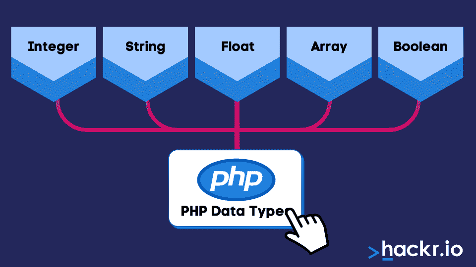
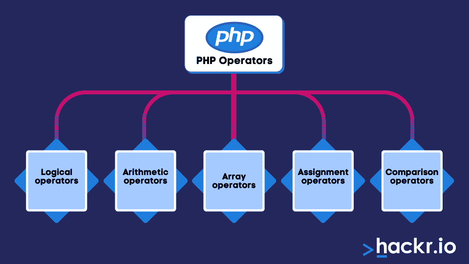
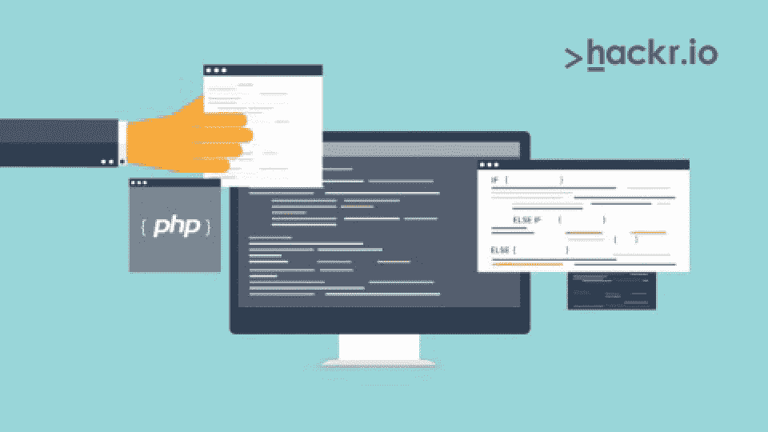

# PHP 是什么？了解关于脚本语言的所有内容

> 原文：<https://hackr.io/blog/what-is-php>

什么是 PHP，PHP 到底是用来做什么的？PHP 是一种服务器端脚本 [编程语言](https://hackr.io/blog/best-programming-languages-to-learn-2022-jobs-future) 用于开发静态或动态网站，甚至 web 应用程序。

PHP 代表什么？ [PHP](https://www.php.net/) 代表超文本预处理器，但你可能会认出它是“个人主页”的旧缩写

脚本是在运行时解释的一组编程指令。脚本语言负责在运行时解释脚本。脚本的主要目的是提升应用程序中各种任务的性能。

但是 PHP 编程是什么，怎么用呢？我们今天将讨论所有这些——继续阅读，收集 PHP 的介绍，并了解它在计算机世界中的所有用途。

## **什么是 PHP 编程？**

PHP 代表超文本预处理器。PHP 编程语言是一种在全球广泛使用的脚本语言，主要用于 web 开发。你可以将 PHP 嵌入到 [HTML](https://hackr.io/blog/html-cheat-sheet) 中，之后也可以工作。

此外，PHP 是服务器端的，而其他编程语言如[](https://hackr.io/blog/how-to-learn-javascript)是客户端的。两者的主要区别在于 PHP 代码在生成 HTML 的服务器上执行，并直接发送给客户端。虽然客户端可以通过运行脚本看到结果，但他们无法访问底层代码。

如果你是初学者，PHP 是一门非常简单的语言。它还包括专业程序员的高级功能。可以从写简单的脚本开始，逐步掌握 PHP 编程语言。

现在，让我们深入了解 PHP 的语法。

## **PHP 的语法**

PHP 的语法非常简单。PHP 文件也可以包含 HTML 或客户端脚本作为 JavaScript。

下面是 PHP 的基本语法:

```
<?php

echo ‘I love programming’;

?>
```

显示屏显示， *“我爱编程。”*

使用 PHP 时，请记住以下几点:

*   虽然不是必需的，但在学习 PHP 编程语言之前，先了解 HTML 是理想的。
*   用 PHP 处理数据库驱动的应用程序，使用数据库管理系统或[](https://hackr.io/tutorials/learn-dbms)。
*   你将需要 XML 或 JavaScript 来用 PHP 构建高级的交互式应用程序。

## **如何用 PHP 写程序**

用 PHP 编写程序极其容易。参见下面的例子:

```
<!DOCTYPE html>

<html>

 <head>

 <title>Example</title>

 </head>

 <body>

 <?php

 echo "PHP Programming is easy.";

 ?>

 </body>

</html>
```

让我们继续前进，了解为什么要使用 PHP。

## **为什么选择 PHP？**

如你所知，作为一名 web 开发人员，有太多的编程语言可供你使用。那么，是什么让 PHP 脱颖而出呢？这里有一些使用 PHP 的好处:

*   PHP 是一种**和 [开源的](https://hackr.io/blog/top-10-open-source-security-testing-tools-for-web-applications) 脚本语言。**
***   PHP 是一种 **服务器端脚本语言** 。可以安装在服务器上；然而，从服务器请求资源的客户机不必安装 PHP。*   是 **跨平台** ，让你在 Windows、macOS、Linux 等各种 [操作系统](https://hackr.io/blog/linux-vs-windows) 上使用。*   PHP 自带 **内置支持系统** ，这意味着你可以将 PHP 与各种数据库管理系统如 Oracle、Postgres、ODBC、ms、SQL Server 一起使用。*   大多数 **虚拟主机服务器** 支持 PHP。*   PHP 为你提供了一个 **庞大的在线社区** ，提供各种支持，包括文档指南和问题解决贴。*   PHP 是 **易学** ，尤其是如果你有其他编程语言的基础知识。*   PCRE 和 Perl 等大量文本处理功能**

 **此外，PHP 通过支持广泛的数据库提供了一个显著的特性。例如，您可以使用特定于数据库的扩展，如 [MySQL](https://hackr.io/blog/sql-commands) 来编写支持数据库的网页，使用抽象层，如 PDO，或者甚至使用 ODBC 扩展来建立到数据库的连接。

此外，在使用 PHP 时，你可以同时使用面向对象编程和[过程编程](https://hackr.io/blog/procedural-programming)。你不仅仅是输出 HTML 相反，您可以输出任何文本，如 XML 或 XHTML。PHP 可以自动生成搜索文件并保存它们，这有助于防止服务器端为动态内容形成缓存。

现在我们已经知道了 PHP 的一些好处，让我们进入 PHP 扩展。

## **PHP 扩展**

PHP 文件用“.”保存。php”扩展名。一些早期的 PHP 文件扩展名包括:

*   。PHP
*   .php3
*   .php4
*   .php5
*   【t0 . phtml】t1 版

## **PHP 用在哪里？**

你可以在很多领域使用 PHP，但这是三个最重要的领域:

*   命令行脚本
*   服务器端脚本
*   编写桌面应用程序

### **命令行脚本**

除了数据库的 web 应用程序之外，还有几个任务在 web 服务器的后台运行。每个任务在指定的时间后结束。因此，每个任务都有自己的时间表。

这里有一个 PHP 命令行脚本的例子:

假设你要给邮件列表上的订阅者发送一封邀请邮件。您可以通过 web 脚本执行这项任务。然而，当用户达到几百人时，这个过程就变得更加棘手了。而且，如果有成千上万的订阅者，一个 web 脚本将只有几分钟的执行时间，这个时间被称为最大执行时间。在这段时间结束时，web 服务器终止 web 脚本，并且无法将电子邮件发送给一部分订户。

**PHP 命令行脚本可以解决这个问题:**

使用命令行脚本，没有最大执行时间。只要服务器处于活动状态，脚本就可以运行。

因此，在命令行脚本的帮助下，任何耗时的任务都可以无缝完成，例如通过 FTP 将文件传输到另一台服务器或备份整个网站或数据库。

### **服务器端脚本**

服务器端脚本是 PHP 最常见和最常用的领域。它需要三个重要组件:web 服务器、web 浏览器和 PHP 解析器。

使用服务器端脚本，您必须运行安装了 PHP 的 web 服务器。此外，您可以通过 web 浏览器轻松访问和运行任何 PHP 程序输出。

### **编写桌面应用程序**

如果你想开发一个桌面应用程序和图形用户界面，PHP 可能不是你的完美解决方案。然而，要访问一些高级 PHP 特性，您可以在客户端应用程序中使用 PHP-GTK 来编写程序。

GTK 是 PHP 的扩展。但是，你可能在主发行版里找不到。访问 PHP-GTK，访问 [官网](http://gtk.php.net/) 。

## **PHP 数据类型和操作符**

****

PHP 支持多种数据类型，比如:

*   整数
*   字符串
*   浮动
*   数组
*   布尔型

### **PHP 整数**

范围在-2，147，483，648 和 2，147，483，647 之间的非十进制数为整数数据类型。只有当至少有一个数字是正数或负数时，数字才是整数。看看下面的命令，它将$z 作为一个整数，函数 var_dump 返回值:

```
<?php 

$z =1674; var_dump($z); 

php?>
```

### **PHP 字符串**

PHP 字符串是任何字符序列。下面是在 PHP 中使用字符串的语法:

```
<?php 

$a = “Hello Programming!”; 

$b = ‘Hello Programming!’; 

echo $a; echo “<br>”; 

echo $b; 

?>
```

### **PHP 浮动**

浮点数是任何带小数点的数字或以指数形式出现的数字。

这里有一个例子:

```
<?php 

$a =3.14;

var_dump($z);

?>
```

### **PHP 数组**

一个数组在一个变量中保存多个值:

```
<?php 

$students = array(“Daniel”,”Josh”,”Sam”);

var_dump($students); 

?>
```

### **PHP Boolean**

布尔值用于条件测试，它告诉你两种状态:

**$ x = true；**

**$ y = false；**

现在，让我们继续讨论 PHP 操作符。

## **PHP 操作符**

****

运算符主要用于对变量进行各种运算。PHP 中不同的运算符包括:

*   逻辑运算符
*   算术运算符
*   数组运算符
*   赋值运算符
*   比较运算符

### **逻辑运算符**

逻辑运算符帮助组合条件语句:

| **操作者姓名** | **符号** |
| 和 | & |
| 或 | &#124; |
| 异或 | 异或 |
| 或 | &#124;&#124; |
| 和 | && |
| 不是 | ！ |

### **算术运算符**

加法、减法、乘法和除法等算术运算符有助于对数值进行运算。

| **操作者姓名** | **符号** | **例子** |
| 加法 | + | $x + $y |
| 减法 | - | $x - $y |
| 分部 | / | $x / $y |
| 乘法运算 | * | $x * $y |
| 求幂运算 | ** | $x ** $y |
| 模数 | % | $x % $y |

**数组运算符**

### PHP 数组用于比较数组:

**操作者姓名**

| **符号** | 工会 |
| + | 相等 |
| == | 不等式 |
| ！= | 身份 |
| === | 非同一性 |
| ！== | 不等式 |
| <> | **赋值运算符** |

赋值运算符为特定变量赋值:

### **操作员**

**意为**

| x = y | x = y |
| x += y | x = x+y |
| x -=y | x = x-y |
| **比较运算符** | 为了比较两个数字或字符串，我们使用比较运算符: |

**操作者姓名**

### **符号**

==

| 等于 | === |
| 相同的 | ！== |
| 不相同 | ！= |
| 不等于 | <> |
| 不等于 | > |
| 大于 | < |
| 小于 | < = |
| 小于或等于 | > = |
| 大于或等于 |  |
| **PHP cookie 和会话** | **饼干** |

我们使用 cookies 来识别网页上的用户。计算机向浏览器中的页面发送请求，同时发送一个 cookie。就 PHP 而言，您可以轻松地检索和创建 cookie 值。

## 下面是一些创建或修改 cookie 的命令:

### **要创建 cookie，请遵循以下代码:**

在这段代码中，语法是:

*setcookie(名称，值，过期，路径，域，安全，http only)；*

**要修改 cookie，请遵循以下代码:**

```
<?php $cookie_name = "user"; 

$cookie_value = "PhP Programming"; 

setcookie($cookie_name, $cookie_value, time() + (60*60), "/"); 

?> 

<html> 

<body> 

<?php

if(!isset($_COOKIE[$cookie_name])) 

{ echo "Cookie named '" . $cookie_name . "' is not set!"; } 

else { echo "Cookie '" . $cookie_name . "' is set!

<br>"; 

echo "Value is: " . $_COOKIE[$cookie_name]; } 

?> 

</body> 

</html>
```

***要删除一个 cookie，使用此代码:***

在上例中，***set cookie***这里将到期时间设置为一天前。

**PHP 会话**

```
<?php 

$cookie_name = "user"; 

$cookie_value = "XYZ"; 

setcookie($cookie_name, $cookie_value, time() + (60*60), "/"); 

?> 

<html> 

<body> 

<?php 

if(!isset($_COOKIE[$cookie_name])) 

{ echo "Cookie named '" . $cookie_name . "' is not set!"; } 

else { echo "Cookie '" . $cookie_name . "' is set!

<br>"; 

echo "Value is: " . $_COOKIE[$cookie_name]; } 

?> 

</body> 

</html>
```

通过使用 PHP 会话，您可以存储多页信息，而无需将信息存储在用户系统中。

```
<?php 

setcookie("user", "", time() - 86400); 

?> 

<html> 

<body> 

<?php 

echo "Cookie 'user' is deleted."; 

?> 

</body> 

</html>
```

**要创建会话，请遵循以下代码:**

## **要修改一个会话，可以执行:**

**最后，编写以下代码来删除会话:**

**结论**

```
?php 

session_start(); 

?> 

<!DOCTYPE html>

 <html> 

<body> 

<?php 

$_SESSION["favfont"] = "Arial"; 

$_SESSION["favbird"] = "vulture"; 

echo "Session variables are set."; 

?> 

</body>

 </html>
```

什么是 PHP？代表超文本预处理器，PHP 是一种开源脚本语言，在 web 开发世界中广泛使用。PHP 主要基于服务器端脚本；然而，PHP 有更多的东西，包括它的 cookies 和扩展、好处和开源特性。

```
<?php 

session_start(); 

?> 

<!DOCTYPE html> 

<html> 

<body> 

<?php 

$_SESSION["favcolor"] = "yellow"; 

print_r($_SESSION); 

?> 

</body> 

</html>
```

现在你已经有了基本的 PHP 介绍，是时候将你的知识应用到 [PHP 项目](https://hackr.io/blog/php-cheat-sheet)中了。

```
<?php 

session_start(); 

?> 

<!DOCTYPE html> 

<html> 

<body> 

<?php 

session_unset(); 

session_destroy(); 

?> 

</body> 

</html>
```

## [下载 10 个最好的 PHP 项目 及源代码](https://hackr.io/blog/php-projects) 获得一些使用 PHP 的实践经验。

请查看本课程！绝对初学者的 PHP

[](https://click.linksynergy.com/link?id=jU79Zysihs4&offerid=1045023.56582&type=2&murl=https%3A%2F%2Fwww.udemy.com%2Fcourse%2Fgetting-started-with-php-programming%2F)

[Download 10 best PHP projects with source code](https://hackr.io/blog/php-projects) to get some hands-on experience with using PHP.

### Check This Course Out! PHP for Absolute Beginners

[](https://click.linksynergy.com/link?id=jU79Zysihs4&offerid=1045023.56582&type=2&murl=https%3A%2F%2Fwww.udemy.com%2Fcourse%2Fgetting-started-with-php-programming%2F)**