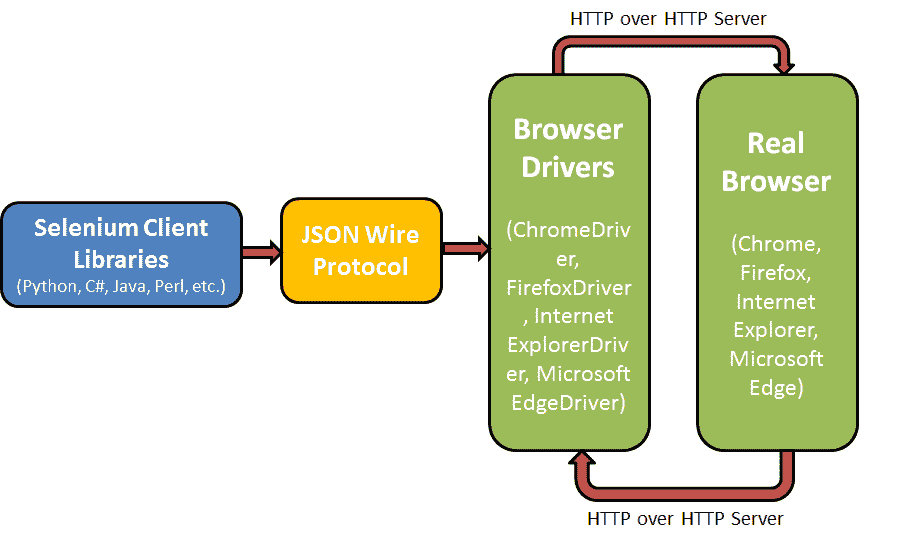
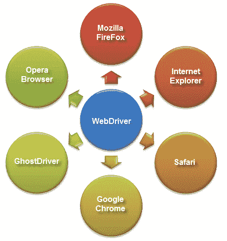
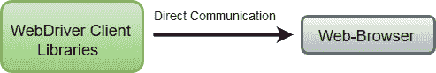
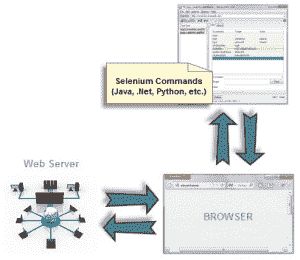
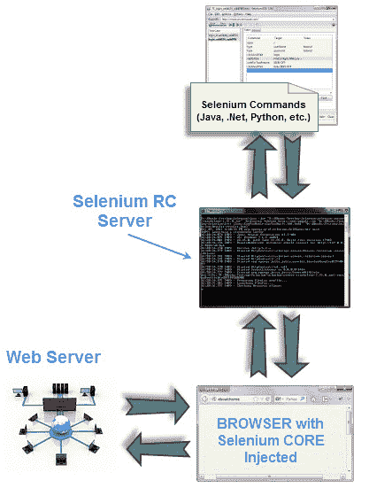

# 什么是 Selenium WebDriver？[完整指南]

> 原文：<https://hackr.io/blog/what-is-selenium-webdriver>

Selenium WebDriver 从一开始就非常受欢迎。这是 Selenium 工具套件中最大的变化之一。在我们之前的博客中，我们讨论了 Selenium WebDriver 流行的原因。在本文中，我们将深入学习 Selenium WebDriver。

## Selenium Webdriver 架构

因此，首先让我们看看 Selenium Webdriver API 如何使用浏览器驱动程序与真正的浏览器进行交互，并理解组成 Selenium Webdriver 架构的主要模块。嗯，Selenium WebDriver 由四个主要部分组成:

1.  Selenium 客户端库
2.  JSON 有线协议
3.  浏览器驱动程序
4.  浏览器



让我们来详细了解他们中的每一个，以及他们对我们的帮助:

### 1.Selenium 客户端库

开发人员和软件测试人员使用他们熟悉的语言来编写自动化脚本。有各种各样的语言可以用来编写脚本，比如 C#、Java、Python、Perl 等等，所以这使得任务变得很困难。然而，Selenium 客户端库或 Selenium 语言绑定促进了多语言支持的能力。您可以使用自己熟悉的语言来编写自动化脚本，Selenium 会完成剩下的工作。为了更好地理解这一点，让我们举一个例子，如果你想用 PHP 语言编写自动化脚本，你需要 PHP 客户端库，剩下的任务就完成了。可以从 Selenium [官网](http://www.seleniumhq.org/download/#client-drivers)下载所有 Selenium 绑定。

### 2.JSON 有线协议

JSON(JavaScript Object Notation)Wire 协议促进了在 web 上的客户机和服务器之间传输数据的能力。它是一个 REST(表述性状态转移)API，提供了一种传输机制，并使用 HTTP 上的 JSON 定义了一个 RESTful web 服务。

### 3.浏览器驱动程序

浏览器驱动程序用于与浏览器交互，并将自动化脚本指令转发给浏览器。浏览器驱动程序负责处理浏览器功能的任何内部逻辑的丢失。每个浏览器都有其特定的浏览器 web 驱动程序。

以下是使用特定浏览器驱动程序运行自动化脚本的步骤:

1.  为每个 Selenium 命令生成 HTTP 请求，并发送给浏览器驱动程序。
2.  特定的浏览器驱动程序通过 HTTP 服务器接收 HTTP 请求。
3.  HTTP 服务器发送在浏览器上执行功能的所有步骤。
4.  测试执行报告被发送回服务器，HTTP 服务器将它发送到自动化脚本。

### 4.浏览器

Selenium Webdriver 最棒的地方在于它支持所有主流浏览器，如 Google Chrome、Mozilla Firefox、Internet Explorer 和 Safari。每个浏览器都有特定的 web 驱动程序来执行自动化脚本。

## 特定于浏览器的 Web 驱动程序的类型

运行自动化脚本需要各种驱动程序，如 HtmlUnit 驱动程序、Chrome 驱动程序、Firefox 驱动程序、Internet Explorer 驱动程序、Opera 驱动程序。让我们来详细了解其中的每一个:

**1。HtmlUnit 驱动程序**

顾名思义，它基于 HtmlUnit，是 WebDriver 最轻量级和最快速的实现之一。如果您在这种情况下使用语言绑定(而不是 Java ),您将需要这个驱动程序。

在使用 HtmlUnit 驱动程序的代码中使用的命令行:

```
WebDriver driver = new HtmlUnitDriver();

```

```
IWebDriver driver = new RemoteWebDriver(new Uri("http://127.0.0.1:4444/wd/hub"),
DesiredCapabilities.HtmlUnit());

```

```
driver = webdriver.Remote("http://localhost:4444/wd/hub", webdriver.DesiredCapabilities.HTMLUNIT.copy())

```

```
driver = Selenium::WebDriver.for :remote, :url => "http://localhost:4444/wd/hub", :desired_capabilities => :htmlunit

```

```
my $driver = Selenium::Remote::Driver->new(browser_name => 'htmlunit', remote_server_addr => 'localhost

```

**2。火狐驱动**
顾名思义，火狐驱动是用来控制火狐浏览器同时运行自动化脚本的。

在代码中使用 Firefox 驱动程序的命令:

**java**

```
WebDriver driver = new FirefoxDriver();

```

**csharp**

```
IWebDriver driver = new FirefoxDriver();

```

**python**

```
driver = webdriver.Firefox()

```

**红宝石**

```
driver = Selenium::WebDriver.for :firefox

```

**perl**

```
my $driver = Selenium::Remote::Driver->new;

```

**3。Internet Explorer 驱动程序**

Internet Explorer 驱动程序用于在 internet explorer 上运行自动化脚本。它支持 IE7、8、9、10 和 11。之前它也支持 IE6，但是在 2014 年它放弃了对 IE6 的支持。

在使用 Internet Explorer 驱动程序的代码中使用的命令行:

**java**

```
WebDriver driver = new InternetExplorerDriver();

```

**csharp**

```
IWebDriver driver = new InternetExlorerDriver();

```

**python**

```
driver = webdriver.Ie()

```

**红宝石**

```
driver = Selenium::WebDriver.for :ie

```

**perl**

```
my $driver = Selenium::Remote::Driver->new(browser_name => 'internet explorer');

```

**4。ChromeDriver**

Chrome 驱动程序与 Chrome 浏览器配合使用，帮助自动化测试自动化脚本。为了让 WebDriver 发现 ChromeDriver，需要在测试脚本中输入 ChromeDriver 的路径。

在使用 ChromeDriver 的代码中使用的命令行:

**java**

```
WebDriver driver = new ChromeDriver();

```

**csharp**

```
IWebDriver driver = new ChromeDriver();

```

**python**

```
driver = webdriver.Chrome()

```

**红宝石**

```
driver = Selenium::WebDriver.for :chrome

```

**perl**

```
my $driver = Selenium::Remote::Driver->new(browser_name => 'chrome');

```

## Selenium Webdriver 的特性

我们知道 [Selenium WebDriver 是开发者的最佳选择之一](https://dzone.com/articles/13-reasons-why-selenium-webdriver-should-be-your-f)，我们需要了解是什么让它脱颖而出。让我们来看看 Selenium WebDriver 的一些顶级特性:

[带 Java 的 Selenium WebDriver 基础到高级+框架](https://click.linksynergy.com/deeplink?id=jU79Zysihs4&mid=39197&murl=https%3A%2F%2Fwww.udemy.com%2Fcourse%2Fselenium-real-time-examplesinterview-questions%2F)

### 多浏览器兼容性

Selenium Webdriver 在浏览器中与网站及其 web 元素进行交互，就像真正的用户一样，使用浏览器的本机支持来直接调用，而不需要任何间歇的软件或设备。它支持所有现代网络浏览器，如 Chrome、Firefox、Opera、Safari 和 Internet Explorer。你可以用简单的命令启动任何浏览器。例如 Chrome 浏览器

```
WebDriver driver = new ChromeDriver();

```

Selenium web driver 还支持 AndroidDriver、HtmlUnitDriver 和 IPhoneDriver。



### 多语言支持

它支持大多数常用的编程语言，如 Java、Javascript、Python、PHP、Ruby、C#、Perl 等。它为我们提供了选择任何编程语言来编写自动化脚本的自由。

它还允许使用更有效的方式编写自动化脚本，如使用 switch 语句、条件语句、决策语句来加强自动化脚本并使其能够处理所有情况。

### 速度和性能

与 Selenium 套件的其他工具相比，Selenium Webdriver 执行测试脚本的速度更快。与 Selenium RC 不同，它直接与浏览器通信，不需要任何中间服务器。



### 1.更好地处理动态 Web 元素

处理动态 web 元素是执行自动化测试时最常见的挑战之一。Selenium Webdriver 知道如何更好地处理动态 web 元素，如复选框、下拉列表和警告等。在静态元素的情况下，使用 XPath 或 ID 定位 web 元素非常容易，但是如果元素的 XPath 或 ID 不断变化，就很难处理了。

Selenium 使用以下一些方法来处理动态元素:

1.  绝对 XPath: 这是处理动态元素最常用的 XPath，它包含了从根节点开始的 web UI 元素的完整路径。
2.  **Contains():** 这个函数有能力找到带有部分文本的元素，可以用来处理动态元素。
3.  **Starts-with():** 该函数基于查找并匹配所提供属性的起始文本与动态元素的属性。

### 2.易于识别和使用 Web 元素

Selenium WebDriver 有一组定位器，有助于在网页上查找 web 元素。这样，在测试自动化套件中实现这些元素就变得更加容易了。以下是几种最常用的定位器:

*   名字
*   类名
*   身份证明
*   标记名
*   链接文本
*   部分链接文本
*   Xpath
*   CSS 选择器
*   数字正射影像图

## Selenium Webdriver vs Selenium RC

Selenium RC 有一些限制，最终导致了 Selenium WebDriver 的开发。Selenium web 驱动程序附带了 Selenium RC 的增强版本。让我们看看 Selenium Webdriver 与 Selenium RC 相比有什么不同。

### 体系结构

Selenium Webdriver 架构非常简单、精确且更高效。它从操作系统层面直接控制 Chrome、Firefox 等网络浏览器。您需要的只是用于编写 Selenium 自动化脚本的 IDE 和一个浏览器。

而 Selenium RC 架构包括一个名为 Selenium Remote Control Server 的中间服务器，它充当自动化脚本和 web 浏览器之间的中间层。Selenium RC server 向浏览器注入 Javascript 代码，从 RC server 获取指令并在浏览器中执行。然后，它将浏览器响应转发给 RC 服务器，RC 向您显示结果。



### 速度

由于 Selenium Webdriver 直接与浏览器交互，它比 Selenium RC 更快，性能更好，Selenium RC 需要一个中间 Javascript 程序才能访问浏览器。

### 真实生活互动

Selenium Webdriver 在与 web 浏览器交互时表现得像真人一样。例如，如果您禁用了文本框，Selenium Webdriver 就不能向文本框字段输入任何值。

而 Selenium RC 可以像任何其他 Javascript 程序一样访问任何被禁用的元素。软件测试人员报告了 RC 中无法访问禁用字段的问题。

### API 的差异

Selenium Webdriver API 比 Selenium RC 简单，因为它不包含不必要的和令人困惑的命令。而 Selenium RC 的 API 充斥着冗余和混乱的命令。例如:大多数时候，软件测试人员都不清楚是使用类型还是类型键，或者是使用 click、mouseDown 还是 mouseDownAt。

最糟糕的是每个浏览器以不同的方式解释每个命令。

### 浏览器支持

Selenium Webdriver 支持 headless HtmlUnit 浏览器。这是一个非常快速的浏览器，因为它不需要等待页面元素加载。这个不可见的浏览器可以加速您的测试执行周期。然而，Selenium RC 不支持 HtmlUnit 浏览器，与 Selenium WebDriver 相比，它需要花费一些时间。

## 设置 Selenium Webdriver 项目

在本地系统上配置 Selenium Webdriver 包括以下步骤:

### 1.下载并安装 Java 8，并在本地系统中设置环境变量

因为我将使用 Java 作为编程语言来编写自动化脚本，所以我需要在我的系统中配置 Java，以便在 eclipse 中运行和执行 Java 代码。

1.  您可以从[http://www . Oracle . com/tech network/Java/javase/downloads/index . html](http://www.oracle.com/technetwork/java/javase/downloads/index.html)下载最新版本的 JDK (Java 开发工具包)
2.  在本地系统中设置环境变量。按照以下步骤完成:进入我的电脑属性->高级系统设置->环境变量->用户变量的新标签->在变量名中写入路径->在变量值中写入 Java 的 bin 文件夹的路径->确定->确定->确定
3.  现在检查 Java 是否配置成功。您可以通过在命令提示符下运行命令( ***javac*** )来检查它。

如果您在命令提示符下获得了所有 Java 命令和操作的列表，那么您的系统中的 Java 环境就已经设置好了。

### 2.下载并配置集成开发环境(本文中我使用的是 Eclipse)

1.  从这个链接为 Java 开发者下载最新版本的 Eclipse:[https://www.eclipse.org/downloads/](https://www.eclipse.org/downloads/)
2.  双击 Eclipse 应用程序文件，并将其安装到您的系统中。
3.  现在给出一个目录来设置工作区，并点击启动按钮来打开 Eclipse IDE。现在您已经准备好编写自动化测试套件了。

### 3.下载并配置 Selenium WebDriver Java 客户端

1.  从[https://docs.seleniumhq.org/download/
    T2【下载 Java 客户端 Selenium web 驱动程序](https://docs.seleniumhq.org/download/)
2.  下载的 Java 绑定应该是压缩格式的。提取文件夹中的文件。它包含在 Eclipse IDE 中配置 Selenium WebDriver 所需的基本 jar 文件。
3.  让我们开始在 Eclipse 中创建一个项目，并在其中配置 Selenium Webdriver。
4.  命名新项目，点击**完成**按钮开始新项目。
5.  现在在创建的项目中创建一个公共类。
6.  是时候在测试套件(Hackr-Test)中添加 Selenium jar 文件了。打开已创建项目的属性。
7.  单击 Java 构建路径并添加外部 Jar 文件。
8.  添加 Selenium Webdriver jar 文件
9.  现在将 Selenium 文件添加到 **libs** 文件夹下，您就可以在 Eclipse IDE 中设置 Selenium Webdriver 配置了，现在您可以编写 Selenium 自动化脚本并在 Webdriver 中运行它。

### 4.在您的本地系统中下载并配置特定于浏览器的 web 驱动程序

由于我将使用 Chrome 浏览器特定的 Webdriver，我将向您解释如何在 Eclipse IDE 中下载和配置 Chrome Webdriver。

1.  打开这个页面，从[http://chromedriver.chromium.org/downloads
    T2【下载最新版本的 Chrome Webdriver](http://chromedriver.chromium.org/downloads)
2.  根据您的操作系统下载 Chrome Webdriver。
3.  解压 Chrome Webdriver zip 文件，复制目录的路径。
4.  是时候在你的自动化脚本中设置 Chrome 驱动路径了。

我们已经在 Eclipse IDE 中配置好了 Selenium 依赖项和 Chrome Webdriver，并准备好运行一个示例自动化脚本。

## 使用 Chrome Selenium-WebDriver 并在本地 Chrome 浏览器中运行自动化脚本的实例

下面是自动化脚本示例，可以运行它来使用 Selenium Webdriver 自动化 web 浏览器。

```
import org.openqa.selenium.By;
import org.openqa.selenium.WebDriver;
import org.openqa.selenium.WebElement;
import org.openqa.selenium.chrome.ChromeDriver;
import org.openqa.selenium.interactions.Actions;
import org.openqa.selenium.support.ui.ExpectedCondition;
import org.openqa.selenium.support.ui.ExpectedConditions;
import org.openqa.selenium.support.ui.WebDriverWait;
import org.openqa.selenium.remote.DesiredCapabilities;
import org.openqa.selenium.JavascriptExecutor;
import java.util.ArrayList;
import org.openqa.selenium.WebDriverException;
import java.util.List;
import java.util.concurrent.TimeUnit;
import org.openqa.selenium.Dimension;
public class Test1 {
public static void main(String[] args){
System.setProperty("webdriver.chrome.driver","D:\\Chrome-Webdriver\\chromedriver.exe"); // give your driver path here
WebDriver driver= new ChromeDriver();
driver.get("http://www.lambdatest.com");
try {
driver.manage().window().maximize();
WebElement sign = driver.findElement(By.xpath("//*[@id=\"bs-example-navbar-collapse-1\"]/ul/li[6]/a"));
sign.click();
WebElement TextBox = driver.findElement(By.xpath("//*[@id=\"app\"]/section/form/div/div/input[1]"));
TextBox.sendKeys("saifs@lambdatest.com");
WebElement Password = driver.findElement(By.xpath("//*[@id=\"app\"]/section/form/div/div/input[2]"));
Password.sendKeys("$@!f@4155441018");
WebElement login = driver.findElement(By.xpath("//*[@id=\"app\"]/section/form/div/div/button"));
login.click();
WebElement menu = driver.findElement(By.xpath("//*[@id=\"Layer_1\"]"));
menu.click();
// WebElement Rts = driver.findElement(By.xpath("//*[@id=\"myApp\"]/nav/div[1]/ul/li[2]/a"));
//Rts.click();
WebElement UrlF = driver.findElement(By.xpath("//*[@id=\"input-text\"]"));
UrlF.sendKeys("https://hackr.io/blog");
// WebDriverWait WaitToLoadElement = new WebDriverWait(driver, 30 );
Thread.sleep(30000);
WebElement Bttn = driver.findElement(By.xpath("/html/body/app-root/app-console/app-header/section/app-test-detail/div[1]/div[1]/div/div[1]/form/div[3]/button"));
Bttn.click();
Thread.sleep(30000);
WebElement ensession = driver.findElement(By.xpath("//*[@id=\"drog-nav\"]/div[2]/ul/li[8]/a"));
ensession.click();
WebElement ensessions = driver.findElement(By.xpath("//*[@id=\"terminate-session-popup\"]/div/div/div[1]"));
ensessions.click();
// Thread.sleep(200000);
WebDriverWait lwait = new WebDriverWait(driver, 40);
lwait.until(ExpectedConditions.visibilityOfElementLocated(By.xpath("//div[@class=\'mCSB_container\']/ul [@class=\'list-unstyled real-browser-test__list-browser text-center\']/li")));
// WebDriverWait waitO= new WebDriverWait(driver, 80);
//waitO.until(ExpectedConditions.visibilityOfElementLocated(By.xpath("//div[@class=\'mCSB_container\']/ul [@class=\'list-unstyled real-browser-test__list-os\']/li")));
driver.manage().timeouts().implicitlyWait(15, TimeUnit.SECONDS);
((JavascriptExecutor)driver).executeScript("window.open()");
ArrayList tabs = new ArrayList (driver.getWindowHandles());
driver.switchTo().window(tabs.get(1)); //switches to new tab
driver.get("https://hackr.io");
WebElement blog = driver.findElement(By.xpath("//*[@id=\"programming\"]/ul/li[5]/a/span/img"));
sign.click();
WebElement blog1 = driver.findElement(By.xpath("//*[@id=\"post-2789\"]/div[3]/div[2]/a"));
sign.click();
}
catch (Exception e) {
System.out.println(e.getMessage());
}
}
}

```

这段代码将启动 LambdaTest 网站，并单击登录按钮，用注册的电子邮件和密码登录。然后它会通过给出一个输入 URL [https://hackr.io](https://hackr.io/) 并选择浏览器和操作系统来运行一个实时测试。最后，它将通过单击 End session 按钮来关闭会话。之后，该脚本将在一个新标签页中启动 [https://hackr.io](https://hackr.io/) 网站，然后通过找到博客元素重定向到博客页面。

## 使用远程 WebDriver 运行 Selenium 脚本(可选)

## Selenium-WebDriver API 命令和操作

让我们快速浏览一下最常用的 Selenium web 驱动程序命令和操作。由于我是使用 Java 语言来编写自动化测试套装的，我将提到大多数经常使用的使用 Java 语法编写的命令。

#### 1.获取网页

这是在自动化脚本中编写的首要命令。此命令用于在浏览器上获取并打开网页。

Java:driver . get(" http://www . Google . com ")；
csharp:司机。URL = " http://www . Google . com "；
Ruby:driver . get " http://www . Google . com "

python:driver . get("[http://www.google.com](http://www.google.com)")

perl:$ driver-> get(([http://www.google.com](http://www.google.com)')

JavaScript:driver . get(' http://www . Google . com ')；

#### 2.定位 web 元素

这些命令用于查找要添加到 Selenium 自动化脚本中的 web UI 元素。这些是由大多数语言绑定的 **Find Element** 或 **Find elements** 方法获取的元素。

以下是 web 元素定位器:

#### 3.提取文本值

开发人员和测试人员总是想要检索 web 元素的内部文本。该命令返回可见文本值。

```
WebElement element = driver.findElement(By.id("elementID"));
element.getText();

```

#### 4.在窗口和框架之间切换

Selenium Webdriver 支持在多个框架和选项卡之间切换。大多数 web 应用程序都有多个框架和窗口，以提高可用性。这个 Webdriver 命令可以帮助你轻松切换多个窗口。

```
driver.switchTo().window("windowName");

```

#### 5.导航:历史和位置

导航到网页的常用命令。

```
driver.navigate().to("http://www.example.com");
driver.navigate().forward();
driver.navigate().back();

```

#### 6.拖放

执行拖放操作的命令。

```
WebElement element = driver.findElement(By.name("source"));
WebElement target = driver.findElement(By.name("target"));
(new Actions(driver)).dragAndDrop(element, target).perform();

```

**总而言之**

Selenium WebDriver 是自动化跨浏览器脚本时最受欢迎的选择之一，因为它提供了易用性、语言选择的灵活性及其架构。它支持各种语言、浏览器和操作系统。此外，开源被证明是锦上添花。

希望你喜欢我们的文章。请在下面的评论区告诉我们你的想法。

**人也在读:**