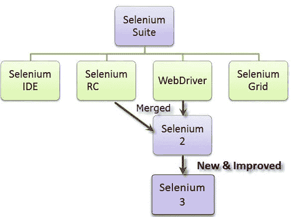

# 硒是什么？Selenium 自动化入门

> 原文：<https://hackr.io/blog/what-is-selenium>

Selenium 自动化测试在测试人员中变得非常流行，因为它提供了各种优势。当我们谈到自动化测试时，首先想到的往往是我们最喜欢的自动化测试工具。然而，它以其简单性、可用性和易用性赢得了许多测试人员和开发人员的心。随着它在 2004 年的出现，Selenium 使自动化测试人员的生活变得更加容易，并且现在是许多自动化测试人员最喜欢的工具。因此，不再拖延，让我们了解什么是 Selenium 测试，以及它如何帮助自动化测试。

## 硒是什么？

Selenium 是 ThoughtWorks 的 Jason Huggins 为了测试他们的内部时间和费用应用程序而发明的，它引入了一个名为“JavaScriptTestRunner”的基本工具。现在，作为一个开源的可移植自动化测试框架，它已经在软件测试人员和开发人员中流行起来。它能够使用特定的浏览器绑定来自动化浏览器，从而自动化 web 应用程序以进行测试。这是一套为不同目的设计的四个工具。让我们详细了解 Selenium 及其提供的不同工具。

它有 4 个主要组件，采用不同的自动化测试方法，这种方法作为 Selenium 工具套件很受欢迎。每个软件测试人员或开发人员根据组织的测试需求选择工具。



### 硒遥控(遥控)

Selenium Core 是这套工具中的第一个工具。然而，由于 [**同源策略**](https://developer.mozilla.org/en-US/docs/Web/Security/Same-origin_policy) ，它有一些与跨域测试相关的问题，因此被弃用。因此，为了克服硒遥控器(硒钢筋混凝土)推出后，硒核心。RC 原来是跨域问题的辅助。RC 有一个 HTTP 代理服务器，有助于欺骗浏览器，使其相信正在测试的 Selenium core 和 Web app 来自同一个域，从而消除了跨域问题。

Selenium RC 分为两个部分，有助于克服跨域问题:

1.  Selenium 远程服务器
2.  Selenium 远程客户端

但是 RC 的主要问题是执行测试所花费的时间。因为 Selenium 服务器使用 HTTP 请求进行通信，所以这更加耗时。因为这个限制，RC 现在也不怎么用了。

### 硒 IDE

Selenium IDE，以前称为 Selenium recorder，是一个用于记录、编辑、调试和重放功能测试的工具。Selenium IDE 是作为对 Chrome 浏览器的扩展和 T2 火狐浏览器的插件实现的。使用 Selenium IDE 插件，您可以用任何受支持的编程语言(如 Ruby、Java、PHP、Javascript 等)记录和导出测试。

[硒 IDE](https://click.linksynergy.com/deeplink?id=jU79Zysihs4&mid=39197&murl=https%3A%2F%2Fwww.udemy.com%2Fcourse%2Fselenium-ide%2F)

### 硒栅

Selenium 网格基于中心节点架构。使用 Selenium Grid，您可以跨不同的浏览器运行并行测试会话。Hub 控制在不同节点上运行的 Selenium 脚本(OS 内的特定浏览器)和在不同节点上运行的测试脚本可以用任何编程语言编写。

Selenium Grid 与 RC 一起用于测试远程机器上的多个测试。现在，由于人们发现 Webdriver 比 RC 更好，因此网格可以同时使用 Webdriver 和 RC。

### Selenium Webdriver

Selenium Webdriver 是 Selenium RC 的增强版，也是使用最多的工具。它通过客户端 API 接受命令，并将它们发送到浏览器。简而言之，Selenium Webdriver 是一个特定于浏览器的驱动程序，有助于访问和启动不同的浏览器。它提供了一个编写和运行自动化脚本的接口。每个浏览器都有不同的驱动程序来运行测试。

*   Mozilla Firefox 使用 Firefox 驱动程序(Gecko 驱动程序)
*   谷歌 Chrome 使用 Chrome 驱动程序
*   Internet Explorer 使用 Internet Explorer 驱动程序
*   Opera 使用 Opera 驱动程序
*   Safari 使用 Safari 驱动程序和
*   用于模拟使用无头浏览器 HtmlUnit 的浏览器的 HTM 单元驱动程序

### Selenium 客户端 API

它是这套工具中的最新工具。使用 Selenium 客户端 API，您可以用各种编程语言编写测试脚本，而不是用 Selenese 编写测试脚本。Selenium 客户端 API 可用于 Java、JavaScript、C#、Ruby 和 Python。这些脚本可以使用预定义的命令和客户端 API 函数与 Selenium 通信。

## 为什么选择 Selenium 进行自动化测试？

既然我们现在已经熟悉了 Selenium 及其工具套件，那么让我们来看看 Selenium 的各种好处，这些好处使它作为自动化测试工具脱颖而出:

1.  **开源工具:**因为它是开源工具，所以它不需要任何许可成本，这使它比其他自动化测试工具更胜一筹。
2.  **满足各种需求的工具:**如前所述，Selenium 有一套工具，因此它能满足用户的各种需求。您可以使用各种工具，如 WebDriver、Grid、IDE 来满足您的不同需求。
3.  **支持所有主要语言:**自动化测试工具的测试人员或开发人员面临的主要挑战是对语言的支持。因为 selenium 支持所有主流语言，如 Java、JavaScript、Python、Ruby、C sharp、Perl、.Net 和 PHP，测试人员更容易使用。
4.  **浏览器和操作系统支持:** Selenium 支持不同的浏览器，如 Chrome、Firefox、Opera、Internet Explorer、Edge 和 Safari，以及不同的操作系统，如 Windows、Linux、Mac。这使得它可以灵活使用。
5.  **社区支持:** Selenium 有一个活跃的开放社区，可以帮助您解决相关的问题和疑问。这使得它成为您自动化测试工具的最佳选择。

下面是 Selenium 与其他可用工具的快速对照表:

| **特性** | **硒** | **QTP** | **RFT** |
| **开源** | 是 | 不 | 不 |
| **支持** | 开源社区 | 专门支持 | 专门支持 |
| **所需的编码技能** | 是 | 不 | 不 |
| **操作系统支持** | Windows、Linux、Mac | Windows 操作系统 | Windows 操作系统 |
| **支持的语言** | Java，JavaScript，Python，Ruby，Perl，。升 C 调 | VB 脚本 | Java 和 C 夏普 |

## Selenium Webdriver 及其架构

因为 Selenium WebDriver 是最常用的工具，所以我们将使用它来执行 Selenium 测试用例。为了在非常简单的层面上理解完整的过程，Selenium WebDriver 架构包括:


基本上， [Selenium web 驱动程序](https://hackr.io/tutorial/selenium-webdriver-with-java-basics-to-advanced)工作在三层:浏览器驱动程序、远程驱动程序和语言绑定。

WebDriver 架构的核心组件:-

*   **Selenium 客户端库/语言绑定**

Selenium 绑定/客户端库由开发人员创建，以支持多种编程语言。例如，如果您想在 Python 中使用浏览器驱动程序，请使用 Python 绑定。可以在[官网下载所有绑定。](http://www.seleniumhq.org/download/#client-drivers)

JavaScript 对象表示法用作数据传输协议，将数据从服务器发送到 web 上的客户端。使用 JSON，用数组和对象支持这样的数据结构来读写数据是非常容易的。这个有线协议提供了一个传输机制，并使用 HTTP 上的 [JSON](http://www.json.org) 定义了一个 [RESTful web 服务](http://www.google.com?q=RESTful+web+service)。

对于 Selenium 绑定，每个 web 浏览器都有特定的浏览器驱动程序。浏览器驱动程序接受来自服务器的命令，并将其发送到浏览器，而不会丢失浏览器功能的任何内部逻辑。浏览器驱动程序也特定于编程语言，如 Ruby、C#、Java 等，用于 web 自动化。

以下是我们使用 Webdriver 运行任何测试脚本时的步骤:

1.  为每个 Selenium 命令生成 HTTP 请求，并发送给浏览器驱动程序。
2.  特定的浏览器驱动程序通过 HTTP 服务器接收 HTTP 请求。
3.  HTTP 服务器发送在浏览器上执行功能的所有步骤。
4.  测试执行报告被发送回服务器，HTTP 服务器将它发送给自动化脚本。

Selenium Webdriver 支持所有主流浏览器，如 Google Chrome、Mozilla Firefox、Internet Explorer 和 Safari 浏览器。

## 在本地机器上设置 Selenium

让我们了解如何在本地机器上配置 Selenium 并在本地浏览器上运行测试的步骤。

1.  安装代码编辑器或 IDE(比如 [Eclipse](https://www.eclipse.org/downloads/) 或 [IntelliJ](https://www.jetbrains.com/idea/download/)

注意:我们将使用 IntelliJ 代码编辑器来编写自动化脚本。

1.  在您的本地系统中下载并安装 [Java 运行时环境](https://www.oracle.com/technetwork/java/javase/downloads/jre8-downloads-2133155.html)。
2.  下载 [Java 开发工具包](https://www.oracle.com/technetwork/java/javase/downloads/jdk11-downloads-5066655.html)
3.  下载并安装所有 [Java Selenium 文件](https://www.seleniumhq.org/download/) ( **Selenium 服务器单机**)
4.  安装特定于浏览器的驱动程序(在这篇博客中，我们将在 Chrome 上执行自动化，因此在这种情况下， [Chrome 驱动程序](http://chromedriver.chromium.org/downloads))

## 用于 Web 自动化的 Selenium 脚本示例

下面是一个自动化脚本示例，可以在本地 chrome 浏览器上运行该脚本来自动化测试过程。因为我们使用 IntelliJ 作为我们的代码编辑器，所以我们将用 IntelliJ 编写同样的代码。

**样本脚本**

```
import org.openqa.selenium.By;
import org.openqa.selenium.WebDriver;
import org.openqa.selenium.WebElement;
import org.openqa.selenium.chrome.ChromeDriver;
public class TestSelenium {
public static void main(String[] args){
System.setProperty("webdriver.chrome.driver","C:\\Users\\Admin\\Desktop\\LT Automation\\chromedriver_win32\\chromedriver.exe");
WebDriver driver= new ChromeDriver();
driver.get("https://hackr.io/");
try {
WebElement signup = driver.findElement(By.xpath("//*[@id="navbarCollapse"]/ul/li[2]/a"));
signup.click();
WebElement login= driver.findElement(By.xpath("//*[@id="modalSignUp"]/div/div/div/div/div[4]/p/a"));
login.click();
String windowHandle = driver.getWindowHandle();
WebElement TextBox = driver.findElement(By.xpath("//*[@id="login-modal-form"]/div[1]/div/input"));
TextBox.sendKeys("sample-email@lambdatest.com");
WebElement Password = driver.findElement(By.xpath("//*[@id="login-modal-form"]/div[2]/div/input"));
Password.sendKeys("sample-password");
WebElement proceed = driver.findElement(By.xpath("//*[@id="login-modal-form"]/div[4]/button"));
proceed.click();
}
catch (Exception e) {
System.out.println(e.getMessage());
}
}
}

```

这段代码将启动一个网站(这里是[https://hackr.io/](https://hackr.io/?ref=blog-post))，找到“注册/登录”元素，点击注册/登录按钮，然后通过找到“登录”进入登录页面。之后，将输入登录页面的凭据，并单击登录按钮，重定向到 Hackr.io 主页。

## 在线硒网格

在本地机器上运行 Selenium 的主要挑战是本地机器上的浏览器数量有限。由于您只能在本地机器上安装一个版本的特定浏览器，因此如果需要测试该浏览器的降级或升级版本，您需要升级或降级您本地机器上已经安装的浏览器。此外，您可以在系统中只安装特定数量的浏览器。因此，如果需要的话，跨所有浏览器和操作系统进行测试几乎是不可能的。因此，在线硒网格可以有所帮助。

借助云上的在线 selenium 网格，您可以测试所有浏览器、浏览器版本、操作系统和分辨率的跨浏览器兼容性。提供 selenium grid-like LambdaTest、SauceLabs、BrowserStack 的在线平台可以帮助你在各种浏览器-操作系统组合的云网格上进行跨浏览器测试。

## 通用 Selenium 命令和操作

在编写自动化脚本时，您将使用许多重复的命令并执行各种操作。让我们快速看一下 Selenium 自动化测试中最常见和最常用的命令。

**页面访问:-** 首先要做的是访问一个网页，开始自动化测试。

```
driver.get("https://hackr.io/");

```

**找到一个元素:-** 找到元素并将其自动化。

```
// find just one, the first one Selenium finds
WebElement element = driver.findElement(locator);
// find all instances of the element on the page
List elements = driver.findElements(locator);

```

**对元素的操作:-** 对找到的元素进行操作。

```
// chain actions together
driver.findElement(locator).click();
// store the element and then click it
```

```
WebElement element = driver.findElement(locator);
element.click();

```

**多元素命令:-** 点击、提交、清除、输入等常用命令。

```
element.click(); // clicks an element
element.submit(); // submits a form
element.clear(); // clears an input field of its text
element.sendKeys("input text"); // types text into an input field

```

**问题命令:-** 检查元素的条件。

```
element.isDisplayed(); // is it visible to the human eye?
element.isEnabled(); // can it be selected?
element.isSelected(); // is it selected?

```

**获取信息:-** 获取元素信息的命令。

```
// directly from an element
element.getText();
// by attribute name
element.getAttribute("href");

```

## 综上

Selenium 是最好的自动化测试工具之一，可用于自动化网络浏览器交互。您可以通过用 Selenium 支持的任何首选语言编写代码来执行自动化测试，并且可以轻松地运行自动化脚本来自动化应用程序或流程的测试。它的易用性使它不同于其他工具，在在线网格的帮助下，你甚至可以在多个浏览器上并行运行你的测试。那么，你还在等什么？写一个漂亮的自动化脚本，测试你的网站！如果你有任何问题，请在下面的评论区告诉我们。

测试愉快！

**人也在读:**