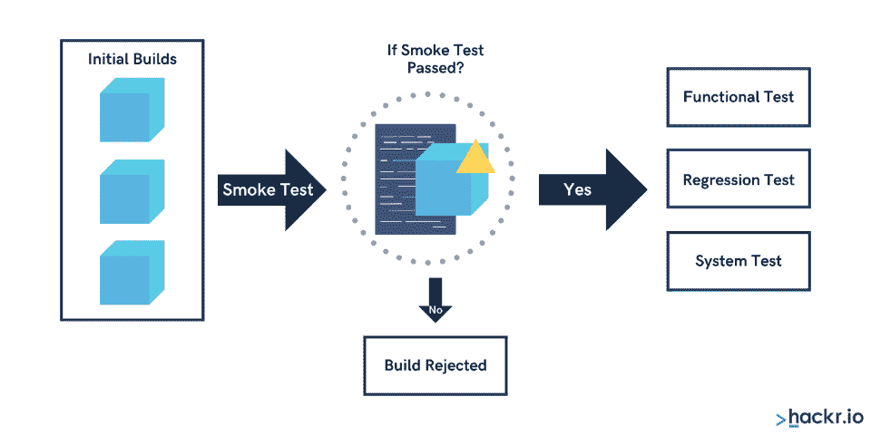
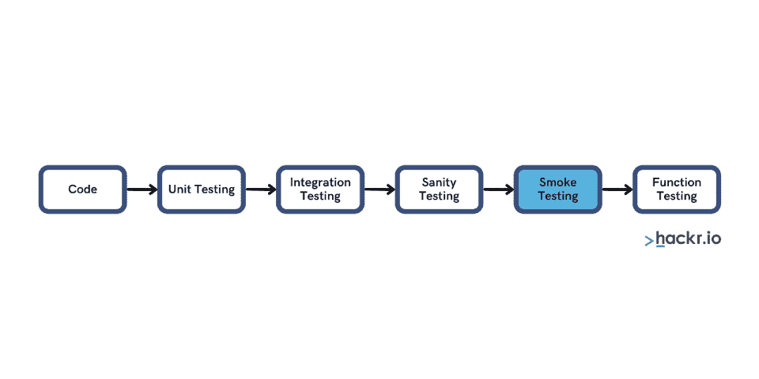

# 什么是烟雾测试？初学者指南

> 原文：<https://hackr.io/blog/what-is-smoke-testing>

# **什么是烟尘测试？**

你可能想知道，“什么是烟雾测试？”不要担心——您将了解到执行冒烟测试所需的所有知识，包括冒烟测试的意义以及冒烟测试与健全性测试的对比。

在开始之前，我们先来看看硬件的冒烟测试。

## 为什么我们称之为冒烟测试？

在“冒烟测试”成为软件的同义词之前，它仅适用于硬件测试。

假设你想测试一个新的电脑主板。你可以遵循这个测试过程:插上电源，打开电源，然后等待。如果你看到硬件冒烟，说明它没有通过测试。如果没有烟，它通过测试。

今天，冒烟测试也适用于软件。这是在发布新软件之前解决关键问题的有效方法。

QA 工程师并不期望看到真正的软件冒烟。尽管如此，他们必须确保软件是完美的，并确保它准备好进行下一阶段的严格测试。

## **什么是烟尘测试？**

软件必须经过多轮测试，冒烟测试就是其中之一。冒烟测试有不同的名称——一些人称之为“构建验收测试”(BAT)，而另一些人称之为“信心测试”无论你使用什么术语，冒烟测试的目标都是一样的:测试软件的基本功能。

例如，你可以使用冒烟测试来测试软件的图形用户界面(GUI)的响应，或者软件是否可以在不同的页面之间安装和运行正确的导航。

此外，冒烟测试允许 QA 工程师识别错误和其他缺陷。然后，QA 团队将确认软件是否准备好进行进一步的测试，或者开发人员是否应该停止软件开发。

如果你正在开发一个图形用户界面应用程序，冒烟测试将集中在以下几个方面:

*   通过主页面和标签测试导航
*   验证你的软件的外观和感觉
*   检查所有关键功能，如登录表单、注册页面、购物车、文件导出等

你可能也听说过软件的健全性测试。冒烟测试和健全性测试有什么区别？冒烟测试侧重于初始软件构建的基本功能的稳定性，而健全性测试在 冒烟测试之后 *进行，并确保对软件所做的任何更改都正常工作。*

## **为什么烟尘测试很重要？**

冒烟测试有助于开发人员和工程师确保新软件尽可能完美。烟雾测试很重要，原因如下:

*   识别关键软件问题
*   启动软件前修复 bugs】
*   验证软件是否稳定
*   赢得顾客对你产品的信任
*   评估每个功能的功能
*   确定软件是否准备好进行下一阶段的测试

## **烟雾测试的特点**

冒烟测试让您发现问题，并为您的开发团队节省时间和金钱。为了优化冒烟测试，请确保您了解其所有特征和过程步骤。

以下是烟雾测试的特点:

*   **构建验证测试** :验证每个特性的用户友好程度。
*   测试选择 :手动或自动冒烟测试，取决于每个软件构建的需求和复杂性。
*   **测试阶段** :

*   **集成测试** 将特性组合成一组进行测试
*   **系统测试** 确认集成软件产品
*   **验收测试** 确定软件是否满足所有需求

## 什么时候有必要进行烟尘测试？

****

每个软件都必须进行冒烟测试。您在以下情况下执行冒烟测试:

*   当功能的构建发生突然变化或每次部署新功能时
*   在开发生命周期的开始
*   在详细测试或回归测试之前
*   当你想测试你编码的稳定性时

**例子** :在开发一个电子商务应用程序时，这里有一些你需要测试的项目:

*   注册按钮功能
*   推送通知
*   基于“产品名称”、“品牌名称”等的搜索功能
*   产品规格
*   选项
*   交货选项
*   有货或缺货指示器

## 谁应该做烟尘测试？

理想情况下，进行冒烟测试的人应该知道新软件的特性以及如何测试它们。在大多数组织中，冒烟测试的任务落在 QA 团队身上，要么是 QA 主管，要么是工程师。

当开发人员将构建发布到 QA 平台时，QA 专家将接管并进行全面的冒烟测试。

[软件手工测试-从初学者到专家的完整课程](https://click.linksynergy.com/deeplink?id=jU79Zysihs4&mid=39197&murl=https%3A%2F%2Fwww.udemy.com%2Fcourse%2Fsoftware-manual-testing-course%2F)

## **烟雾测试的类型**

烟雾测试有三种类型:

作为最常见的冒烟测试方法之一，手动方法非常适合任何初创公司构建一套冒烟测试。使用手动方法，测试人员在软件中更新或创建脚本和每个唯一的代码。我们建议您执行 20 到 50 个测试，因为少于这个数量的测试不足以发现错误。

也称为回归测试，冒烟测试的自动化方法将已经记录的测试与新软件进行比较，以快速捕捉并消除错误。这种方法通常比手动方法更快。而且，一个完美的自动化会话不仅仅可以测试软件的功能。它还可以提供对用户在与你的软件交互时的行为的洞察。

混合方法结合了手工测试和自动化测试，取其精华。使用混合方法，您可以获得自动化测试速度的好处，以及通过手工测试进行二次检查的安全性。

## **烟雾测试的好处**

以下是烟雾测试的一些优势:

*   冒烟测试可以让您更快地检测出漏洞。

你可以使用冒烟测试在软件生命周期的早期发现 bug。这本身就能为你节省时间和金钱。

*   **冒烟测试让新 bug 的排查变得相对容易。**

使用冒烟测试的另一个好处是它可以排除新的错误。由于它的高覆盖率，您可以毫不费力地发现回归错误。

*   **冒烟测试增强您的开发团队的能力。**

如果提高能力是你的目标之一，那么你不应该跳过冒烟测试。您可以用它来测试每一个特性，避免浪费资源。

*   **冒烟测试让你接受或拒绝新的构建。**

冒烟测试让你成为一名谨慎的看门人。您可以接受或拒绝任何新版本。

*   **冒烟测试让你评估软件开发进度。**

你可以使用冒烟测试来确定一个新的构建是否为下一个测试阶段做好了准备。

## **烟雾测试提示**

我们如何才能最大限度地发挥烟雾测试的优势？使用下面这些有用的提示来帮助你通过烟雾测试:

在进行冒烟测试之前，确保你已经准备好了所有需要的东西。例如，您应该确保您有正在运行的数据库表和足够的备份存储。你可能还想事先收集所有的测试文件，并确保你的烟雾测试软件运行良好。

通过尽早进行冒烟测试，立即解决 Nip 编码问题。当你要发布你的软件时，你不希望不得不去修正错误。

养成记录每次冒烟测试的习惯。这有助于您在需要时访问可靠的数据。

适当的冒烟测试不应超过 60 分钟。不要让开发人员等你几个小时来完成一个冒烟测试。

## **最后的想法**

现在你已经有了“什么是冒烟测试？”这个问题的答案我们希望您拥有在发布前测试任何软件的工具。

请记住，每次冒烟测试后，您都需要进行清理。每个 QA 专家的清理工作都不一样。有些人喜欢在进行冒烟测试之前清理干净；其他人在每次冒烟测试后都这样做。在这个上下文中，清理意味着删除文件、清空数据库表，有时甚至是停止服务器。