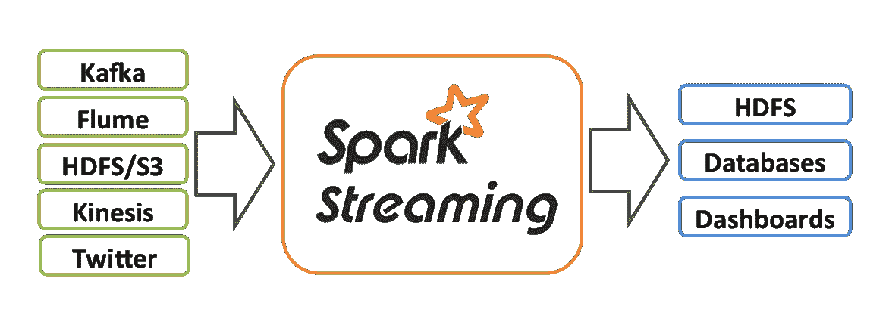
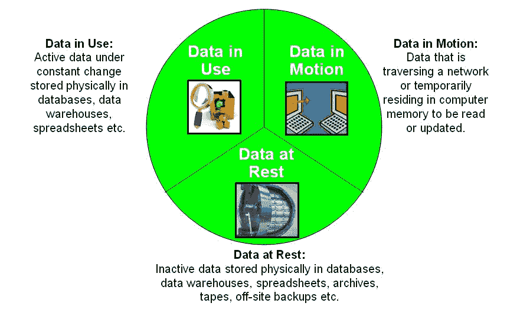
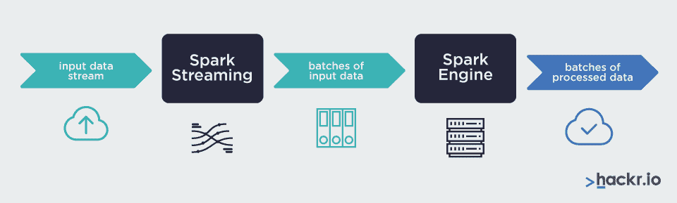
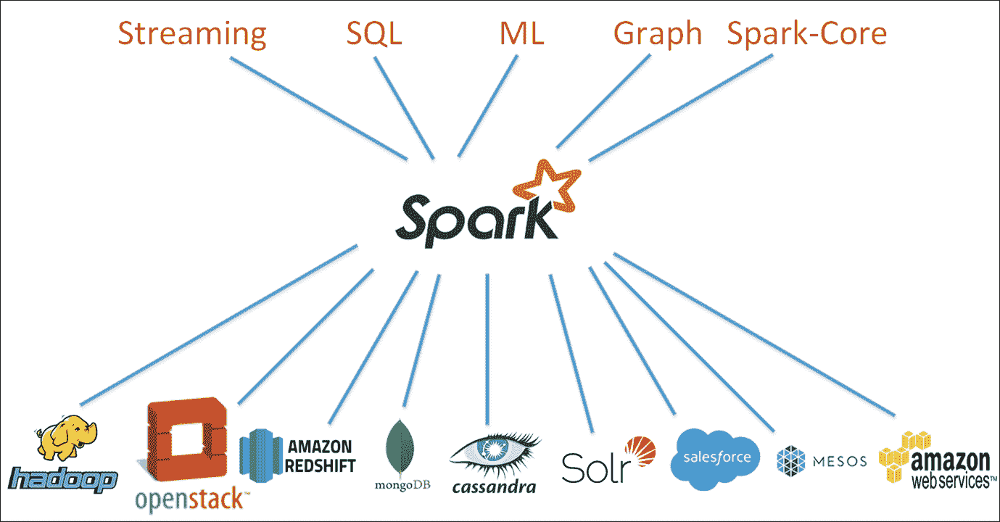
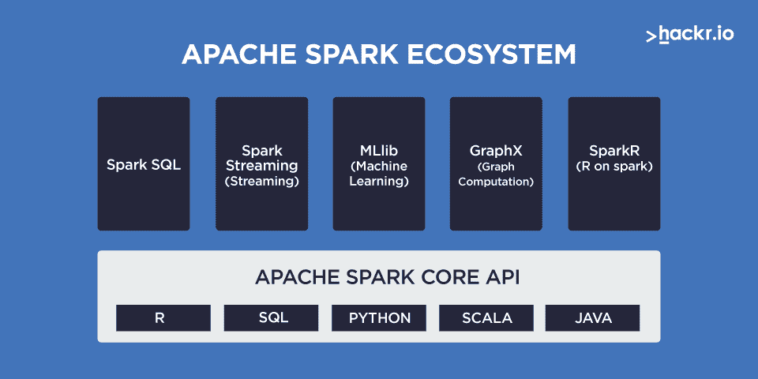

# 什么是火花流？终极指南[更新]

> 原文：<https://hackr.io/blog/what-is-spark-streaming>

## **什么是流媒体？**

*来源:[Spark.apache.org](https://spark.apache.org/docs/latest/streaming-programming-guide.html)*

流是尽可能快地处理数据的行为。如此之快以至于看起来像是实时完成的。

2017 年，IBM 的研究目录 Arvind Krishna 发表演讲。他宣称，如果不能或多或少地即时捕获和分析，[流数据会在毫秒](https://www.eenewseurope.com/news/cognitive-iot-soon-upon-us-says-ibm-research-director-arvind-krishna)内失去价值。

如今，流媒体行业的价值约为 1250 亿美元，因此无法快速捕获和处理实时数据可能会导致数十亿美元的损失。

流媒体行业不仅仅对商业有价值。它在其他各种人类活动中也很有价值。例如，执法机构可以使用实时数据来跟踪嫌疑人。安全服务可以即时分析国际旅客旅行，寻找可能突出可疑行为的模式。数百万人可以瞬间分享电影和音乐。

简而言之，我们关心流媒体，因为如果我们不这样做，我们可能会每年损失数十亿美元，或者失去许多更有效地工作和娱乐的机会。

## **流媒体和大数据**

实时处理少量数据总是比处理大量数据更容易。当我们谈到涉及大规模数据的大数据时，这一点变得更加明显。

大数据项目涉及大量信息，计算机系统可以区分静态和动态数据。“静态数据”是物理存储在设备上的数据，“动态数据”是在存储设备之间移动的数据。

*来源:[Wikipedia.org](https://en.wikipedia.org/wiki/Data_at_rest)*

## **流式处理与批处理**

“流式传输”意味着实时传输和处理数据。信息的处理速度与产生速度几乎相同。

数据科学家和软件工程师将流式处理和批处理区分开来。在批处理中，某些东西以块的形式产生数据，然后，一个或多个“某些东西”处理这些块。正如我们在后面讨论火花流时将会看到的，这种区别是很重要的。

当[人工智能](https://hackr.io/blog/what-is-artificial-intelligence) (AI)对股市走势做出即时反应时，它正在进行流式处理。另一方面，当计算机服务器将几个地区的销售数据发送到公司总部进行非工作时间处理时，它会进行批处理。

**注意:**流处理的是运动中的数据，而批处理处理的是静止的数据。

## **Apache Spark 简介**

### **阿帕奇火花发动机**

Apache Spark(或者只是 Spark)是一个开源计算引擎。Spark 引擎作为一个集成系统，与单独的代码库协同工作。该系统通过使用跨计算机集群的并行处理来处理海量数据。

Spark 是面向对流式大数据感兴趣的数据科学家和开发人员的行业标准工具。

**注意:**如果你熟悉流式大数据，注意 Spark 是*而不是*Hadoop 的修订版。

## **什么是火花流？**

****

*来源:[Packtpub](https://subscription.packtpub.com/book/big-data-and-business-intelligence/9781785885136/1/ch01lvl1sec8/apache-spark-architecture-overview)*

Spark Streaming(或者确切地说，Apache Spark Streaming)是一个用于处理流的软件系统。Spark Streaming 实时分析数据流。

事实上，目前没有系统真正实时地处理流。总会有延迟，因为数据会到达分析引擎可以使用的部分。

## 【Spark Streaming 是如何工作的？

**一言以蔽之:** Apache Spark Streaming(或者只是 Spark Streaming)使用 Spark 引擎来分析大数据流。

Spark Streaming 使用并行数据处理来近乎实时地处理数据流。Spark Streaming 同时在几个计算机集群上进行并行处理。

[使用 Kafka 和 Spark 结构化流的数据工程](https://click.linksynergy.com/deeplink?id=jU79Zysihs4&mid=39197&murl=https%3A%2F%2Fwww.udemy.com%2Fcourse%2Fdata-engineering-using-kafka-and-spark-structured-streaming%2F)

### **并行数据处理**

在计算的早期，长时间运行的任务必须共享一个处理器。为了解决这个问题，软件设计了处理器，使其在称为*线程*的独立通道中“关注”每个任务。这是计算机“多线程”的基础多线程让计算机用户假装他们的机器可以同时做几件事。

随着计算机技术的进步，在多个独立的处理器上真正共享任务成为可能。计算机不再伪装它。他们现在正在进行并行处理。

例:想象一下在一个环形炊具上烹饪一顿大餐。如果需要，你可以交换锅碗瓢盆。就像多线程一样。现在想象一下在多环炊具上烹饪同样的食物。所有的锅碗瓢盆可以同时加热。这就像并行处理。

Apache Spark 引擎处理跨多个计算机集群协调并行数据处理的所有问题。

### **计算机集群**

联网的计算机从称为*节点的交叉点分支出来。*每个节点是一个物理设备，执行与其他节点相同的任务。主机或“控制器”向节点分配任务。我们称以这种方式协同工作的计算机为*计算机集群*。

Spark Streaming 能够在计算机集群上进行并行处理，从而获得了巨大的能力和灵活性。

## **火花的优点**

Spark 支持多种编程语言。因此，Spark 非常灵活，许多不同背景的程序员都可以使用它。Spark 支持 [Java](https://hackr.io/blog/what-is-java) ，Python，R，Scala，SQL。

由于其卫星代码库，Spark 的任务范围很广，从流媒体到机器学习，再到数据存储和处理。

Spark 是高度可扩展的。用户可以在单台笔记本电脑、小型公司网络或跨越多个国家的大型计算机集群网络上使用 Spark。

更多优势包括:

*   Spark 做快速大规模数据处理。
*   它支持几种类型的计算机任务。
*   Spark 读写 Hadoop(准确的说是 Apache Hadoop)系统。
*   Spark 比它的主要竞争对手 MapReduce 更高效。
*   Spark 在静态数据源上运行复杂计算方面胜过 MapReduce。
*   许多人认为 Spark 是 MapReduce 的自然继任者。
*   Spark 比 Hadoop 快 40 倍。
*   Spark 可以使用来自多个来源的数据。
*   Spark 可以将结果推送到数据库、文件系统和实时仪表盘。用户甚至可以配置许多其他输出目的地。

## **Apache Spark:高级设计细节**

这部分是 Spark 内部设计的鸟瞰图。它比本文的其余部分更具技术性。尽管如此，对于任何想要了解 Spark 生态系统的人来说，这都是一本必读书。

Spark 的主要部分占据了三个不同的层次:组件层、核心层和框架层。

### **组件级别**

这一级有四个组件:

*   Spark SQL 结构化数据。该组件使用户能够查询有组织的数据。
*   火花流实时。该组件使用户能够处理实时数据流。它是提供实时分析的组件。
*   MLLib 机器学习。
    MLLib(机器学习库)是为用户提供众多[机器学习算法](https://hackr.io/blog/machine-learning-algorithms)的组件。
*   GraphX 图形处理。这个组件是 Spark 的原生工具，用于进行图形计算。

### **火花核心等级**

Spark 核心组件层处理 Spark 提供给用户的所有基本功能。它包括但不限于故障恢复、内存管理、存储系统交互和任务调度。

### **框架级别**

**独立调度程序**

该框架在集群级别工作，将多个 Spark 应用程序所需的所有资源集合在一起。在这样做的过程中，框架减少了重复工作，并有助于确保冗余。

(冗余有助于确保单点故障不会导致整个系统瘫痪。)

Spark 中的主进程使用这个框架来管理它的集群，并管理所有集群中的资源。

**YARN(又一个资源分配器)**

考虑 YARN 的简单方法是，它提供应用程序来管理它们使用的计算资源。因为有了 YARN，应用程序甚至可以管理分布在许多机器或许多计算机集群上的资源。

高级读者可以将 YARN 视为一个提供资源管理框架的集群级操作系统。

**Mesos**

Mesos 是用于管理计算机集群的开源软件。Mesos 是专门为在广泛分布的计算机环境中运行而设计的。它是集中式的，高度容错。

**如何可视化 Spark 的架构**

在你的脑海中，想象组件层是顶层，核心层是中间层，框架层是底层。不过，相对位置并没有显示出什么特别之处。这里要带走的主要内容是，核心层是 Spark 中一切的核心。

## **流故障以及它们如何影响火花？**

没有一个系统是 100%安全的。偶尔会出点差错。在流媒体中，数据包可能会神秘地丢失，再也没有消息。其他的包出现的很晚，就像参加聚会的散兵游勇。事实上，在计算机科学中，这些数据包真的被称为“掉队者”它们与之前的和之后的不同步。有时，硬件故障也会导致问题。

不管什么原因，在敏感环境下都不能允许流故障。银行交易必须如实记录。已经售出的机票必须分配给正确的乘客。

流处理器可以恢复故障，但这是一项既费时又费钱的工作。

恢复需要很长的恢复时间和“热”复制。(热复制是指在系统仍在处理实时数据时进行复制。)流式处理系统通常不能有效地处理掉队者。

Spark 发展了两种处理故障的策略，数据流和数据帧。两者各有利弊。

## 【Spark Streaming 如何处理故障

Spark 流使用离散流(数据流)来实现容错流。数据流是一种从故障中恢复的方法，比传统的复制和备份方法具有更好的跟踪记录。DStream 也容忍掉队者。

## 【Spark 结构化流如何处理故障

Spark 结构化流使用连续流方法，使系统能够连续处理流数据。它避免了处理错误和掉队的许多问题，因为结构化流在更新最终结果之前等待所有数据到达。

Spark 结构化流使用数据帧。

## **火花流与结构化流**

Spark Streaming 的数据流由连续的 RDD(弹性分布式数据集)块组成。虽然具有容错功能，但数据流分析和数据流处理比其竞争对手的 DataFrames 要慢。这意味着与数据帧相比，数据流在传递消息时不太可靠。

结构化流使用数据帧来分析和处理数据。它之所以能做到这一点，是因为它直接构建在 Apache Spark 引擎之上。

在这两种接口中，Spark 结构化流更适合拥有丰富分布式系统工作经验的熟练软件开发人员。

## **知名星火用户**

这里，我们提供了“严肃”Spark 用户的两个用例。我们相信，通过这样做，您将对 Apache Spark 在现代大数据世界中的位置有一个明确的想法。

### **叫喊**

Yelp 使用 Apache Spark 来预测给定用户与特定广告互动的可能性。通过这样做，Yelp 增加了点击其广告的人数，从而增加了收入。

Yelp 使用 Apache Spark 处理训练机器学习算法所需的海量数据，以可靠地预测人类行为。

### 赫斯特

赫斯特公司是一家庞大、多元化的信息和媒体公司，为其客户提供来自 200 多个网站的可视内容。赫斯特的编辑团队可以通过亚马逊 EMR 使用 Apache Spark 流来监控哪些文章做得好，哪些是热门话题。

**结论**

## Apache Spark Streaming 是一个强大的工具，用于编写基于大数据的流应用程序。Spark Streaming 有望很快取代其主要竞争对手 Map Reduce，成为领先的大数据流处理器。可以选择使用其中任何一种的数据科学家和开发人员可能会更好地专注于 Spark 流。

Spark 引擎为用户提供了两种流处理模型:Spark 流和 Spark 结构化流。虽然具有容错能力，但 Spark 流处理掉队者时会有困难(参见上面的“Spark 流如何处理流故障”)。

Spark 结构化流不仅容错。由于其设计方式，它还可以毫无困难地处理掉队者。更好的是，使用结构化流，只需少量的代码更改，就可以轻松地与其他数据处理应用程序一起工作。然而，缺点是 Spark 结构化流比 Spark 流更具挑战性。

**人也在读:**

**People are also reading:**