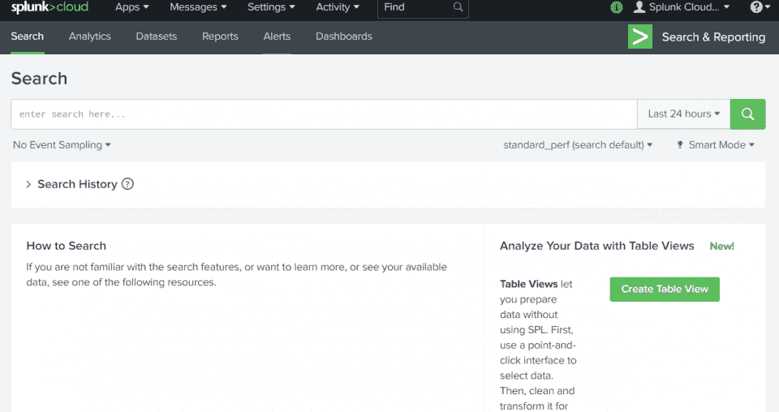
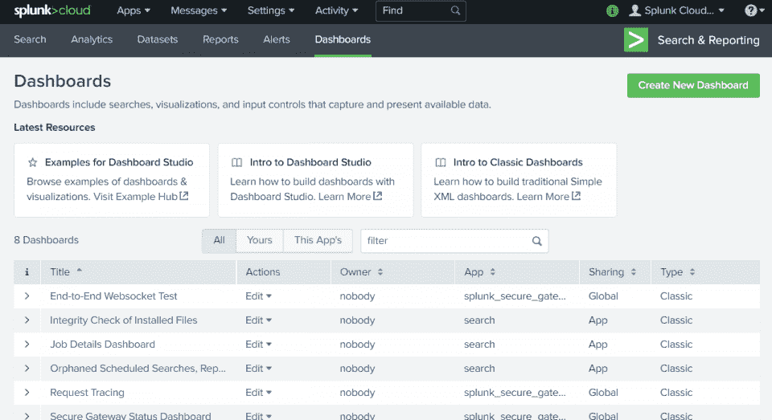
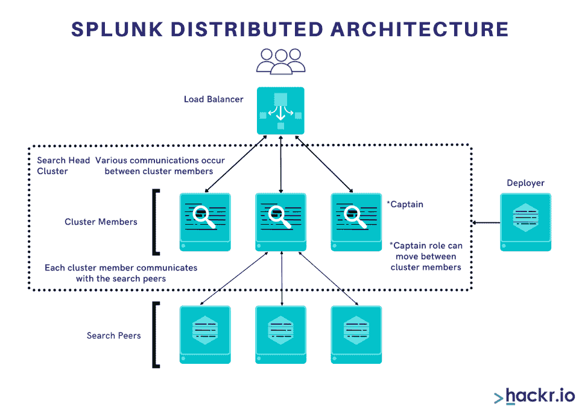
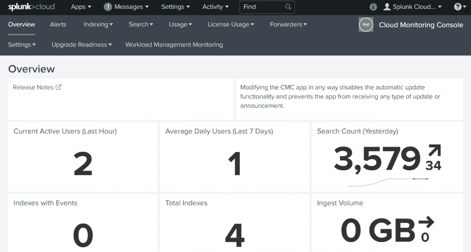

# Splunk 是什么？了解 Splunk 一切的指南

> 原文：<https://hackr.io/blog/what-is-splunk>

## **什么是 Splunk？**

什么是 Splunk？今天的计算机产生了大量的数据。其中一些是人类可读的。很多都不是。Splunk 是一种数据管理解决方案，可以获取大量机器数据，对其进行分析，并生成易于阅读的可视化报告。

Splunk 和其他类似的技术正成为许多行业的必需品。从寻求优化结果的营销人员到试图路由流量的网络开发人员，人们能够阅读和理解机器生成的数据是至关重要的。

下面，我们将讨论 Splunk 是什么，为什么使用它，为什么它是如此重要的技术。虽然它不是唯一可用的数据挖掘和数据可视化工具，但它 *是* 中最受欢迎的一种。

## **什么是 Splunk？**

Splunk 于 2003 年在旧金山联合创立。大约 20 年后，Splunk 是一家年收入 23.6 亿美元的企业。

Splunk 是一种能够索引和分析实时机器生成数据的实用程序。然后，这些数据被发送到报告、图表、警报、仪表板和可视化界面中。

虽然 Splunk 不是这个领域的唯一竞争对手，但 Splunk 已经成为主要的实时日志管理系统之一。它可以用于各种目的，有些非常具体，有些则很笼统。

## **Splunk 是用来做什么的？**

Splunk 的分析解决方案可用于识别关键数据模式、诊断问题并提供核心指标。

对于一个组织来说，这提供了数据挖掘最基本的优势。组织能够识别潜在的模式，例如瓶颈或物流问题。在此基础上，他们可以在风险发生之前做出明智的反应。

具体来说，Splunk 经常被用作日志分析和监控解决方案。虽然 Splunk 可以处理任何数据集，但 Splunk 最常见的应用是挖掘日志以确定系统性能、网络性能或网站性能。

如果使用的话，Splunk 也可以是一个关键的商业智能解决方案。借助 Splunk，组织、开发人员和个人可以挖掘数据以获得重要见解。Splunk 可用于确保应用程序得到适当的负载平衡，资源得到智能使用，确保满足安全性和合规性指标，并为企业识别创收机会。

但是由于 Splunk 确实有很大的准入门槛，开发和配置 Splunk 可能是一项挑战。Splunk 管理员和开发人员致力于确定组织的数据需求，并将其转化为系统可用且易于分析的数据。Splunk 并不完全是“一劳永逸”，但是一旦理解了，它就非常强大。

## Splunk 是如何工作的？

Splunk 实时导入数据，然后根据设定的目标进行分析。

例如，一个网站管理员可能会输入机器可读的流量来分析流量的流向，哪里可能会有瓶颈，以及是否会出现中断。当流量发生异常变化时，当恶意攻击即将发生时，或者当网站管理员想要获得额外的资源时，网站管理员的仪表板可以提醒网站管理员。

Splunk 本质上是一种灵活的产品。它旨在获取数据，寻找指标，然后根据组织定义的指标进行分析和报告。

如果销售人员想了解特定的用户统计数据，他们可以这样做；如果一个企业想查看物流数据，他们可以。

因此，Splunk 是一个非常灵活和强大的平台，可用于分析多种类型的数据。但它确实需要训练才能做到这一点。

## **什么是 Splunk 架构？**

Splunk 如此有用的部分原因是它拥有分布式架构。换句话说，搜索是沿着可能性之树向下进行的，而不是线性的。搜索到搜索头，然后向下遍历搜索对等点。

通过 Splunk 的分布式架构，组织可以更轻松地向上扩展。并且可以更快地进行搜索。当需要处理大量数据时，这种类型的优化在数据挖掘和管理中至关重要。

Splunk 可以在内部运行，也可以在云上运行。许多组织使用基于云的应用程序，根据使用的资源量收取可变的费用。将 Splunk 用作基于云的服务的优势在于，它可以利用云的力量处理海量数据。一个缺点是，这种力量确实是以直接成本为代价的。

## 如何学习 Splunk？

由于 Splunk 是如此受欢迎的套件，因此有许多关于其基础知识的课程、研讨会和课程。因为 Splunk 是非常高级的高级数据管理解决方案，所以用户需要了解数据分析和数据科学的基础知识。其实 Splunk 最抢手的就是 [数据科学技能](https://hackr.io/blog/data-scientist-skills) 。

Splunk 本身也提供了一些关于 [Splunk 基础](https://www.splunk.com/en_us/training/free-courses/splunk-fundamentals-1.html) 的基础类。但这些只是形成了使用平台的基础。大多数用户还需要理解数据科学和分析背后的概念。

## 什么是 Splunk 认证？

如果您正在尝试学习 Splunk，您可能会对投资 Splunk 认证感兴趣。Splunk 认证对任何数据科学家或开发人员来说都是一个福音。认证路径如下:

*   **Splunk 认证超级用户。** 认证超级用户是指对使用系统非常有信心的人。他们精通数据导入和提取、数据分析、仪表板、报告等。认证超级用户应该了解 Splunk 的基本原理。
*   **Splunk 云认证管理员。** 认证管理员是能够主动管理 Splunk 系统的人。他们可以使用控制台功能，管理其他用户，了解维护系统以及控制和配置系统的基本知识。
*   **Splunk 认证开发商。** 认证开发人员是 Splunk 系统方面的专家，能够围绕 Splunk 平台进行积极开发。很少有人能自称为 Splunk 认证开发人员。

  以上认证路径可以向雇主表明你了解 Splunk 的来龙去脉。Splunk 本身提供专门帮助个人通过这些认证的课程和作业，这些认证是通过公司提供的。

## Splunk 有什么好处？

Splunk 如此受欢迎肯定有原因。Splunk 专注于与性能相关的分析和指标，但这不是它能做的全部。它具有广泛的功能。以下是 Splunk 的一些核心优势。

*   Splunk 允许与机器学习和人工智能集成。 虽然 Splunk 的学习曲线可能很陡，但作为 AI 的标准学习曲线， *并不像* 那样陡。企业可以通过采用 Splunk 平台来利用人工智能和机器学习。
*   Splunk 是一个“数据决定一切”的平台。 换句话说，它是一个通用的实用程序。即使 Splunk 更频繁地用于特定用例，它也可以应用于任何数量的复杂数据。
*   **Splunk 可以减少停机时间和中断。** 通过监控系统健康和性能，Splunk 可以帮助组织减少代价高昂的停机时间并避免潜在的中断。
*   Splunk 可以提供更智能的数据洞察。 在商业智能方面，Splunk 可以整理物流和运营数据，识别模式，并通过易于阅读的可视化报告来帮助分析这些模式。
*   **Splunk 可以改善安全系统和性能。** Splunk 可用于识别潜在入侵、性能问题和可靠性问题，直接向仪表板发送报告和警报。
*   Splunk 具有极强的可扩展性。 因为有了 Splunk 架构，Splunk 甚至可以轻松搜索巨大的数据集。组织将能够增长他们的数据，而不用担心他们最终会超出他们的数据管理系统。
*   **Splunk 可以通过云和内部部署使用。** Splunk 既可以下载到机器上，也可以在云上使用，提供额外的灵活性。许多其他类似的系统只能在云上使用。

Splunk 最明显的优势是它是一个通用系统。尽管它最常用于日志管理，但它也可以用于其他应用程序。这是一个强大、灵活且可扩展的解决方案。

## **Splunk 有哪些负面？**

尽管如此，Splunk 并不是完美的解决方案。对于给定的项目，它并不总是最理想的解决方案。Splunk 的负面包括:

*   这并不总是划算的。 对于较大的项目，Splunk 对于较大的项目来说会变得相当昂贵，因为当资源被使用时，它的成本会上升。组织可能会发现在数据管理和数据分析上花费太多。
*   **可以是** ***太*** **广义。** 因为它不是针对某个特定的用例，所以它的仪表板对于某些用例来说可能过于一般化。例如，对于日志管理，它可能没有足够的特定于日志管理的定制。
*   很难学。 说到 Splunk，市场准入门槛很高。这是一个非常全面的系统，即使是简单的任务也需要一些时间来学习。这是一个最适合经常使用它的人的系统，比如营销人员或数据科学家。

当然，后者也可以是一种好处。Splunk 很难掌握。这意味着这是某些市场非常需要的技能。那些拥有 Splunk 认证或掌握技术的人可能会发现在该领域找到工作并不困难。

## Splunk 的替代产品有哪些？

数据管理是一个快速发展的领域。因此，Splunk 也有一些受欢迎的替代品，这是理所当然的。让我们来看看几个最常见的:

1.  ****。Loggly 成立于 2009 年，是一个基于云的分析和日志管理解决方案，可以对大量数据进行快速搜索。Loggly 旨在通过实时梳理日志来帮助组织快速识别性能问题。****
***   [**相扑逻辑**](https://www.sumologic.com/) **。** 另一个基于云的分析引擎 Sumo Logic 是为日志管理和分析服务而设计的。相扑逻辑可以应用于商业智能、运营、物流和安全。它提供实时数据和指标分析。*   ****。LogZilla 不仅关注日志管理，还关注网络编排，重点是确保网络性能始终保持高水平。通过 LogZilla，组织可以减少负载平衡问题、瓶颈和其他与性能相关的问题。*******   ****。**log faces 是一个日志服务器、聚合器和查看器，它提取实时日志流以及批处理日志流和历史日志流，并从中挖掘可能指示中断或资源管理问题的数据。*****   [**哨兵**](https://sentry.io/welcome/) **。** 一个性能监控系统，Sentry 提取日志并挖掘与性能相关的问题，在相关时发出警报。Sentry 是一种自托管、基于云的错误管理和性能管理解决方案，可以使网络管理更加轻松。*   [**Hadoop。**](https://hadoop.apache.org/) Hadoop 是一个众所周知的大数据系统，比 Splunk 具有更广泛的效用。由 Apache 项目管理的 Hadoop 几乎可以用于任何大数据任务。这是一个非常受欢迎的系统。******

 ****与 Splunk 相比，这些替代方案各有利弊。正如你可能注意到的，他们中的大多数都有一个关键的焦点。有些人只专注于日志管理，而其他人也可以完成商业智能分析。有些更关注安全性，而有些更关注负载平衡。

根据您的组织或项目，Splunk 可能更适合或更不适合您的数据。通常，确定正确解决方案的最佳方法是尝试尽可能多的解决方案。

## 谁在使用 Splunk？

许多大公司都使用 Splunk:包括思科、IBM、Adobe、Salesforce、脸书和沃尔玛。

根据 Splunk 的数据，[110 个国家的 15，000 多名客户](https://www.splunk.com/en_us/customers.html) 使用 Splunk 工具挖掘他们的数据。Splunk 是一种非常通用和强大的技术，很容易理解它为什么如此成功。

就 *工作* 而言，Splunk 最常被数据科学家、数据分析师、数据工程师和数据架构师使用。但是 Splunk 也可能被工程师、营销人员、网络开发人员、网站管理员和科学家使用。任何需要处理超大数据集的人都可以将它们转移到 Splunk 平台。

**结论**

## 因此，如果您想知道“什么是 Splunk？”答案是:Splunk 就是 *一切。* Splunk 是一种与复杂数据集交互的方式。如果您有复杂的机器可读数据集，那么您可以使用 Splunk 来处理和分析它们。要了解有关 Splunk 的更多信息，可以参加课程、授课甚至训练营。

So, if you’re wondering, “What is Splunk?” the answer is: Splunk is *everything.* Splunk is a way to interact with complex data sets. If you have complex, machine-readable data sets, then you can use Splunk to process and analyze them. To learn more about Splunk, there are courses, lessons, and even bootcamps available.****