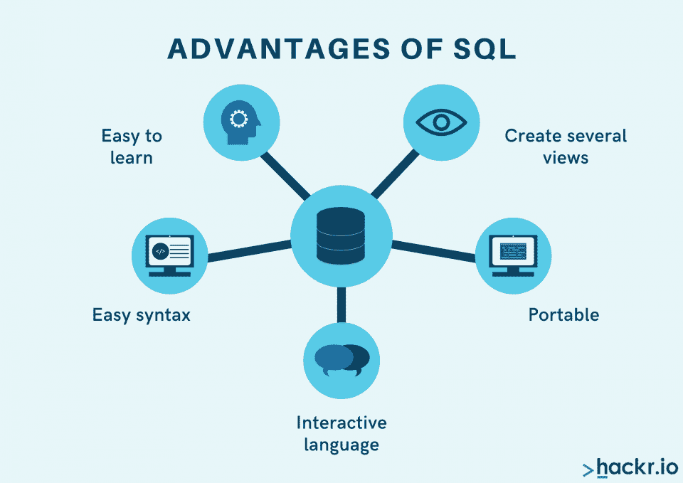

# 什么是 SQL？初学者权威指南

> 原文：<https://hackr.io/blog/what-is-sql>

互联网上有大量的数据和信息。每秒钟都会产生万亿字节的数据。但是这些海量的信息是从哪里存储的呢？嗯，答案是[数据库。](https://www.oracle.com/database/what-is-database/)

数据库是以系统方式排列的数据集合，以电子方式从计算机系统中存储和检索。它以多行多列的表格形式存储数据，每一行都有几个条目。

数据专业人员借助 SQL 或结构化查询语言从这些表中检索数据。SQL 无疑是处理数据库的必备语言。

如果您是这个领域的新手，本文将帮助您熟悉 SQL 及其工作。让我们继续深入了解这个话题的细节。 本文将涵盖什么是 SQL，顶级 SQL 命令，SQL 的演变，以及优势和应用。

我们开始吧！

## **什么是 SQL？**

SQL 代表结构化查询语言。它是一种标准化的编程语言，用于在关系数据库上处理和执行多种操作。

早在 1986 年，美国国家标准协会(ANSI)就将 SQL 作为标准语言。此外，国际标准化组织(ISO)也将 SQL 作为数据库标准。

SQL 是一种流行且广泛使用的语言，用于在关系数据库中提取数据和组织数据。SQL 查询用于执行多项任务，如检索、删除或更新数据库中的数据。有一些传统的命令来完成这些任务，如“更新”、“插入”、“删除”、“删除”、“创建”和“选择”

此外，一些最流行的使用 SQL 的关系数据库管理系统(RDBMS)有:

*   微软 SQL 服务器
*   甲骨文
*   访问
*   赛贝斯
*   安格尔

### **SQL 的功能**

SQL 有多种应用，包括:

*   创建、删除、更新或丢弃表格和数据库
*   修改或访问 RDBMS 中的数据
*   定义数据库中的数据。
*   使用其他语言的 SQL 模块和库

现在你已经了解了 SQL 的基础知识，让我们继续学习 SQL 使用的不同类型的数据。

## **SQL 数据类型**

在 SQL 中，可以使用这些数据类型:

*   数字
*   二进制
*   字符串
*   日期和时间

## **顶级 SQL 命令**

SQL 有几个语句或命令可以对数据库进行更改。下面是最常用的 [SQL 命令](https://hackr.io/blog/sql-commands) :

1.  创建
2.  更新
3.  改变
4.  解释
5.  截断
6.  选择
7.  下降
8.  授予
9.  喜欢
10.  插入

让我们通过示例详细研究每个命令。

### **创建**

“创建”命令用于创建表格、数据库或视图:

#### **用于数据库**

#### SQL 使用下面的语句创建一个新的数据库:

#### **语法:**

```
Create Database DatabaseName;
```

**举例:**

```
Create Database EmployeeDetail;
```

#### **为表**

SQL 使用下面的语句创建一个表。

#### **语法:**

```
CREATE TABLE TableName 
(
Column1 data type,
Column2 data type,
Column3 data type
);
```

#### **举例:**

```
CREATE TABLE Employee
(
CustomerID int,
CustomerName varchar(255),
PhoneNumber int,
Address varchar(255),
City varchar(255),
Country varchar(255)
);
```

上面几行代码创建了一个名为“Employee”的表，将 CustomerID、CustomerName、PhoneNumber、Address、City 和 Country 作为属性或列。

#### **为视图**

要创建一个视图，使用下面的语法:

**语法:**

```
CREATE VIEW OR REPLACE ViewName AS
SELECT Column1, Column2, ..., ColumnN
FROM TableName
WHERE Condition;
```

**举例:**

```
CREATE VIEW OR REPLACE DLIEmployees AS
SELECT CustomerName, PhoneNumber
FROM Customers
WHERE City = "DELHI";
```

这将创建一个包含两列(CustomerName 和 PhoneNumber)的视图，这些列是“customers”表中城市为德里的客户的。

### **更新**

如果你想修改表中已经存在的数据，使用 Update 语句。

**语法:**

```
UPDATE TableName
SET Column1 = Value1, Column2 = Value2, ...
WHERE Condition;
```

**举例:**

```
UPDATE Employee
SET EmployeeName = 'Rachel', City= 'Los Angeles'
WHERE EmployeeID = 5;
```

该语句更新雇员的详细信息，其 EmployeeID 为 5。

### **改变**

您可以使用 Alter 语句来添加、修改或删除表中的列。

**语法:**

添加列:

```
ALTER TABLE TableName 

ADD ColumnName Data Type;
```

删除列:

```
ALTER TABLE TableName 

DROP COLUMN ColumnName;
```

修改列名:

```
ALTER TABLE TableName 

ALTER COLUMN ColumnName Data Type;
```

**例:**

```
ADD Column Address:​
```

```
ALTER TABLE Employee 

ADD Address varchar(255);
```

它将名为“地址”的列添加到“雇员”表中。

删除列地址:

```
ALTER TABLE Employee 

DROP COLUMN Address ;
```

它从“雇员”表中删除一个名为“地址”的列。

现在，向您的表中添加一个列 JoiningDate，并将数据类型设置为“year ”,如下所示:

```
ALTER TABLE JoiningDate 

ADD JoiningDate date;​
```

**

```
ALTER TABLE JoiningDate 

ALTER JoiningDate year;
```

### 为了从表中获取信息，我们使用 Explain 语句。**解释**

**语法:**

```
EXPLAIN ANALYZE
SELECT * FROM Table1 JOIN Table2 ON (Table1.Column1 = Table2.Column2);
```

**举例:**

```
EXPLAIN ANALYZE
SELECT * FROM Employee1 JOIN Orders ON (Customers.CustomerID = Orders.CustomerID);
```

结果包含来自表“Employee1”和“Orders”的元组或行，这两个表的 CustomerID 相同。

### **截断**

要从表格中删除完整数据，使用 truncate。

**语法:**

```
TRUNCATE TABLE TableName;
```

**举例:**

```
TRUNCATE Table Customers;
```

该语句删除存储在‘Customers’表中的所有数据。

### 选择

要从表格中检索一组特定的信息，使用 Select。

**语法:**

```
SELECT Column1, Column2, ...ColumN 

FROM TableName;
```

(*) -从特定表格中选择所有数据

```
SELECT * FROM table_name;
```

**举例:**

```
SELECT EmployeeID, EmployeeName 

FROM Customers;
```

它从“Customers”表中返回 EmployeeID 和 EmployeeName 列。

(*) -选择特定表格中的所有数据

```
SELECT * FROM Employee;
```

这将返回“雇员”表的全部数据。

### **下降**

要一次完全删除整个数据库，请使用 Drop 语句。

**语法:**

```
DROP DATABASE DatabaseName;
```

**举例:**

```
DROP TABLE Employee;
```

这将删除“雇员”表。

### **授予**

Grant 语句用于用户访问数据库。

**语法:**

```
GRANT PName
ON Object1
TO [WITH GRANT OPTION];
```

**举例:**

```
GRANT SELECT ON Customers TO admin;
```

### **喜欢**

“Like”操作与“Where”子句一起使用。如果您希望在表中找到特定的模式，请使用“Where”子句。

**语法:**

```
SELECT ColumnName(s)
FROM TableName
WHERE ColumnName LIKE pattern;
```

**举例:**

```
SELECT * FROM Employee
WHERE EmployeeName LIKE 'A%';
```

这里，' % '匹配 0 个或更多字符。

### **插入**

要向表中插入新数据，使用 Insert Into 语句。

**语法:**

```
INSERT INTO TableName (Column1, Column2, Column3, ...,Column100)
VALUES (value1, value2, value3, ...);
```

在这种情况下，不需要提及列名。您可以将值的顺序与列数据类型相匹配，如下所示:

```
INSERT INTO TableName
VALUES (Value1, Value2, Value3, ...);
```

**举例:**

```
INSERT INTO Employee(EmployeeID, EmployeeName, PhoneNumber, Address, City)
VALUES ('15', 'Ana', '0000000000', 'House No 56, 5th Avenue', 'London');​
```

上述语句将雇员的数据插入到“雇员”表中。

```
INSERT INTO Employee
VALUES ('10', 'Ross','1111111111', 'Carlton Inn, 45', 'New York');
```

**SQL 历史记录**

## IBM 的研究人员 Raymond Boyce 和 Donald Chamberlin 在 20 世纪 70 年代首先开发了结构化查询语言(SQL)。更早的时候，SQL 被称为 SEQUEL，它是在 Edgar Frank Todd 的论文“大型共享数据库的数据关系模型”发表后于 1970 年创建的。

在这篇论文中，Todd 认为数据库中的所有数据都可以用关系的形式来表示。作者 Malcolm Coxall 在他的书《Oracle Quick Guides》中写道，SQL 最初是为了操作存储在 IBM 的关系管理系统“System R”中的数据而设计的。

1979 年晚些时候，一家名为 Relational Software 的公司，现名为[甲骨文](https://en.wikipedia.org/wiki/Oracle_Corporation#History)，发布了他们自己的 SQL 语言的商业版本，名为甲骨文 V2，并将其公之于众。之后，美国国家标准协会(ANSI)和国际标准组织已经将 SQL 视为关系数据库通信中的标准语言。

**SQL 为何诞生**

## 有史以来，数据存储一直是专业人士面临的主要挑战。

阻碍以前形式的数据存储的主要障碍有:

安全问题

*   数据的依赖性
*   冗余数据
*   慢速
*   可扩展性
*   **安全问题**

### 当涉及到与各种各样的用户共享数据时，安全性总是一个威胁。基本的数据共享表或文档不提供高科技安全选项。一般安全功能，如密码保护、锁定文档的特定部分等。，不足以保护数据免受外部威胁。

**数据的依赖性**

### 文件系统中有大量遵循特定格式的文件和记录。如果对单个文件或记录进行了任何修改，则必须同时更新其余的记录。之后，必须对整个系统进行更改。

因此，这显然是一项耗时且细致的任务，给文件系统带来了很大的缺陷。

**冗余数据**

### 在文件系统中，没有跟踪重复文件的机制。在一个系统中，相同的文件可以存储在不同的位置，导致冗余。

数据冗余会占用系统中不必要的存储空间，并带来安全威胁。

**慢速**

### 文件系统需要更多的编程和查询来获取新的报告或文件，而且快速检索解决方案会耗费大量时间和精力。这再次对文件系统中数据的无缝管理形成了很大的障碍。

**可扩展性**

### 你需要选择一个满足你当前需求的解决方案。但是，企业的需求会随着时间发生变化。为了适应这种变化，您必须保持一个提供可伸缩性的数据存储系统。

文件系统不可扩展，所以它落后了。

**SQL 的优势**

## ****

下面是 SQL 的一些优点:

**易学** : SQL 是一种高度用户友好的语言，适合[初学者学习](https://click.linksynergy.com/link?id=jU79Zysihs4&offerid=1045023.1691820&type=2&murl=https%3A%2F%2Fwww.udemy.com%2Fcourse%2Fmicrosoft-access-sql-beginners-expert%2F)。

*   **简单语法** :每个 SQL 查询都是由开发人员以结构化的方式制定的。为了成功地执行这些命令，您必须遵循标准的方法来编写每个命令/语句，这提供了简单的语法。
*   交互语言:SQL 语言的主要目标是从数据库中检索结果。在这种语言的帮助下，您可以轻松地与表进行通信，以获取所需的数据。
*   **可移植** :通过维护系统相同的环境设置，可以在不同的系统上执行相同的查询。如果环境不同，那么执行就不可能。
*   **创建多个视图** :视图是在 SQL 的帮助下创建的虚拟表格。它用于满足需求的临时目的。
*   **相关:** [**10 门最佳在线 SQL 课程**](https://hackr.io/blog/best-sql-courses)

进一步说，您可能想知道 SQL 的实时使用情况——这就引出了我们的下一部分。

**SQL 的应用和使用**

## 在这个数据驱动的世界中，SQL 正被广泛使用，因为管理大规模数据库已经成为首要关注的问题。它是查询关系数据库的主要标准语言，如 MySQL、Oracle 等。

以下是 SQL 的一些应用和用法:

*   We can use SQL as a Data Definition Language (DDL), meaning that we can create a database, characterize its structure, use it, and delete it afterwards. Also, we can call it a Data Control Language (DCL) which enables us to decide the grant and revoke permissions to our database. 
*   SQL can also be used as a Data Manipulation Language (DML), meaning that we can manage existing databases and perform various operations on data stored in a database. 

    我们也可以使用 SQL 作为客户端或服务器语言，连接应用的前端和后端。

*   **使用 SQL 的行业**

## SQL 在全球众多行业中广泛使用，因为它确保了数据的高效存储。

以下是一些使用 SQL 的行业示例:

**教育**

### 在各种教育机构中，例如学校、学院或大学，需要检索或保存员工数据。SQL 帮助维护信息记录，如考试详细信息、员工详细信息、学生详细信息、课程、教学大纲、出勤、费用详细信息等。

**金融**

### 管理资产、股票和金钱很有挑战性。使用 SQL，金融部门可以轻松处理和管理其产生的大量数据。

**零售**

### 零售业有大量的数据需要管理，SQL 不仅管理这些数据，还提供安全性。在很大程度上，零售企业选择 SQL 来处理他们的数据以及进行实时分析。

**医疗保健**

### 医疗保健行业需要一个可靠的管理系统来维护员工、患者、药房等的数据。SQL 帮助这个行业维护所有这些记录以及其他重要的好处。SQL 数据库的简单管理帮助医疗保健行业无缝运作。

**结论**

## 简而言之，SQL 是一种标准化的语言，用于管理关系数据库和处理一些操作，如添加、删除、更新、插入和修改数据库中的数据。对于组织来说，帮助他们轻松处理大量信息是一件好事。

SQL 解决了数据管理中遇到的障碍，如冗余、安全性、数据依赖性等等。主要行业都在他们的业务中实现 SQL。

希望扩展您的 SQL 证书吗？试用认证！

[立即获得 SQL 认证！](https://hackr.io/blog/sql-certifications)

**人也在读:**

**People are also reading:**