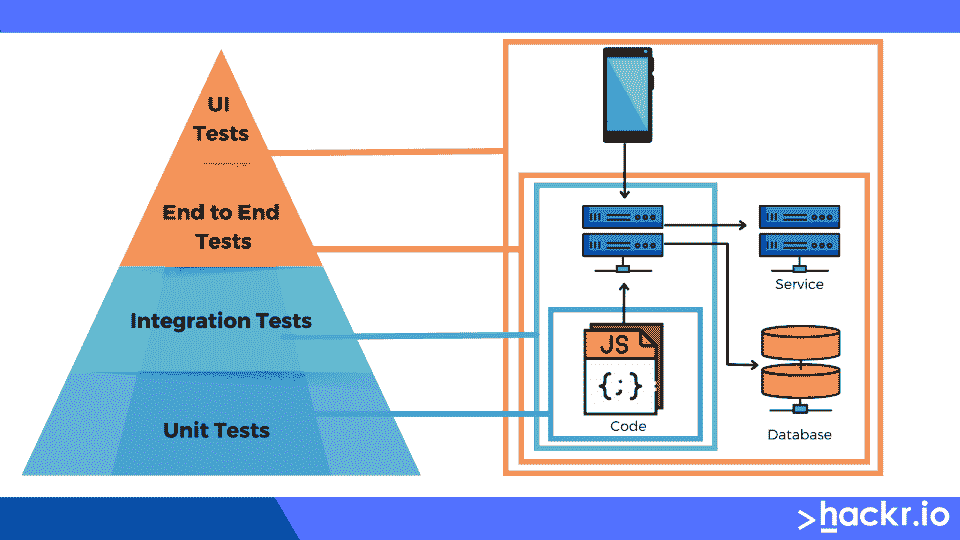

# 什么是单元测试？类型、优点、缺点和最佳工具

> 原文：<https://hackr.io/blog/what-is-unit-testing>

软件开发是一条漫长而曲折的道路，涉及许多阶段。在产品最终部署之前，开发通常包括概念化和设计、编码、测试和调试。如果你是一名开发人员，或者是一个开发应用程序或类似产品的团队的一员，你可能已经知道这个过程的每一步有多重要。

在任何产品的开发过程中，测试都是一个不可跳过的步骤。它是你或者你的团队如何检查一个软件产品是否没有缺陷，是否符合相关的需求。这也是开发人员发现他们的项目是否按预期执行并为用户提供总体满意体验的方式。

单元测试是团队更有效地发现产品缺陷的一种方式，这样他们就可以在发布日之前修复它们。如今，几乎每个软件开发公司都在其[软件测试周期](https://hackr.io/blog/what-is-software-testing-life-cycle)中包含单元测试，以确保软件产品的每个单元都功能齐全，并按预期执行。

在本文中，我们将回答这个问题，“什么是软件工程中的单元测试？”当我们谈论单元测试的定义、它的重要性、它的特性等等时。我们还将讨论单元测试的优缺点，并在 2023 年讨论它的一些最佳实践！

## 什么是单元测试？

那么什么是软件中的单元测试呢？

单元测试位于测试金字塔的顶端，这意味着它是功能测试的第一级——开发无错误软件产品的最关键步骤。单元测试的主要目标是在开发的早期阶段测试产品的每个单元或模块，以防止任何错误迁移到下一个级别。

但是现在我们已经回答了“什么是单元测试？，“很可能你还有另一个问题:到底什么是“单位？"

单元是产品中最小和最简单的部分，你可以通过测试来提高它的性能。它可以是方法、过程、对象或模块。该测试只需要几个输入，并产生一个输出。

执行单元测试的责任通常落在 web 开发人员和质量分析师的身上。他们可以选择手动或者借助一些工具自动进行测试。然而，如今单元测试似乎更多时候是自动化的。



## 单元测试是做什么的？

您可能想知道，“为什么要进行单元测试？它到底是做什么的？”为什么不能使用一个更传统的开发过程来完成所有的工作，然后再进行测试呢？如果这是你想做的，你可以！然而，单元测试可以以一些独特的方式提供帮助。

单元测试方法可以帮助公司、团队或个人软件开发人员提高他们代码的质量。此外，它还可以帮助创建可重用的代码模块，使编码过程更加快速和流畅。随着过程变得更加简化，开发人员可能更容易创建更简单、更清晰的文档。如果需要的话，单元测试还可以帮助确保最终产品可以与其他技术和工具无缝集成。

单元测试有几个功能可以帮助你提高软件产品及其质量。其职能包括:

*   由于单元测试框架的可靠性，有助于创建广泛编程的基础
*   帮助无缝地评估软件产品的每个单元

*   帮助利用简单的测试技术，例如走查、审查和检查编程代码
*   确保每个独立单元遵守严格的测试计划，以产生有效的结果

同样，值得一提的是，正确地进行单元测试将会为您节省时间和金钱，而这些时间和金钱是您在以后的复杂阶段寻找和解决错误所花费的。

单元测试还可以帮助您实现测试驱动的开发策略，在这种策略下，在任何编码发生之前，首先创建测试用例。如果你宁愿使用更传统的“先编码，后测试”的方法，单元测试仍然可以在你准备好的时候帮助你检查你的工作是否有错误。

## 单元测试是如何工作的？

单元测试工作非常简单。单元测试是用来检查测试主题(一个特定的软件产品功能，也称为单元)是否正确的代码片段。这个过程可能包括检查单元是否返回准确的结果，执行预期的功能，等等。

如果单元测试没有收到预期的结果，则测试失败。反之亦然——如果单元测试得到了想要的结果，单元就通过了，开发人员可以继续下一步。

## 谁应该创建单元测试？

我们上面提到过，单元测试可能属于开发人员或 QA 分析师的职责范围。但是谁应该负责创建单元测试呢？

常识告诉我们，创建单元测试应该是 QA 测试人员的责任。然而，单元测试通常被认为是编程阶段的一部分。因此，程序员通常倾向于创建单元测试，因为他们最了解自己的代码，这使得在产品代码中导航更加容易。

单元测试通常由开发人员自己完成的原因有几个。这些原因包括以下几点:

*   作为程序员，他们更可能知道如何访问他们可以轻松测试的部分
*   它们也是模仿对象的理想选择，尤其是那些用其他方式可能无法访问的对象
*   如果开发人员是创建单元测试的人，从长远来看可以节省很多时间

最重要的是，开发人员处理单元测试是最有意义的，因为这可以节省宝贵的时间。当你时间紧迫或进度落后时，尽可能地节省时间至关重要。

尽管程序员创建单元测试更为常见，但有时其他人可能会在过程的后期介入。例如，当程序员重构或继续生产代码开发时，其他人可以通过编写测试来帮助创建安全措施。

## **使用单元测试的重要性**

为什么要进行单元测试？为什么它们是必不可少的，为什么这么多公司在他们的开发过程中使用它们？

当创建任何产品或软件时，在软件开发周期(SDLC)的早期阶段发现并修复潜在的缺陷是至关重要的。单元测试帮助开发人员设计健壮的软件组件，同时维护良好的代码。一般来说，单元测试方法有助于消除每个代码单元中的任何问题。

单元测试是一个基本的检查，以确保软件产品满足指定的需求，并按预期运行。因此，它是每个敏捷软件开发过程中不可或缺的一部分。对于每一个软件构建，开发人员都应该执行单元测试套件来生成一份报告，详细说明软件各个方面的性能。为了确保快速解决问题，每一个失败的测试都应该通知 QA 团队。

如果做得正确，单元测试可以帮助公司节省时间和金钱。我们将在本文的后面触及一些更具体的优势。

[Python 中的单元测试和测试驱动开发](https://click.linksynergy.com/deeplink?id=jU79Zysihs4&mid=39197&murl=https%3A%2F%2Fwww.udemy.com%2Fcourse%2Funit-testing-and-tdd-in-python%2F)

### **好的单元测试的特征**

我们已经回答了“什么是单元测试？”但是还没有深入研究单元测试需要什么。什么是好的单元测试，它如何帮助识别软件产品中的错误？开发人员应该如何创建他们的单元测试？好的单元测试应该具有以下大部分(如果不是全部)特征:

*   大而复杂的项目需要数百个单元测试。一个好的单元测试只需要很少的时间就可以运行——只需要几毫秒就可以完成。有时，您需要重复运行测试来检查特定的 bug 是否已经被消除。因此，创建快速的单元测试以使整个过程更加有效是至关重要的。

*   易于调试- 每个单元测试都应该足够清晰地讲述一个关于应用程序行为方面的故事，使其易于理解。一些测试在单独运行时可以成功执行，但在集成时会失败，这表明存在设计缺陷。

*   **独立和隔离-** 好的单元测试是独立的，通常是独立运行的。它们也独立于外部因素，如文件系统或数据库。确保您创建的任何单元测试都不依赖于其他测试用例是至关重要的。

*   **自检-** 被设计成自动化的单元测试应该能够在没有任何人工干预的情况下自动检测它们是通过还是失败。

*   一个好的单元测试应该在你每次执行时产生相同的结果。单元测试需要一致地执行，因为它们是您检查代码及其功能的基础。

## 有哪些不同的单元测试技术？

正如你所想象的，在执行单元测试时，人们会使用一些不同的技术。在某些情况下，每种风格都可能比其他风格更好，因此在决定使用哪种方法时，您可能需要仔细考虑。以下是三种单元测试技术:

### **1。白盒测试**

白盒测试有时也被称为玻璃盒测试或透明测试。在这种单元测试技术中，测试人员已经知道了被测试产品的全部内部功能。因此，白盒技术使测试人员能够验证软件产品或系统的功能，例如它的代码、基础设施以及与外部系统的任何集成。

### **2。黑盒测试**

正如你所想象的，黑盒测试是白盒测试的反义词。有些人可能将这种技术称为“行为测试”在这种技术中，测试人员完全不知道产品的内部功能。黑盒测试的主要目的是测试软件产品的功能，看看它在对产品的所有细节一无所知的情况下表现如何。因此，测试人员对产品的代码结构或实现一无所知。

### **3。灰盒测试**

灰盒测试，也称为半透明测试，是上述技术的混合。当使用这种技术时，测试人员对产品的内部工作方式了解有限。灰盒测试有几种子类型，包括模式测试、矩阵测试、正交模式测试和回归测试。

## 单元测试是如何执行的？

仅仅回答“什么是软件单元测试”这个问题是不够的—我们还必须看看它是如何完成的。

所有的单元测试通常遵循一个相似的循序渐进的过程。在这个过程中，开发人员创建一些代码，其明确目的是测试软件产品中的特定功能。开发人员也可以选择进一步隔离这个功能，允许他们更严格地测试它。当功能被隔离时，测试可能揭示测试主体和其他单元之间任何不必要的依赖。然后他们可以消除这些依赖性。

开发人员和 QA 测试人员可以手动或自动执行单元测试。然而，迄今为止，自动化单元测试是大多数人的首选方法。

手动测试可能更加繁琐和耗时。但是，如果您更喜欢手动执行单元测试，您可以创建一个指导文档，以便一步一步地遵循。

编码人员在[自动化测试](https://hackr.io/blog/automation-testing-tools)中使用 Python 的 [UnitTest 框架](https://docs.python.org/3/library/unittest.html)或者其他类似的框架。有了这些工具，他们可以开发自动化的单元测试用例。

该过程通常如下:

1.  程序员编写代码来测试软件产品的特定功能。稍后，当产品代码部署时，他们可以注释掉或者完全删除这个测试代码。
2.  如果他们愿意，开发人员也可以隔离测试主题(功能)，以便更彻底地测试它。在严格的测试过程中，结果可能会显示出测试主题和软件产品中其他单元之间不必要的依赖关系。一旦这些不必要的依赖被揭露出来，开发人员就可以着手消除它们。
3.  当开发人员执行自动化单元测试用例时，框架将记录任何失败的结果。框架也可以标记或报告失败的案例。注意，如果失败足够严重，框架可能会停止进一步的测试。

## **单元测试的优势**

*   在早期阶段暴露软件产品中所有可能的缺陷，允许它们在进入下一步之前被纠正和消除
*   增强代码可读性和质量
*   简化文档并支持代码重用
*   在快速捕捉错误方面节省时间和金钱，否则这些错误可能会转移到项目的后期阶段
*   提高部署速度，加快项目完成和调试时间

## **单元测试的缺点**

*   引入和实施新功能时的实施成本
*   阻碍原型开发，其中底层代码变化很快
*   测试使用功能，因此 ide 很难看到功能是否在使用中
*   当单个代码库发生变化时，具有相互依赖性的测试可能会影响结果

## **单元测试中的常见挑战**

单元测试并不总是简单明了的。在整个测试过程中考虑以下挑战:

*   **标签:**测试标签对于顺利的测试操作至关重要。如果你忘记了这个至关重要的任务，它可能会导致团队成员之间的巨大混乱。
*   **了解整个代码:**开发软件需要过多的编码。对于开发人员来说，处理完整的代码可能是一件具有挑战性且乏味的事情，从而导致测试延迟。
*   误解测试加倍:当你的模拟比生产代码更复杂时，就会出现这个问题。在这种情况下，测试加倍有助于简化测试。最大的挑战是当测试替身在不同的书中有不同的名字。
*   调试:这需要大量的时间和精力。因此，如果任何测试不断失败，随之而来的调试将导致更多的延迟。

## **单元测试** **最佳实践**

如果您想在进行单元测试时获得更好的结果，您可能想要遵循一些单元测试的最佳实践。考虑以下提示:

*   确保所有单元都是独立的:每当有新的变更需求时，任何依赖都会影响单元测试。此外，依赖性增加了调试测试用例的复杂性。

*   **测试多个用例:**单个单元涉及多个用例；因此，测试人员必须在不同的测试用例中测试每个用例，允许团队有效地重构或更改代码。
*   **使用 AAA (Arrange，Act，Assert):** 这种模式将被测试的内容从“安排”步骤中分离出来，减少了使用“Act”的断言的混杂，使测试用例更具可读性。
*   正确且一致的标记:始终确保变量、测试用例、场景等有正确的命名。为了更好的可读性和团队间的理解，避免使用神奇的字符串。

## 单元测试是什么样的？一个单元测试例子

单元测试遵循特定的工作流程:

**创建测试用例→评审→基线→执行测试用例**

单元测试实际上可以是你想要的任何东西。它可以是一段代码，一个类，甚至是一个方法。然而，对于单元测试来说，越小越好。较小的测试将允许您更快地运行您的测试，并且您还可以同时运行更多的测试。

这是一个小而简单的单元*和*单元测试的很好的例子。它有一个类，为这个类添加了两个数字和一个测试函数。

```
public class Adder{

public int addnum(int num1, int num2){

return num1 + num2;

}

}

import org.junit.Assert;

import org.junit.Test;

public class Addertest{

@Test

public void test addnum(){

Adder adder1 = new Adder();

int num1 = 3;

int num2 = 2;

int result = adder1.addnum(num1, num2);

Assert.assertEquals(5, result);

}

}
```

您不必手动进行单元测试(除非您想这样做)。在这一过程中，有许多工具可以帮助您，例如:

### **1。Jtest**


Jtest 是一个开源的 IDE 插件，提供一键操作来创建、缩放和维护单元测试。您可以使用这个工具来自动化单元测试的关键方面以节省时间，这允许团队关注业务逻辑并创建更有意义的测试套件。

### **2。JUnit**


[JUnit](https://junit.org/junit5/) 是一款最适合 Java 单元测试的免费单元测试工具。这个工具支持识别测试方法的断言。JUnit 首先测试数据，然后在代码中使用数据。

### **3。努尼特**


NUnit 是一个测试框架，非常适合。Net 程序员。您可以使用这个开源工具来编写手动脚本。这个工具支持可以同时运行的数据驱动测试。

### **4\. JMockit**


[JMockit](https://jmockit.github.io/) 是一款面向 Java 的开源代码覆盖工具。它使用记录和语法验证来模仿 API，并附带了行、路径和数据覆盖。

### **5。艾玛**


这个开源工具可以分析和报告用 Java 编写的代码，类似于 JMockit。 [EMMA](http://emma.sourceforge.net/) 还支持不同类型的覆盖，比如方法、行、基本块等等。

### **6。PHPUnit**


PHPUnit 非常适合 PHP 开发者。您可以使用它在预定义断言方法的帮助下单独测试单元，以确保系统以特定的方式运行。

## 什么是测试驱动开发？

测试驱动开发(TDD)有时也被称为测试优先开发(TFD)。但是到底是什么呢？它与软件单元测试有什么关系？

TDD 是软件开发中的一种迭代方法，开发人员在编写任何产品代码之前创建测试用例。本质上，在任何编码发生之前，为每个功能开发测试用例。这些测试用例旨在简化开发过程，并使最终产品中的错误和缺陷最小化。

测试通常很简单，包含产品代码必须满足的需求条件。开发每个测试用例是为了帮助指定并验证产品代码需要做什么。一旦创建了测试用例，就编写生产代码，然后对照这些测试用例进行检查。如果代码失败，开发人员可以重新调整，直到结果满足测试用例的要求。

TDD 有三个阶段，即:

1.  **创建测试用例**以验证每个特定特性的功能。开发人员必须确保测试能够正确编译，以确保它们能够执行。测试用例也必须精确。
2.  如果测试失败，下一步是执行必要的代码修正。开发人员必须对代码进行必要的修改，直到它通过测试。这个步骤可以根据需要重复多次。
3.  最后一步是**根据需要重构代码**。一旦代码通过了所有测试，开发人员就可以检查任何代码冗余。此外，开发人员还可以进行代码优化来提高性能。但是，程序员必须小心地完成这一步，以免影响产品之前测试过的功能。

测试驱动开发有一点学习曲线，但它可能是开发人员武器库中的一个有价值的工具。做得好的话，可以激发对最终产品的信心。可以理解的是，并不是每个人都喜欢测试驱动的开发方法，因为它有时会变得乏味。

## **结论**

单元测试是一种[类型的软件测试](https://hackr.io/blog/types-of-software-testing)，在编码过程中完成，有助于在产品开发的早期阶段识别错误和问题。如果做得正确，它可以帮助开发人员发现错误并找出其根本原因。通过成功的单元测试，开发人员可以在产品部署之前纠正他们的代码并进行必要的优化。由于软件产品的每个单元或组件都在单元测试中得到检查，这有助于确保结果是高质量的。

准备好学习更多关于软件测试的知识了吗？看看这些 [*软件测试教程和课程*](https://hackr.io/tutorials/learn-software-testing) *。*

**人也在读:**