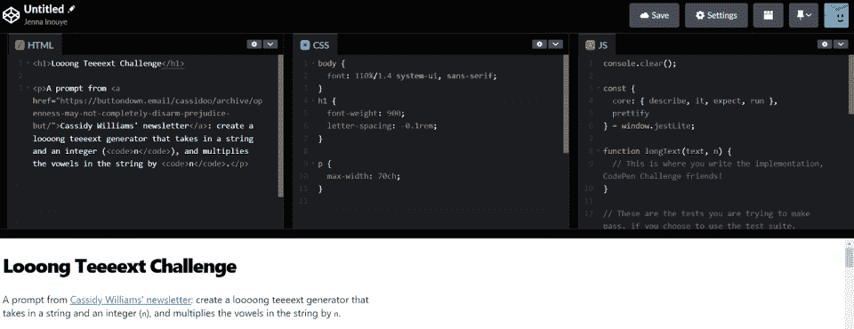
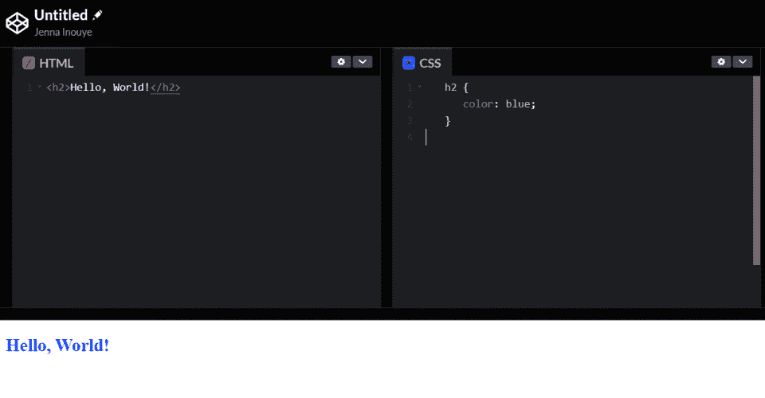

# 什么是 Web 开发？终极指南

> 原文：<https://hackr.io/blog/what-is-web-development>

你用过的每一个网站，从谷歌到脸书，都是由某人开发的。但是什么是 web 开发呢？

Web 开发是指与开发网站或 web 应用程序相关的所有任务，即使同一个开发人员或团队可能无法独立完成所有这些任务。

Web 开发的范围从开发简单的静态纯文本页面到复杂的基于 web 的互联网应用程序，如电子商务网站。作为一种职业，web 开发很受欢迎，因为它不需要正规教育。在训练营、教程和实践的帮助下，你可以成为一名网络开发人员。

今天，web 开发包括某些形式的移动应用程序开发、云应用程序开发和软件即服务解决方案。

## **网络发展简史**

在 90 年代，网站只是一些静态的文本和超链接页面。开发人员使用标记语言 [HTML](https://hackr.io/blog/how-to-create-a-website-using-html) 将文本和图像格式化成易于理解的格式。但该网站的目标是传递信息，而不是创造一个动态或互动的体验。

到 90 年代中期，JavasScript 和图形浏览器被引入，增加了网站的交互性和更大的视觉吸引力。网站变得动态和令人兴奋，最终成为他们今天的复杂解决方案。尽管 web 开发无疑已经变得更加高级和复杂，但它变得更加容易访问。

更快的网速使得网站开发更受欢迎。现在，桌面应用越来越少，SaaS(软件即服务)解决方案越来越多。今天，一个网络开发者可以做任何事情，从一个社会媒体网站到一个简单的游戏。

## **网络开发的类型**

Web 开发可以参考很多东西，从网站最初的设计(外观和感觉)到动态元素。但是 web 开发最基本的定义是为 web 开发一个网站。

### **1。前端 Web 开发**

[前端 web 开发](https://hackr.io/blog/how-to-become-a-front-end-developer)，也称为客户端开发，是开发用户将看到并与之交互的网站部分。这包括网站的图形界面(或“外观和感觉”)以及功能(或交互性)。

HTML、CSS 和 JavaScript 通常用于创建网站的前端。这些技术创造了网站的结构、风格和功能。下面，你可以看到 HTML 和 CSS 是如何一起创建一个同样是蓝色的标题的:

**

### **2。后端 Web 开发**

[后端 web 开发](https://hackr.io/blog/how-to-become-a-backend-developer)，也称为服务器端开发，是开发网站中用户看不到的部分。这包括网站或 web 应用程序的功能以及数据库和服务器配置。

PHP、Ruby on Rails 和 Node.js 通常用于构建后端。开发人员也越来越多地使用 Python。后端 web 开发通常被称为“web 编程”然而，虽然它对网站行为的发展是必不可少的，但它并不比前端开发复杂多少。

### **3。全栈 Web 开发**

[全栈 web 开发](https://hackr.io/roadmaps/full-stack-developer-roadmap)是指开发一个网站的前端和后端组件。全栈开发人员可以在客户端和服务器端开发 web 应用程序。

实际上，一个全栈开发人员必须对前端和后端 web 开发有很强的理解。一个好的后端开发人员通常会比全栈开发人员赚得更多，因为全栈开发人员倾向于使用比后端开发人员可能使用的企业应用程序更有限的技术(如 WordPress CMS 解决方案)。

| 

### 曾经创建过 WordPress 博客吗？67000 美元怎么样？

虽然 web 开发人员经常从头开始编写网站，但他们并不需要这样做。今天，有像 WordPress CMS 这样的无代码/低代码解决方案。据 Salary.com 报道，WordPress 开发者的平均工资是 67000 美元。 |

## **流行的 Web 开发语言**

在桌面应用开发中，常用 C++和 Python。网页开发最常用的编程语言是什么？

### **1。HTML**

HTML 或超文本标记语言是创建网页和 web 应用程序的标准标记语言。开发人员使用 HTML 来构建 web 文档(由 HTML 标记描述)，并应用样式来格式化内容(使用 CSS)。

### **2。CSS**

CSS 或级联样式表是一种样式表语言，用于描述以 HTML 或 XML 编写的文档的表示。开发人员使用 CSS 来设计所有 HTML 标签的样式，包括文档的主体、标题、段落和其他文本。

### **3。JavaScript**

JavaScript 是一种高级的解释编程语言。JavaScript 让网站变得动态和互动。开发者将其用于前端和后端开发，使其同样受到全栈开发者的欢迎。

### **4。PHP**

PHP 是一种通用的脚本语言，特别适合服务器端的 web 开发。它用于后端 web 开发；PHP 代码编译 HTML/CSS/JavaScript 代码，然后发送到浏览器。

### **5。Python**

Python 是一种广泛使用的高级解释通用编程语言。它的设计理念强调代码的可读性，它的语法允许程序员用比 C++或 Java 等语言更少的代码行来表达概念。虽然 Python 是一种更古老的语言，但由于人工智能和机器学习，它最近出现了显著的复兴。

[终极 2023 Fullstack Web 开发训练营](https://click.linksynergy.com/deeplink?id=jU79Zysihs4&mid=39197&murl=https%3A%2F%2Fwww.udemy.com%2Fcourse%2Fthe-ultimate-fullstack-web-development-bootcamp%2F)

网站编程不会发生在真空中。许多工具有助于网页开发，包括框架、编译器和优化工具。有了合适的工具，网页开发会更快更可靠。

### **1。框架(例如:角形。JS)**

框架就像模板。它们为您的代码提供了一个结构，因此您不必每次创建新网页时都从头开始。棱角分明。JS 是一个流行的框架，React Native 也是。

### **2。UI 套件(示例:引导程序)**

UI 工具包就像是你的网站界面的工具包。它们提供了一组预制的、可重用的组件，您可以用它们来构建您的 UI。Bootstrap 是最流行的 UI 工具包之一。UI 工具包也是一个框架，但主要用于用户界面。

### **3。代码库(例如:Github)**

代码库是软件开发人员可以存储和共享代码的地方。Github 是最流行的代码库。Github 允许多人同时处理同一个代码。

### **4。代码编译器(例如:CodePen)**

代码编译器是将代码从一种编程语言翻译成另一种编程语言的程序。CodePen 是一个流行的代码编译器，允许你编写和共享 HTML、CSS 和 JavaScript 代码片段。

优化工具使你的代码运行更快，占用空间更少。SASS 是一个流行的 CSS 优化工具。它是 CSS 的超集，使优化和改进你的 CSS 代码更加容易。

## **网络开发职业**

正如我们所讨论的，web 开发意味着许多不同的事情。根据你的关注点和兴趣，你可以从事不同的 web 开发职业。让我们来看看一些最常见的职业道路、机会和薪酬水平。

### **1。UX 设计师**

UX 设计师负责网站或网络应用的用户体验。他们致力于创建一个易于使用、视觉上吸引人、有助于实现企业或组织目标的网站。根据 Salary.com 的数据，一名 UX 设计师的平均收入预计在 99000 美元左右。

### **2。前端开发者**

前端开发人员使用 HTML、CSS 和 JavaScript 设计网站的外观和功能。通常，他们也是设计师——但并不总是这样。根据 [Payscale](https://www.payscale.com/research/US/Job=Front_End_Developer_%2F_Engineer/Salary) 的数据，一名前端开发人员的平均预期收入约为 77，000 美元。

### **3。后端开发者**

后端开发人员使用 MySQL、PHP、JavaScript 和 Python 等技术来设计动态网站的后端功能。后端开发人员的薪酬普遍高于前端开发人员，但前端开发人员也开始迎头赶上。根据 [Payscale](https://www.payscale.com/research/US/Job=Back_End_Developer%2F_Engineer/Salary) 的数据，一名后端开发人员的平均预期收入约为 87，000 美元。

### **4。全栈开发者**

正如我们之前提到的，全栈开发人员同时使用这两种技术。但是前端和后端开发之间有一个模糊的界限。全栈开发人员仍然倾向于比前端开发人员获得更高的报酬，但没有非常优秀、专注的后端开发人员的报酬高。根据 [Payscale](https://www.payscale.com/research/US/Job=Full_Stack_Software_Developer/Salary) 的数据，一个全栈开发人员平均每年可以赚 8 万美元左右。

| 

### 到底有多少 Web 开发人员？

根据伯克利的数据，全球大约有 2300 万网络开发人员。大约 50%的 web 开发人员被称为[全栈开发人员](https://bootcamp.cvn.columbia.edu/blog/how-to-become-a-full-stack-developer)。 |

## **其他类型的开发**

Web 开发跨越了各种开发实践。云开发和 SaaS 解决方案在某种程度上混淆了“web”开发。“Web 开发”可以指一个网站，但是当网站被用于其他事情的时候呢？

### **网络开发与移动开发**

原生移动应用以特定语言编码，例如 Swift(用于 iOS)和 Java(用于 Android)。移动开发可能是进入 web 开发领域的一个很好的切入点，因为技能是可以转移的。

有一些技术，比如融合了 web 开发和移动开发的渐进式 Web 应用程序。还有一些开发工具包和框架，比如 Ionic，可以让你用 HTML、CSS 和其他 web 技术创建移动应用。

### **Web 开发与云开发**

云开发是使用云计算技术构建和部署应用程序的 web 开发。云开发人员专注于创建可扩展的应用程序，这些应用程序可以部署在各种不同的平台上，包括云。然而，云开发人员本质上是 web 开发人员，经常不接触底层服务器技术。

### **网络开发与 SaaS 开发**

SaaS，即软件即服务，是一种专注于创建通过互联网交付的软件的 web 开发。SaaS 开发人员构建的应用程序通常是基于订阅的，世界上任何地方的用户都可以访问。所以，如果你看到 SaaS 开发，就知道这也是一种流行的 web 开发类型。

## **如何成为一名网页开发者**

成为一名 web 开发人员并不难。这通常是对技术、工具和编程语言的实践和熟悉的问题。

要成为一名网站开发人员，你需要:

*   学习 HTML，CSS，JavaScript。
*   获得一个托管帐户(或脚本编译器)。
*   使用 web 开发页面或项目进行练习。
*   了解如何使用 Github(或其他代码库)。

一个入门级的 web 开发人员应该能够创建一个干净的、有吸引力的、实用的工作网站。有许多入门级的网站开发人员的职位，你可以用来获得经验。

## **结论**

既然我们已经介绍了 web 开发的意义和专门化，是时候将知识付诸实践了。网络开发领域预计增长 13%——远高于平均水平。对于那些喜欢 web 开发和职业道路中许多不同焦点的人来说，有着难以置信的机会。

如果你对网页开发感兴趣，你的第一步是参加一个全栈训练营或者网页开发和设计原理的课程。您将发现自己喜欢(和不喜欢)web 开发的地方，并了解更多相关的工具和技术。然后，您可以从[全栈编程项目](https://hackr.io/blog/full-stack-project-ideas)开始实践并构建投资组合。

**人也在读:**

## **常见问题解答**

#### **1。什么是 Web 开发(举例)？**

web 开发的一个例子是建立一个 WordPress 帐户，在互联网上拥有一个实时博客。你可以安装 WordPress 并根据你的个人需求和风格进行定制。这样做，你就可以“为网络开发”

#### **2。Web 开发是做什么的？**

从最基本的层面来说，Web 开发就是创建任何网站。这包括从最初的编码到建立数据库和电子商务功能的一切。

#### **3。哪种语言最适合 Web 开发？**

web 开发的最佳语言是您最熟悉的语言。然而，有些语言比其他语言更受欢迎。例如，PHP 是一种非常流行的服务器端 web 开发语言，而 JavaScript 更多地用于客户端开发。

#### **4。怎样才能学习 Web 开发？**

Web 开发易学难精通。您可以从使用 HTML 和 CSS 创建一个起始项目开始。最容易开始的项目之一是网上简历。跟随在线简历教程学习 HTML 和 CSS 如何在屏幕上格式化文本。