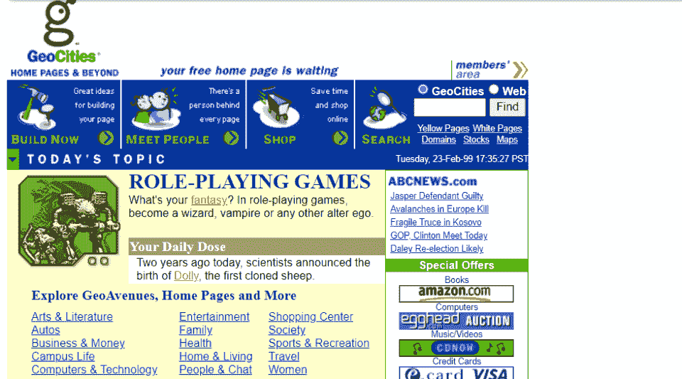
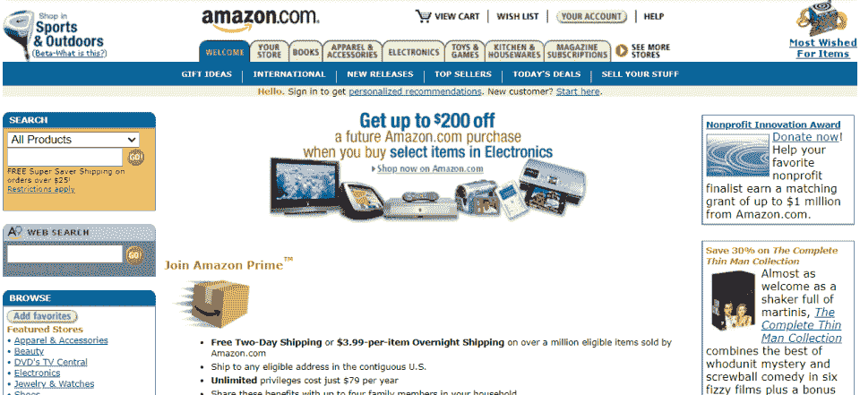
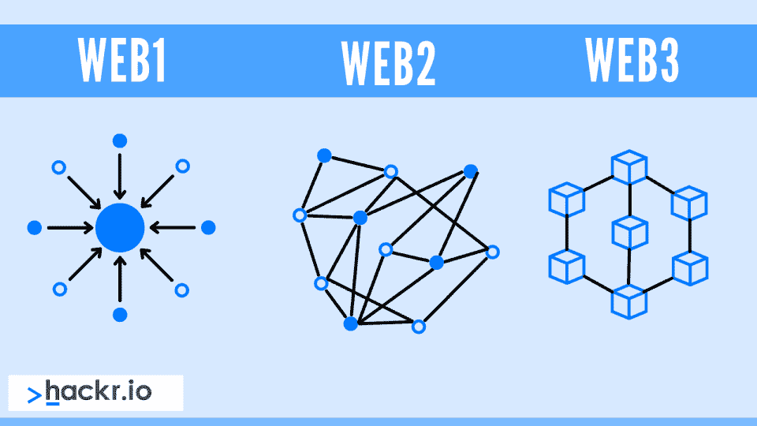

# 什么是 Web3？去中心化网络终极指南

> 原文：<https://hackr.io/blog/what-is-web3>

你已经听说过“Web3”以及它是网络的未来——甚至可能是社会的未来。但是什么是 Web3 呢？这值得大惊小怪吗？

Web3 不是一项特定的技术。相反，这是一种看待互联网以及我们如何与之互动的方式。Web3 着眼于未来的技术和原则，因为我们进一步整合了网络世界和现实世界。

混合到 Web3 中的是 Web 3.0 [区块链](https://hackr.io/blog/blockchain-programming-beginners-guide)(包括 Web 3 加密)、NFTs 和元宇宙。当你阅读这篇文章时，请记住“Web 3.0”不是一个通用的概念；没有权威机构可以定义“Web 3.0”。互联网在不断发展，我们对它的理解和认识也会发生变化。

准备好了吗？让我们开始吧。

| 

### **简单 Web3 含义**

Web3 是一套技术和原则，将定义我们作为一个社会如何与“万维网”互动 Web3 的主要标志包括区块链技术(加密货币和 NFTs)，元宇宙技术(增强和虚拟世界)，以及普遍的去中心化。 |

## 早期 Web: Web 1.0 和 Web 2.0

蒂姆·伯纳斯·李于 1989 年首次创建了万维网。从那以后，它发生了巨大的变化。它开始时只不过是简单格式化的文本和超链接。随着网速变得越来越快(世界变得越来越复杂)，网络已经演变成今天的样子。

### **Web 1.0 (1991 年至 2004 年)**

在网络的早期，网站大多是静态的。内容由一台服务器提供，有时甚至不是服务器群中的一台服务器，而只是企业办公室中的一台服务器。有些页面是动态的；这些是用 SSI 和 CGI 构建的。页面主要使用表格和框架进行格式化。

从文化上来说，互联网是一个与“现实生活”截然不同的世界。大多数人尽力在网上保持匿名。除非无法避免，否则他们不会把自己的现实生活和网络角色联系起来。虽然有些企业确实在网上做生意，但这种情况仍然很少见。只有最大的企业才真正拥有强大的网站。

### **Web 2.0 (2005 年至今)**

我们不能说互联网自 2005 年以来没有改变。但是 2005 年的文化转变彻底改变了我们看待和使用互联网的方式。互联网的普及和网速的提高使互联网从根本上与现实世界更加紧密地联系在一起。

网络变得不再是静态的，而是动态的。更多的企业开始使用互联网。社交媒体的兴起将“IRL”(现实生活中的)身份与网络身份联系了起来。我们开始将互联网更多地融入我们的社会。

**

## **web 3 的核心原则**

像 Web 1.0 和 Web 2.0 一样，Web3 是哲学、原则和技术的混合体。

Web 2.0 见证了亚马逊和谷歌等“大品牌”对互联网的重大整合。Web3 被理想化为一个去中心化的互联网——一个可扩展的、私有的、安全的和(也许是最重要的)点对点的互联网。与 Web3 相关的技术包括 [NFT](https://hackr.io/blog/best-nft-courses) 和加密货币。

从更广的层面来看，Web3 见证了互联网向日常生活的进一步扩展。“元宇宙”技术、虚拟现实、增强现实，甚至 MMO 游戏都是 Web3 的典型——这些技术模糊了“现实生活”和“互联网”之间的界限，甚至超过了 Web 2.0。

### 为什么 Web3 很重要？

Web3 之所以重要，有几个主要原因。第一，经济原因。Web3 包含了许多备受瞩目的技术，并且(在某些方面)让人想起了互联网泡沫。几年来，任何人要筹集首轮融资，都必须提到“加密”。

第二，Web3 解决了当前互联网的问题——很大程度上，它是由大公司控制的，这些公司可能没有考虑到用户的最佳利益。

最后，Web3 承认一个已经发生的社会转变:互联网和“现实生活”之间的模糊界限。

### **Web3:局限性和批评**

不是每个人都喜欢 Web3，甚至不相信 web 3 是一个东西。Web3 被像杰克·多西这样的人称为“流行语”。由于 Web3 不是一个严格定义的概念，任何东西都可以被称为“Web3 ”,只要给出正确的解释。

一些网络 3 技术，如加密货币，似乎正在扩大阶级分化。真正的权力下放还没有实现。还有像脸书这样的大公司追求“元宇宙”这样的概念(并受版权保护)。

其他人仍然相信 Web3 的概念，但质疑其当前的先锋(区块链、NFTs 和元宇宙)是否是有价值的技术。

从根本上说，Web3 的最大问题是它似乎创造了一个人为稀缺的世界。当元宇宙激起主流兴趣时，“数字开发商”开始出售数字土地。类似地，NFT 促进了个人对数字概念和数字艺术的独特所有权。换句话说，Web3 服务于将财富资本化。

但这并不是反对 Web3 的理由。这是一个论点，即区块链、NFTs 和元宇宙在哲学上可能不是 Web3 技术。

Web3 基础设施将与区块链技术、加密货币、NFTs 和元宇宙有许多关联。目前，法规正在改变我们如何看待这些技术以及它们在我们世界中的地位。

### **区块链技术:加密货币和 NFTs**

你可能听说过，几乎任何东西都可以在区块链上运行。这是事实，因为“区块链”实际上是一种比大多数人认为的更简单的技术。“区块链”是一个可见、透明、对等的总账系统。它的缺陷主要是由于*实现*，而不是它的技术。

加密货币使用通过区块链转移的代币。加密货币的目标是真实的，全球去中心化:一种同时被所有人持有和验证的货币。

由于加密货币是分散的，并且在很大程度上不受监管，许多加密货币经历了诈骗和黑客攻击。第一种主流加密货币比特币无法真正实现去中心化(并且仍然无法实现真正的去中心化)。为什么？它对市场和存储库的依赖程度如此之高，以至于大多数个人无法下载与同行验证所需的全部区块链。

NFT 就像加密货币，但不是加密令牌，任何东西都可以通过 NFT 进行交易。艺术有 NFT，法律合同有 NFT。因为区块链是一个分类帐系统，所以“NFT”(不可替换的令牌)实际上可以是任何离散的事务对象。同样，目标是为记录事务创建一个分散的点对点解决方案。

一些常见的 Web3 加密货币应用包括:

*   罗宾汉密码
*   柠檬. io
*   神秘的
*   比特币基地商业
*   隐猫

“元宇宙”已经成为脸书的同义词，但它是一个很久以前的概念。元宇宙的理念仅仅是一个与我们的世界互动的数字世界。随着虚拟和增强现实已经成为现实，而不是科幻小说，我们越来越接近“元宇宙”

向虚拟现实和增强现实的转变预示着我们很可能正在走向一个数字黄金时代，在这个时代，网络属性将开始向完全可交互的 3D 世界转变。我们还没有完全实现，但许多公司正在探索它会是什么样子，例如，在虚拟现实购物中心。已经可以查看 VR 博物馆和动物园了。

“元宇宙”真的只是一个时间问题，所涉及的技术正在不断进步。

| 

### **什么是 Web3 加密？**

Web3 不应与 Web3 项目、Web3 加密或 Web3 令牌混淆。这些加密货币/区块链技术被*称为* Web3，但它们并不是人们所指的 Web3 概念。 |

## **如何参与 Web3**

你可能会带着怀疑的眼光阅读 Web3。一些科技巨头，比如埃隆·马斯克，对 Web3 不屑一顾是有原因的。

Web3 目前植根于各种各样的技术，从实施不佳到极具破坏性。但是 Web3 就像 Web 2.0 一样不可避免——所有的东西都会进化。Web3 最终可能不是加密货币、NFTs 或元宇宙。但那将会是。

Web3 背后的主要驱动力是互联网通过智能设备、[物联网](https://hackr.io/blog/top-10-iot-applications)解决方案以及社交媒体不断融入我们的日常生活。人们通过以下方式参与 Web3:

*   创造新的颠覆性技术。
*   学习如何开发 VR/AR 技术。
*   投资加密货币、NFT 和 Web3 初创公司。

Web3 *作为技术*可能不会一成不变。我们不再像 2005 年 web 2.0 出现时那样使用相同的 Web 开发技术，但是我们以几乎相同的方式使用*互联网*。另一方面，Web3 作为一种理念、标准和社会趋势，更有可能在我们的社会中发挥重要作用。

## **web 3 的未来**

所以，你可以建立下一个 Web3 平台。或者只是投资下一件大事。从 Web 2.0 到 Web 1.0 从来没有任何巨大的转变。如果你在社交媒体上，你可能已经体验过 Web3 了。

在对 Web3 技术的讨论中，迷失的是 Web3 *到底是什么*——我们看待互联网方式的转变。

在 Web 1.0 时代，互联网确实只是昙花一现。这是一些人的爱好。这是少数人的职业。这是大多数人可以接受或放弃的东西。

在 Web 2.0 时代，互联网成为一个重要但仍然独立的世界。它成了我们玩游戏和远程工作的地方，但不是我们居住的地方。

Web3 开启了界限模糊的时代，在这个时代，网络世界与“真实”世界不再那么泾渭分明。我们已经在那里了。随着社交网络、在线约会和远程工作的激增，我们已经开始在这两个领域之间无缝移动。

未来可能会更好地实现我们正在探索的现有技术，以及对这些技术的进一步监管。

## **结论:Web3 是什么意思？**

Web3 概述了一种与互联网互动的新方式——以及可能分散互联网并将其重新置于普通用户控制之下的新技术。但是 Web3 仍然是新的，涉及的技术仍然在寻找它们的立足点。

**如果你对驱动 Web3 的技术感兴趣，可以考虑:**

*   了解更多关于加密货币、NFT 和其他区块链技术的训练营。
*   Web3 技术研究，如元宇宙和虚拟现实开发。

Web3 的世界仍在发展中。它充满了非凡的机遇和希望。如果你想成为塑造新世界的声音，是时候开始学习区块链技术了。

[探索我们的顶级区块链和加密货币教程](https://hackr.io/blog/best-cryptocurrency-blockchain-tutorials)

**人也在读:**

## **常见问题解答**

#### **1。什么是 Web 3.0 及其实例？**

元宇宙可能是 Web 3.0 技术最著名的例子，但不一定是脸书正在建造的那个。作为一个概念，元宇宙是一个后稀缺、点对点、去中心化的数字世界，与现实世界互动。

#### **2。Web3 有什么用？**

理想情况下，Web3 将导致互联网的去中心化和民主化。通过这样做，Web3 应该能够获得更高级别的安全性、隐私和控制。

Web 3.0 工具包括增强现实、虚拟现实、区块链技术以及任何模糊现实世界和互联网之间界限的东西。

#### **4。Web 2 和 Web 3 有什么区别？**

Web 2 的典型代表是大公司获得了对大片在线领域的控制权(如谷歌)，万维网成为人们生活和工作的必不可少的方式。Web 3 将会看到网络不仅是必不可少的，而且会无缝地融入我们的生活。

#### **5。我如何投资 Web3？**

你可以投资许多 Web3 初创公司和技术，如 AR/VR 公司、加密货币公司和 NFT 收藏。

#### **6。Web3 的未来是什么？**

希望 Web3 技术将变得不那么具有破坏性，并作为一个整体得到更好的实现。数字世界将需要解决颠覆性技术和严重信任缺失带来的问题。

#### 7 .**。为什么突然有这么多人在谈论 Web3？**

Web3 这个术语是几年前才被创造出来的。然而，许多 Web3 技术，如加密货币，具有深远的破坏性和高知名度。