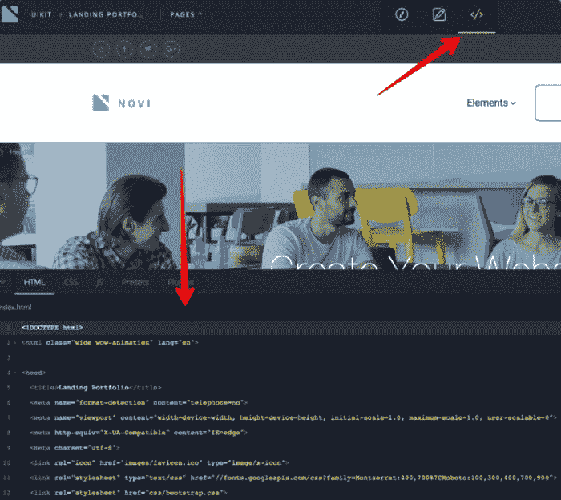

# 是什么让 Novi HTML 可视化编辑器成为 Web 开发人员的绝佳选择

> 原文：<https://hackr.io/blog/what-makes-novi-html-visual-editor-great-choice-for-web-developers>

让我问你一个问题。你期望从 HTML 编辑器中得到什么？随着多个网站建设者和 CMS 在网上，机会是你想得到一切你需要在你的指尖。无论你是刚入门还是有高级编码技能，让我给你展示一些前所未有的使用 Novi HTML 可视化编辑器的技巧。

谈到定制的可能性，Novi editor 非常灵活。好了，这些都是不值得你花时间去验证 Novi HTML 可视化编辑器的常见特性:

*   HTML 编辑器软件是 B2B/B2C 平台；
*   易用性；
*   三模式仪表盘；
*   面向开发者的工具；
*   设计可能性。

现在，让我们深入兔子洞，了解一下为什么 [Novi HTML 拖放构建器](https://novibuilder.com/visual-html-real-time-editor/?aff=hackr) 可以成为网页设计师的优秀工具。

[用 HTML 和 CSS 构建响应式现实世界网站](https://click.linksynergy.com/deeplink?id=jU79Zysihs4&mid=39197&murl=https%3A%2F%2Fwww.udemy.com%2Fcourse%2Fdesign-and-develop-a-killer-website-with-html5-and-css3%2F)

## **对 Novi HTML 编辑器的期望**

### **#1 HTML 编辑器软件是一个 B2B/B2C 平台**

Novi 最大的优点是它是网页设计师和最终用户的 B2B/B2C 在线平台。简而言之，HTML 编辑器代表了两种业务模型的混合，并作为业务和最终用户之间的纽带。一方面，它为最终用户提供了导入当前项目和调整页面的机会。另一方面，它允许 web 开发人员创建自己的模板。因此，当企业主需要在代码中添加文本时，Novi HTML 拖放构建器就是解决方案。

### **#2 需要一个单独的托管账户**

不同的复杂平台和网站建设者有不同的需求和可能性。作为一名编码人员，您可能希望尽可能发掘 HTML 编辑器的价值。为了让你的旅程有趣和愉快，你需要有一个单独的托管账户。总之，它导致了更快的页面加载速度。查看 [详情这里](https://novibuilder.com/documentation/?aff=hackr) 。

### **#3 易用性**

事实上，Novi 是唯一允许用户使用其源代码的 HTML 编辑器软件。对于那些有技术背景和一些经验的人来说，Novi 提供了大量的可能性。对于非技术人员来说，HTML 编辑器软件也大有可为。所以，你可以利用大量现成的模块，大量的插件，以及刚开始时非常需要的视觉元素。

借助传统的文件管理器或 FTP，HTML 网站易于操作和上传。所以，去把网站放到你需要的文件夹里，然后发布。你可以选择不同的页面设置，修改搜索引擎优化设置，包括元关键字和元描述。因此，根据你需要创建什么样的网站，导入一个适合你需要的现成模板，并开始用 Novi HTML drag-n-drop builder 调整页面。

[用 HTML 和 CSS 构建响应式现实世界网站](https://click.linksynergy.com/deeplink?id=jU79Zysihs4&mid=39197&murl=https%3A%2F%2Fwww.udemy.com%2Fcourse%2Fdesign-and-develop-a-killer-website-with-html5-and-css3%2F)

### **#4 HTML 编辑器软件自带三模式仪表盘**

*   编辑设计模式 对于喜欢用代码工作的 web 开发人员来说是一个完美的解决方案。它允许你在各种元素的帮助下定制你的网站。在这里，您可以使用源代码，并在一个地方拥有所有必要的工具。
*   **简单的编辑模式** 让非技术人员也能处理各种类型的内容。同样，您选择所需的模板并开始编辑。Novi 是一个 HTML 拖放生成器，它可以让你非常容易地做出任何你需要的改变。因此，你可以为你的滑块上传新的图像，复制图层，添加或删除元素，编辑按钮，添加链接&图标，文本，等等。
*   **预览模式** 向你展示你的页面将会是什么样子。所以，去检查你的工作结果，不要发布网站。

因此，包括 HTML、CSS 或 JS 编辑器在内的所有三种模式都可供网页设计师使用。还有一个选项可以创建一个新页面，只需点击一下就可以访问—**高级页面管理器** 。挤满了功能，它允许你给你想要的页面带来一些新的感觉。无论您想要或替换或删除它，一个用户友好的上下文菜单来帮助您。

### **#5 开发工具**

作为一名程序员，你希望在 Novi HTML 可视化编辑器中拥有多种工具。不要限制自己。充分利用 **预置管理器** 为你的在线项目编辑源代码就这么简单。您也可以创建新的预置，保存它们并在以后使用。

在左右面板的帮助下，您可以更改设置、添加内容和进行其他更改。通过双击菜单项来更改文本或菜单项的名称，使用文本上方的图标设置字体样式和链接。

想改变你的标志形象？点击 **【上传】** 按钮，上传您的图像。在 **页面面板** 中，可以访问所有页面。无论是创建一个新页面，还是在当前页面上添加一些内容，拖放功能都可以做到。要更改设置、上传 favicon、社交链接或联系方式，请转到 **项目设置** 。

作为奖励，Novi HTML 可视化编辑器附带了一些额外的功能，对于处理客户网站的网页设计者来说，这些功能尤其有用。因此，您可以下载项目模板，在发布之前向客户展示。此外，您可以保存项目原型并进一步使用它。

### **#6 设计可能性**

当谈到设计时，你可能想尽可能多地接触网页设计。Novi HTML 可视化编辑器的美妙之处在于，它允许您随心所欲地实现各种 web 设计趋势和 UI/UX 功能，让您的项目大放异彩。首先，您会得到一套时尚的预设计模板，这些模板具有几乎无穷无尽的编辑功能。内置的部分，块，和必要的插件将帮助您获得创造性。

对于那些喜欢使用源代码的网页设计师来说，扩展的设计能力将是一个不错的额外收获。您可以选择 HTML、SCC 或 JS 编辑，使用插件和预设元素。要访问代码视图，请单击顶部的图标并欣赏它。

高级可视化编辑功能允许您同时访问两个不同的模板版本。第一个版本实际上是所见即所得编辑器，对于想要设计伟大的新手来说，这是一个完美的选择。第二个是标准的 HTML 代码和所有相关文件。

通过更改分辨率功能，您可以在各种现代移动设备上查看您的网站外观。无需在它们之间切换， **改变分辨率模式** 提供了几个选项供选择。

其实在 WordPress 上安装 Novi HTML 编辑器模板也不是不可以。然而，准备好自己处理所有必要的修改和代码变更。

## **Novi HTML 可视化编辑器是你的绝佳选择吗？**

好了，现在你知道 Novi HTML 编辑器软件是不喜欢限制自己的程序员和 web 开发人员的绝佳选择。尽管这是一个非常容易使用的 HTML 拖放生成器，但专业的 web 开发人员会对它强大的设计功能感到惊讶。事实上，还有哪些网站建设者可以为你提供分别处理不同编程语言的可能性呢？

所以，如果有机会试试这个 HTML 编辑器软件，千万不要错过。

如果你想利用你的 HTML 技能来建立你自己的网站，我们推荐你使用 NameCheap 来

[buy your domain name](https://www.namecheap.com/?clickID=wUoTbQ3KtxyNR9L3K50RiSEKUkAx6n2NkXBZwI0&irgwc=1&utm_source=IR&utm_medium=Affiliate&utm_campaign=2890636&affnetwork=ir&ref=ir)

和

[web hosting services](https://www.namecheap.com/hosting/shared/?clickID=wUoTbQ3KtxyNR9L3K50RiSEKUkAx6E09kXBZwI0&irgwc=1&utm_source=IR&utm_medium=Affiliate&utm_campaign=2890636&affnetwork=ir&ref=ir)

。它们是业内最好的，而且超级实惠。

**人也在读:**