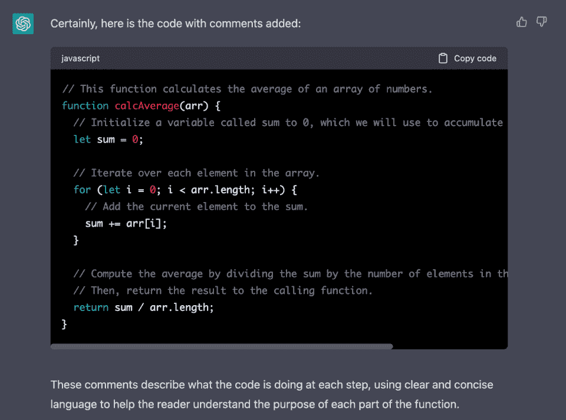
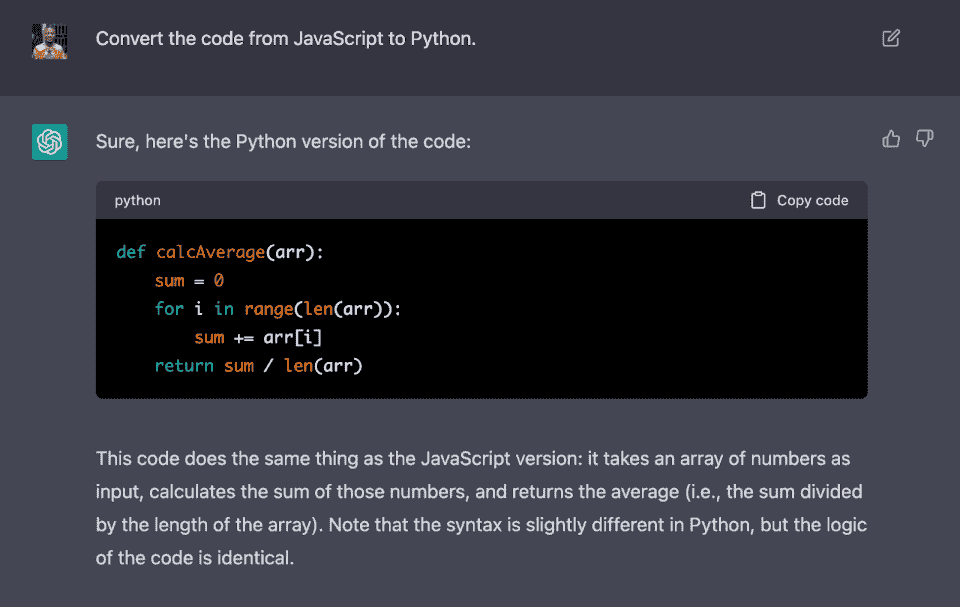
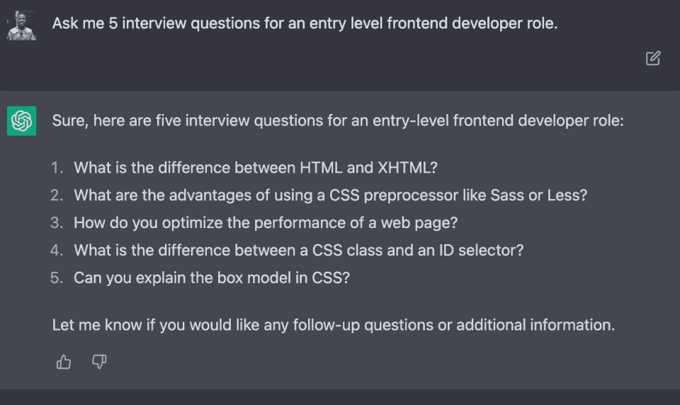
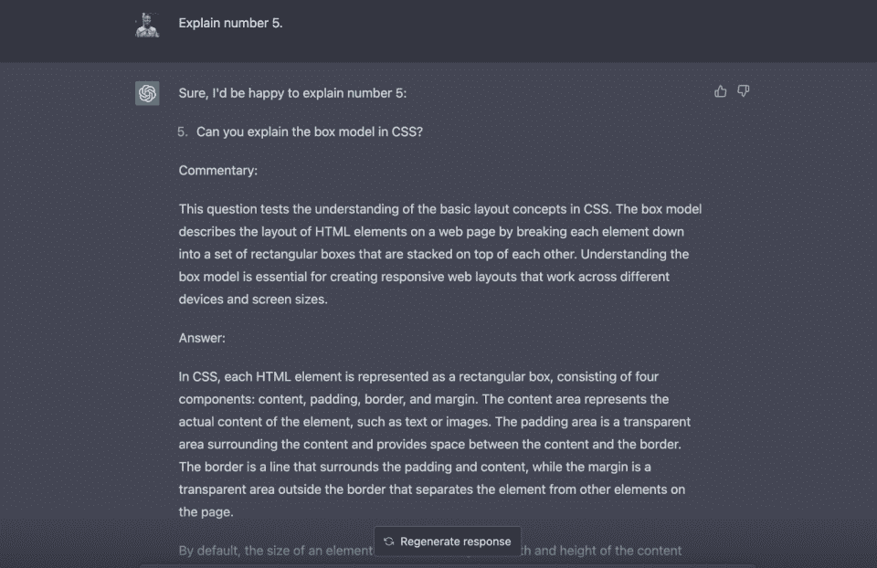
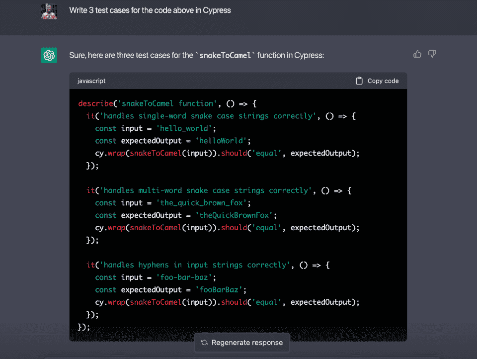
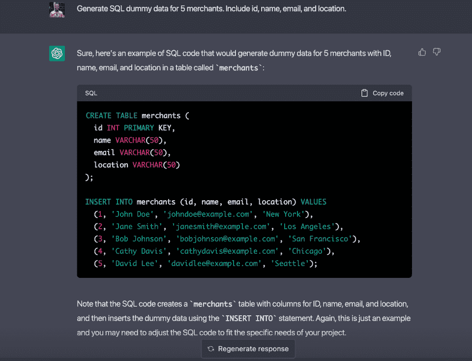
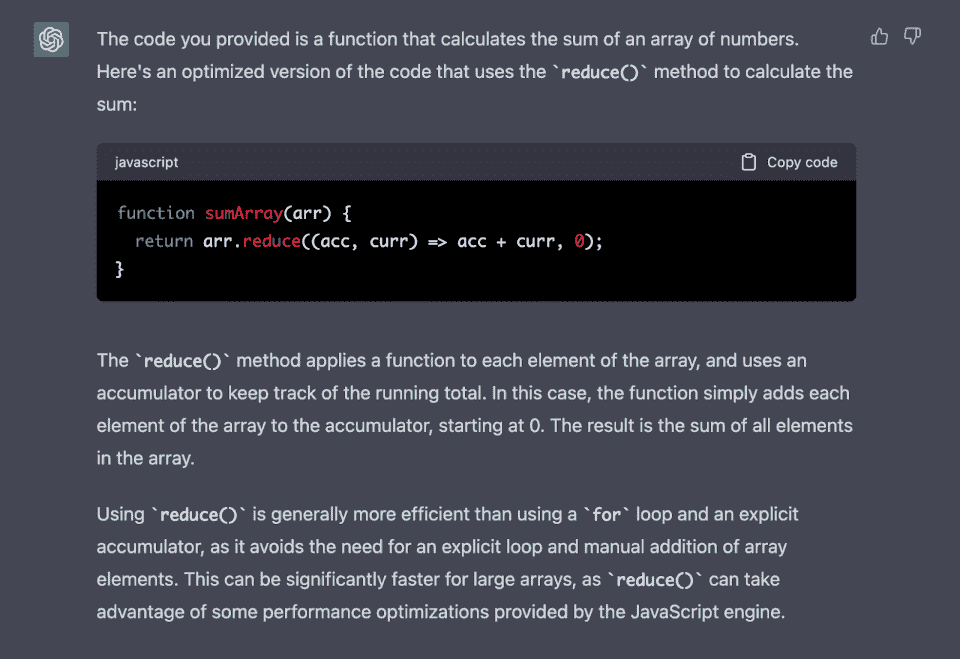
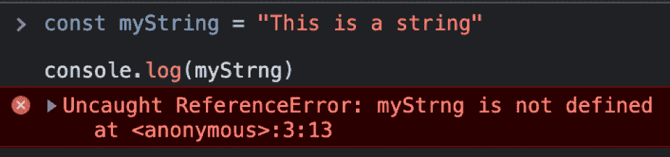
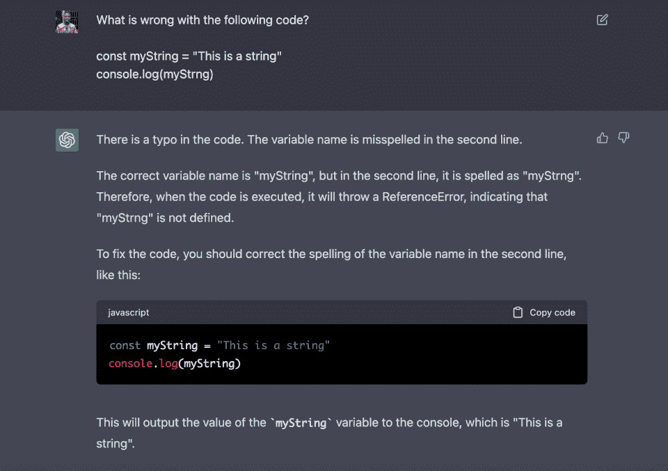
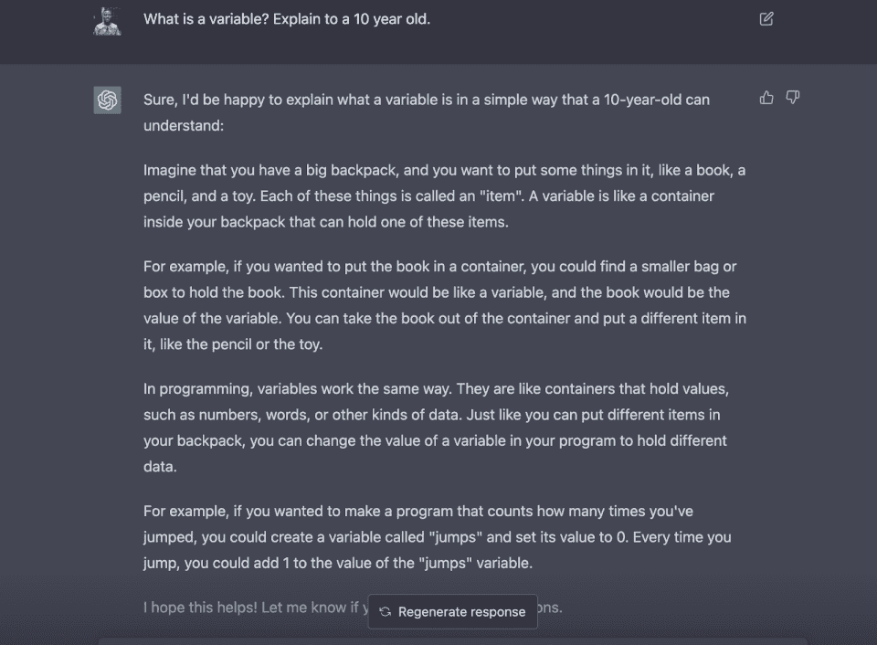

# 为什么程序员转向 ChatGPT 作为他们的人工智能助手

> 原文：<https://hackr.io/blog/why-coders-are-turning-to-chatgpt>

作为程序员，我们总是寻找新的方法来提高工作效率。我们喜欢帮助我们更快取得成果的工具。ChatGPT 就是这样一个迅速流行起来的工具。在不到三个月的时间里，ChatGPT 的用户数量已经超过了 [1 亿](https://www.theguardian.com/technology/2023/feb/02/chatgpt-100-million-users-open-ai-fastest-growing-app)。

ChatGPT 是一个人工智能聊天机器人，能够提供基于文本的问题答案。

在本文中，我们将提供一个全面的指南，介绍如何作为程序员有效地使用 ChatGPT，一些最大限度地利用它的技巧和诀窍，以及要记住的它的局限性。

## **chat GPT 到底是什么？**

ChatGPT 是 OpenAI 开发的机器学习模型。该模型使用无监督学习对大量文本数据进行训练。这意味着模型没有被明确地教导做什么，而是从数据模式中学习。

因此，它可以为广泛的问题提供答案。您可以使用聊天界面与 ChatGPT 进行交互，它可以为您的问题提供基于文本的答案。好的一面是，你甚至不需要成为一名程序员就可以使用它。如果可以提问，可以用 ChatGPT。

## 如何使用 ChatGPT？

要使用 ChatGPT，请访问[官方网站](https://chat.openai.com/)并创建一个帐户。注册并登录后，您会看到一个界面，下面有一个文本框。键入您的问题，ChatGPT 将为您提供答案。

## **chat GPT 能为你做什么？**

作为一名程序员，ChatGPT 可以成为一个有价值的工具，帮助你更好更快地工作。以下是一些使用 ChatGPT 改进编码工作流程的方法。

向代码中添加注释是至关重要的，因为它可以使代码更具可读性和可理解性，尤其是对于现在和将来需要使用它的其他开发人员。

ChatGPT 可以自动为你的代码生成注释。您只需要将代码提供给 ChatGPT，并要求它创建评论。然后，它将分析代码，并添加注释来描述它做什么以及如何工作。

如果您正在处理一个大型的代码库，并且需要快速地为许多函数和方法添加注释，这将非常有用。

这里有一个例子，我让 ChatGPT 为我写的一些 [JavaScript](https://hackr.io/blog/how-to-learn-javascript) 代码生成注释。


*要求 ChatGPT 为代码*自动生成注释



ChatGPT 为我的代码自动生成的注释——令人印象深刻！

### **2。将代码从一种语言转换成另一种语言**

您经常会遇到不熟悉的语言的代码，尤其是来自其他开发人员的教程或项目。ChatGPT 可以在这方面提供帮助，因为它可以将代码从一种编程语言翻译成另一种编程语言。例如，我让 ChatGPT 将我的代码从 JavaScript 转换成 [Python](https://hackr.io/blog/best-python-courses) ，它很轻松地做到了这一点。



*ChatGPT 将我的代码从 JavaScript 转换成 Python*

### **3。帮助您准备技术面试**

ChatGPT 帮助你准备技术面试。要做到这一点，只需要让它扮演采访的角色。没错；它会表现得像招聘经理！

因此，提供相关问题的背景很重要。例如，假设你是一名前端开发人员，即将参加一个入门级职位的面试。以下是如何使用 ChatGPT 进行准备的方法。



*询问 ChatGPT 问我一些面试问题*

在这种情况下，你可以试着自己回答问题，但如果你有一个不明白，你也可以要求解释。

例如，如果你不知道第五个问题的答案，你可以使用类似下面截图中的提示。然后，它提供了问题的详细解释，包括一个适当的答案。



*请 ChatGPT 解释一个我不知道答案的问题*

**注意:**如果你想知道下一次技术面试的顶级面试问题和答案，请查看我们的 **[面试问题文章列表。](https://hackr.io/blog/tag/interview-questions)**

### **4。为你的代码编写测试**

测试是软件开发的一个重要部分，但是编写测试很耗时。使用 ChatGPT，您可以快速地为您的代码生成测试用例。让我们看一个例子。

下面是一个将 Snake 大小写转换为 Camel 大小写的 JavaScript 函数。

```
function snakeToCamel(str) {

  const words = str.split(/[_-]/);

  const capitalizedWords = words.map((word, i) => {
    if (i === 0) {
      return word;
    } else {
      return word.charAt(0).toUpperCase() + word.slice(1);
    }
  });

  return capitalizedWords.join('');
}​
```

我将这段代码交给 ChatGPT，让它为函数编写测试，如下所示。我甚至指定了我喜欢的测试库(Cypress)和测试用例的数量。



*要求 ChatGPT 为我的 Javascript 函数编写测试用例*

### **5。生成虚拟数据**

您可能需要使用虚拟数据的原因有很多，无论是在无法访问真实数据的情况下进行原型设计，还是出于隐私考虑，或者是出于培训和教育目的。无论您的理由是什么，ChatGPT 都可以轻松快速地生成虚拟数据。

例如，如下图所示，我让 ChatGPT 为五个商家生成虚拟 SQL 数据，包括 id、姓名、电子邮件和位置。



*要求 ChatGPT 生成 SQL 虚拟数据*

### **6。重构你的代码**

重构代码可能涉及检查和应用最佳实践、使用更有效的替代方案、优化性能等等。再说一次，ChatGPT 可以通过分析您的代码并提供改进它的建议来提供帮助。

在这个例子中，我让 ChatGPT 重构下面的 JavaScript 函数来计算数组中所有数字的总和。然后，它返回了解决相同问题的不同方法，甚至解释了为什么它比原来的方法更好。


*请求 ChatGPT 重构我的 Javascript 代码*

**

*ChatGPT 优化版我的 JavaScript 代码*

### 7 .**。代码中的调试错误**

有时候，像错别字，标点符号之类的小事。，可能会引入烦人且耗时的错误。幸运的是，ChatGPT 可以帮助您快速调试和修复代码中的错误。例如，下面的代码抛出一个*未捕获的 RefenceError。*

**

*故意出错的 JavaScript 代码*

所以，我让 ChatGPT 告诉我代码出了什么问题。它不仅告诉我出了什么问题，还提示了如何解决问题，并提供了解决方案。



ChatGPT 解释了我的代码有什么问题，然后为我修复了它！

### **8。使用 ChatGPT 作为研究助理**

作为一名程序员，你可能需要研究解决问题的最佳方案。与标准的 Google 搜索、论坛搜索和文档阅读会话不同，只需向 ChatGPT 询问一些技术问题或探索解决问题的不同方法。

在这个例子中，我假设你正在学习编码，但是你对变量的概念有点困惑。没问题，只需要让 ChatGPT 向你解释变量，就像它向 10 岁小孩解释一样！结果是一个容易理解的解释。



向我解释变量的概念，就好像我是一个 10 岁的孩子一样

### **9。为你的项目集思广益。**

您可以向 ChatGPT 寻求编码项目的新想法或添加到现有项目中的功能。

例如，如果你有一个新公司的登录页面，你可以让 ChatGPT 提出新的功能添加到页面中。如下所示，这是一个产生你可能没有想到的有价值的想法的好方法。


*要求 ChatGPT 为我的登录页面推荐新功能*

## **如何从 ChatGPT 获得更好的答案**

毫无疑问，ChatGPT 是一个强大的工具，可以为广泛的问题提供丰富的答案。但是从 ChatGPT 获得最佳回应需要特定的策略。让我们来看看从 ChatGPT 获得更好答案的一些技巧。

*   **具体:**问清楚直接的问题。你向 ChatGPT 提出的问题越具体，你得到有益回答的机会就越大。例如，不要问，*“我怎样才能写出更好的代码？”*你可以问，*“提高 JavaScript 代码可读性的最佳实践是什么”。*
*   **问后续问题:**如果你对回答不满意，问后续问题以澄清或获得更多信息。这将有助于 ChatGTP 完善其响应并提供更准确的信息。
*   **提供上下文:**提供 ChatGPT 相关信息，它可以使用这些信息来理解您的问题的上下文，如以下两个示例所示:

*   *   ***不好:**“我的代码怎么了？”*

*   *   **好:**“我正在构建一个 React 组件，当我试图渲染它时，出现了 TypeError。这是代码。你能帮我理解是什么导致了这个错误吗？”

## **chat GPT 有哪些局限性？**

虽然 ChatGPT 是一个非常强大的语言模型，但它并不是一个完美的工具。使用 ChatGPT 时，需要记住一些基本限制。

1.  **有限的知识库:**虽然 ChatGPT 经过了海量数据的训练，但它能够有效处理的主题是有限的，包括可能超出其范围的专业或技术主题。
2.  缺乏上下文意识: ChatGPT 可以生成语法正确的响应，但它可能无法理解更广泛的对话上下文。这可能会导致回答不完整，或者没有考虑到细微差别或细节。
3.  **有偏见的回答:**与任何[机器学习模型](https://www.kdnuggets.com/2019/08/types-bias-machine-learning.html)一样，ChatGPT 根据它接受训练的数据，显示出对某些回答的偏见。虽然 ChatGPT 中已经做出了努力来最小化偏差，但是在使用它的时候意识到这个限制是很重要的。
4.  缺乏情商: ChatGPT 不具备人类在对话中可能具备的情商。这意味着它有时可以给出技术上准确的响应，但缺乏人类可能提供的同理心或理解。
5.  **安全问题:** ChatGPT 可能不会始终提供安全的解决方案，因此您必须谨慎向 ChatGPT 提供任何敏感信息。您还应该确保 ChatGPT 提供的任何建议或解决方案不会损害安全性。

## **结论**

ChatGPT 是一个强大的工具，程序员可以使用它来完成各种任务，包括向代码添加注释、调试错误、进行研究等等。当有效使用时，毫无疑问 ChatGPT 可以帮助您提高编程技能和工作流程。

ChatGPT 拥有超过 1 亿的用户，并且还在增加，可以肯定地说 chat GPT 将会继续存在。忽略它，风险自负，或者利用它，提高你在职业和个人生活中的效率。但是请记住，要充分利用这个革命性的工具，您需要考虑它的局限性。

人工智能让你着迷吗？通过这个牛津人工智能项目探索人工智能的实际应用。[点击此处下载招股说明书。](https://getsmarter.sjv.io/c/2890636/1143816/13499)